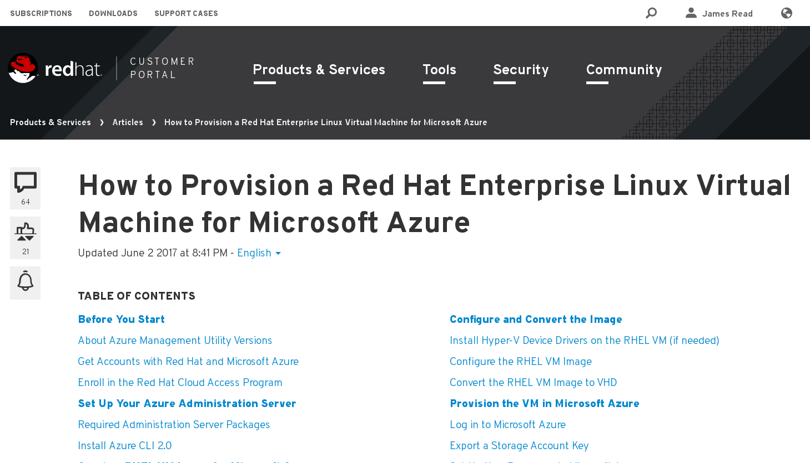
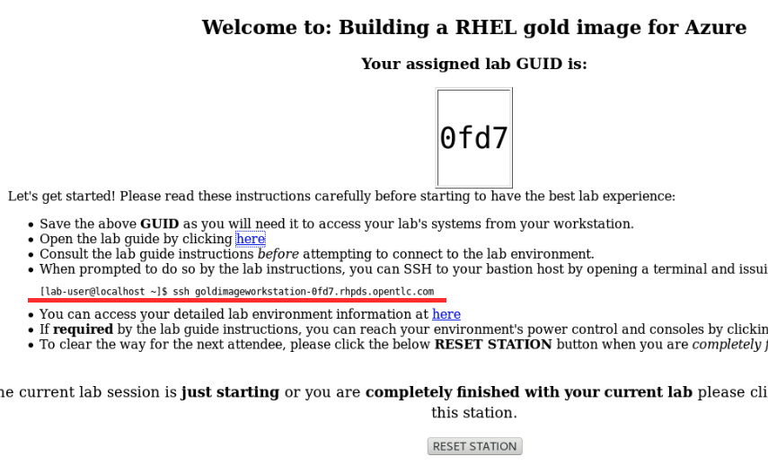
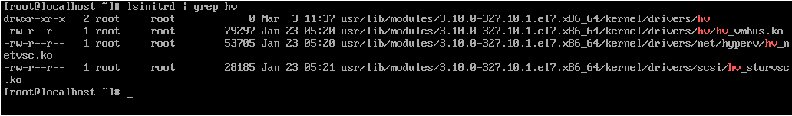

:data-uri:
:toc: left
:sectanchors: true
:sectlinks: true
:sectnums: true
:encoding: UTF-8

= Building a RHEL gold image for Azure

include::sidebarhighlight.adoc[]

NOTE: There is a HTML rendered version of this document that **is much nicer
nicer to read than on GitHub, available here: http://40.112.68.75/guide/ **.

== Introduction and Lab Outline

This lab walks you through the process of building a RHEL "gold image" that can be used in a Microsoft Azure cloud environment. 

This process is necessary if your organisation wants to use Cloud Access
("Bring your own subscription"), and not Marketplace images. It is important to
understand that marketplace images can only be consumed with on a Pay As You Go
basis from Azure - you cannot use existing Cloud Access subscriptions.

If you're not familiar with Cloud Access, it's a feature of most existing Red
Hat subscriptions for RHEL, JBoss, CloudForms, OpenShift and Gluster that allow
Enterprise subscriptions to be moved to a public cloud provider. To find out
more about cloud access and how to convert subscriptions, please look at this
link;
https://www.redhat.com/en/technologies/cloud-computing/cloud-access[Overview
to Cloud Access].

=== Why would I want to learn how to build a gold image for Azure?

- Most users of Red Hat at scale have their own gold images, with requirements
  for standard service configuration, security settings, and pre-installed packages.
- Most of these users already have an existing large number of Red Hat
  Enterprise Linux subscriptions too, and want to bring those to Azure.

- The Azure Marketplace images cannot be customised before they are
  provisioned, and they also cannot be used with existing subscriptions.
  Therefore it is necessary to learn how to build a RHEL gold image for Azure.

=== What will I do in this lab?

. You'll start this lab by logging into a build-workstation running in Red
Hat's cloud. You will have root on this workstation.
. Create a local virtual machine on this workstation, and boot it up
. Perform standard installation settings changes like network, bootloader and
  removes SSH keys necessary for Azure.
. Install the Windows Azure Live Agent (WALA) and configure
. The image is then prepared (like Windows Sysprep) so that multiple new images can be created from this template. 
. Review how the Azure tools work

[NOTE]
Because this lab produces a virtual machine that is approximately 10Gb in size,
which is unpractical to upload to Azure during the Red Hat Summit due to
bandwidth limits. This lab includes instructions on how you would upload the image using the
Azure tools, but you will not practically take that step during this lab.

=== What skills do I need for this lab? 

It's recommended that you have some basic Linux skills - Red Hat Certified
Systems Administrator level will be absolutely fine to complete this lab.

Please do ask if you have questions, Red Hatters should always be nearby to
help out!

=== After completing this lab, you should be able...

- To understand how to build a RHEL gold image for Azure
- To understand the reasons behind some of the changes we make for Azure
- Be able to build your own Azure image for use in Cloud Access

=== Author & Support, and ackowledgements

This lab was submitted by **James Read**.

This lab is being supported by **Götz Riger**, **Dan Kinkead**, and **Khaled
Elbedri**. 

Here's what we look like if you want to ask for help!

[cols="^,^"]
|===
|           |                   
| **James Read**                                        | **Götz Rieger**
| EMEA Senior Solution Architect for Microsoft, Red Hat | Senior Solution Architect, Germany, Red Hat
| Email: james@redhat.com                               | Email: grieger@redhat.com                          
|===
[cols="^,^"]
|===
|               | 
| **Dan Kinkead**                                       | **Khaled Elbedri**
| Platform Technical Integrated Support Manager, Red Hat| Technical Sales Lead for Open Source, Microsoft
| Email: dkinkead@redhat.com                            | Email: Khaled.Elbedri@microsoft.com
|===

James would like to express his sincere thanks to Götz, Dan, Khaled and others for
supporting this lab... and **you** for choose to sit here! 

This lab was based around a similar excellent knowledge base article on the Red Hat
customer portal. James would also like to thank the original authors and current maintainers of
the knowledge base article(s).

Small changes to those instructions to that document have been made to convert
it to a Red Hat Summit lab. This lab also includes additions not included in
the original article about using Azure Active Directory, LVM and a bit more.

Be sure to add the following article to your bookmarks **for reference after the Red Hat Summit**!

https://access.redhat.com/articles/uploading-rhel-image-to-azure

This link is also mentioned at the end of this lab guide, along with many other
relevant and useful links.

== Lab Orientation 
=== Environment

In this lab, we'll be using the lab laptop and remote workstation only. 

No special networking, connection Azure details are needed, no Red Hat subscriptions are
needed either. Very simple really!

You may need these details later in the lab;

|===
| Activation Key | **gold**
| Lab ID | **L1071**
| GUID | This is generated for you automatically - 4 characters that are unique to your lab and used in your hostname.
|===

=== Connecting to your lab workstation 

There are 3x machines used in this lab;

. Your lab laptop
.. Graphical environment
.. No root access
. Your lab workstation 
.. Hosted in the cloud
.. Can run virtual machines
.. This is the machine that you SSH into
. The virtual machine gold image you will be building

**You should now SSH into your lab workstation using the SSH command specified on
the lab provisioning webpage**. You can find the **Terminal** application in
the Applictions -> Favorites top menu.

== Start creating your gold image virtual machine

=== Welcome to your workstation!

If you logged in successfully, you should see this message;

----
---
  Welcome to the RHEL Gold Image Workstation!

        Red Hat Summit 2018
---
lab-user@goldimageworkstation-GUID:
----

Lets just take a look around, this is a very simple workstation. Run a couple
of simple commands below to explore the lab workstation;

It's running RHEL 7.5.

    lab-user@goldimageworkstation-GUID: cat /etc/redhat-release
    Red Hat Enterprise Linux Server release 7.5 (Maipo)

It has just 8Gb of RAM; 

    lab-user@goldimageworkstation-GUID: free -h
                  total        used        free      shared  buff/cache   available
    Mem:           7.6G        136M        7.3G         16M        195M        7.3G
    Swap:            0B          0B          0B

Your workstation is a 2x core machine;

    root@goldimageworkstation-GUID: lscpu | grep -i CPU
    CPU op-mode(s):        32-bit, 64-bit
    CPU(s):                2
    On-line CPU(s) list:   0,1
    CPU family:            6
    CPU MHz:               2294.872
    NUMA node0 CPU(s):     0,1

This is more than enough to host a couple of small virtual machines - in this
lab we just will create one virtual machine.

=== Become root

You can become root on your lab workstation using `sudo su`. This will allow
you to install packages and create virtual machines with libvirt.

    lab-user@goldimageworkstation-GUID: sudo su
    root@goldimageworkstation-GUID: whoami
    root

=== Configure Yum server

This lab environment has stored updates and essential packages on a utility
server. You need to configure your workstation to get packages from this server

    lab-user@goldimageworkstation-GUID: cd /etc/yum.repos.d/
    lab-user@goldimageworkstation-GUID: wget http://40.112.68.75/lab.repo

It's always a good idea to clean the yum cache after repos change;

	lab-user@goldimageworkstation-GUID: yum clean all

Check that the repository can be found with this command;

    lab-user@goldimageworkstation-GUID: yum repolist

You should see the 2x repos in the list;

    root@goldimageworkstation-GUID: yum repolist
    Loaded plugins: product-id, search-disabled-repos, subscription-manager
    This system is not registered with an entitlement server. You can use subscription-m
    rhel-7-server-extras-rpms
    rhel-7-server-rpms
    (1/2): rhel-7-server-extras-rpms/primary_db
    (2/2): rhel-7-server-rpms/primary_db

=== Install packages needed to create Linux virtual machines

The following packages are used in this lab. Below, there is a brief
description of what the packages do, and in which repository to find them.

|===
| Package	| Repository | Description
| libvirt	|rhel-7-server-rpms	|Open source API, daemon, and management tool for managing platform virtualization.
|libguestfs	| rhel-7-server-rpms	| A library for accessing and modifying virtual machine file systems.
|libguestfs-tools	| rhel-7-server-rpms	| System administration tools for virtual machines; includes the guestfish utility.
| virt-install | rhel-7-server-rpms | Used to create a virtual machine
definition and register it with libvirt. 
|===

Install the packages as follows;

    root@goldimageworkstation-GUID: yum install libvirt libguestfs libguestfs-tools virt-install

=== Check that the processor Virtualisation Extensions are enabled on your workstation

To run virtual machines on the workstations, the processor Virtualisation
Extensions need to be enabled in the BIOS/EFI. This will have been done for you
automatically by the script that setup your workstation.

To check if the extensions are enabled, run the following command in your
terminal;

	root@goldimageworkstation-GUID: dmesg | grep -i kvm

You *should _not_ see* the following... If you do, something has gone terribly
wrong, please contact a lab admin!

	[164324.526483] kvm: disabled by bios
	[164346.574009] kvm: disabled by bios
	[164964.310827] kvm: disabled by bios

You *should see* something like this; 

    ...
    [    0.000000] Hypervisor detected: KVM
    ...

=== Setup the libvirt daemon

We're now going to start libvirt, which is a helper service that talks to and
manages KVM.

    root@goldimageworkstation-GUID: service libvirtd start
    root@goldimageworkstation-GUID: chkconfig libvirtd on

=== Introduction to image best practices

Red Hat releases a distribution of RHEL in .qcow2 format. This is optimized for
virtualization on libvirt hypervisors which is a useful starting point for
building an image for Azure. Once you have the base image configured, you can
use this image as a template for creating subsequent VMs in Microsoft Azure.
Note the following configuration settings in the next couple of sections.

==== VM Configuration Settings

Microsoft Azure VMs must have several specific configuration settings. Some of these settings are enabled during the initial VM creation. Other settings are set when provisioning the VM image for Microsoft Azure. Keep these in mind as you move through the procedure and refer back to it if you need to.

[options="header",cols="1,2"]
|===
| Option | Requirement
|LVM	| Do not use Logical Volume Management (LVM) on the operating system
disk. Instead, use regular partitions and format the disk using ext3, ext4, or
xfs. LVM or RAID can be used for data disks. <<about-lvm,Explain more about LVM>>
|ssh	| ssh must be enabled to provide remote access to your Azure VMs.
| dhcp	| The primary virtual adapter should be configured for dhcp (IPv4 only).
| Network Manager	| This service should be disabled on RHEL 6.x images.
| Swap Space	| Do not create a dedicated swap file or swap partition. Swap space may be configured in the Azure Linux agent.
| NIC	| Choose virtio device for the primary virtual network adapter.
| encryption	| Do not use full disk encryption for the operating system disk. Data disks can be encrypted.
|===

=== Find the KVM Guest Image

We will now find the latest KVM Guest Image that is pre-downloaded for you on
your workstation. Normally, you can find KVM Guest Images on the Red Hat Customer Portal, but we've cached them locally to speed up download times. 

[NOTE]
We recommend downloading the latest minor version of each major version of
RHEL. Even though we support RHEL 6.7, we prefer you use RHEL 6.9. Likewise,
even though RHEL 7.1 is supported, you should use RHEL 7.5. 

RHEL 7.0 is not supported in Microsoft Azure because the driver packages for
Azure's network cards and similar were only released in 7.1 and later.

On your lab laptop, run the following command in a terminal; 

	root@goldimageworkstation-GUID: cd /opt/
    root@goldimageworkstation-GUID: ll

You should see an image filename that was downloaded from the customer portal
for you; **rhel-server-7.5-x86_64-kvm.qcow2**

Copy the image to `/var/lib/libvirt/images/`; We create a copy of this image because if we break something during the install, we can just make a new copy without having to download the image again.

	root@goldimageworkstation-GUID: cp rhel-server-7.5-x86_64-kvm.qcow2 /var/lib/libvirt/images/

=== Create a Local RHEL VM from this image

We are now going to create a new virtual machine on the workstation, based on
this standard KVM guest image. We will customize this image, then prepare it to
upload to Azure. 

You do not have any access to a graphical environment on your workstation, so
we will create a virtual machine using command line tools **virt-install** and
**virsh** (virtual shell). 

----
root@goldimageworkstation-GUID: virt-install -n goldimage -r 2048 --os-type=linux --os-variant=rhel7 --disk /var/lib/libvirt/images/rhel-server-7.5-x86_64-kvm.qcow2,device=disk,bus=virtio -w bridge=virbr0,model=virtio --vnc --noautoconsole --import
----

If successful, you should see; 

    Starting install...
    Domain creation completed.

Let's pause for a moment to understand what this command just did;

. `virt-install -n goldimage` created a new KVM/libvirt Virtual Machine called
"goldimage"
. `-r 2048`, gave this machine 2048Mb (2Gb) of RAM. Note that in Azure, this
virtual machine could be configured for any Azure machine size, and would not
be limited to 2Gb. We're just using 2Gb to initially build the image as there
is no workload installed.
. `--os-type=linux --os-variant=rhel7` configures the virutal hardware choices
to be the most compatible with RHEL.
. `--disk
/var/lib/libvirt/images/rhel-server-7.5-x86_64-kvm.qcow2,device=disk,bus=virtio`
sets the virtual machine to use the base disk image we just copied, and
connects it to the virtual machine using the "virtio" interface and driver. 
. `-w bridge=virbr0,model=virtio` This gives the virtual
machine a local network connection so we can SSH into it later.
. `--import` This imports the virtual machine definition to the local libvirt
daemon.

The virtual machine should be started automaticlaly for you, you can check this
as follows;

    root@goldimageworkstation-GUID: virsh list
     Id    Name                           State
    ----------------------------------------------------
     2     goldimage                      running

If you see this, **awesome**! If you cannot see this, you should be sad and
contact a lab admin :) 

=== Connect to the VM serial console

Lets connect to our VM, but because it does not have a default network
configuration, we're going to use the serial console. 

    root@goldimageworkstation-GUID: virsh console goldimage

You will probably start seeing bootup warning messages like this... **don't
panic**!

    [  186.475166] cloud-init[802]: 2018-05-04 03:19:50,499 - url_helper.py[WARNING]: Calling 'http://192.168.122.1/latest/meta-data/instance-id' failed [50/120s]: request error [('Connection aborted.', error(111, 'Connection refused'))]

It's important to pause here and understand what is happening here.

==== Understanding cloud-init

`cloud-init` is a useful tool in environments that support it, like Red Hat
OpenStack Platform. It is a utility that is pre-installed on virtual machines,
and it starts up on bootup. It asks local
metadata servers for confguration information - network device IP addresses,
initial root passwords, initial SSH keys and various other details.

In our virtual environment, we have not got a cloud-init metadata server
configured - and it would be unusual to use cloud-init in simple environments
like this. Most importantly, cloud-init support for RHEL on Azure is not yet
generally available (<<cloud-init-about,Learn more here>>).

We could have disabled cloud-init using bootup options, but this was hopefully
a useful learning opportunity! Wait for cloud-init to time out (should take
about 3-5 minutes) and you should
then get a login screen eventually; 

----
Red Hat Enterprise Linux Server 7.5 (Maipo)
Kernel 3.10.0-862.el7.x86_64 on an x86_64

localhost login:
----

Great, a basic login prompt! Here's a quick **checkpoint of what we've done so
far**;

. SSHed into the workstartion that is running in Red Hat's cloud
. Setup virtualisation on the workstartion
. Created a goldimage virtual machine

The problem is, because cloud-init failed, the
root password has not been set, and so you cannot login...

We're going to set the root password manually by turning the machine off,
editing it's virtual disk, editing the shadow password file, and then starting
it back up again!

We need to exit the serial console first to get back to our workstation.

. Press the keyboard shortcut **Control + ]** to exit the serial console. 
. Power off the virtual machine; `virsh destroy goldimage` 

Note that `virsh` uses the word "destroy" to mean "power off" virtual machine.
We did not delete this virtual machine, and we can check it still exists with
the following command;

    root@goldimageworkstation-GUID: virsh list --all
     Id    Name                           State
    ----------------------------------------------------
     -     goldimage                      shut off

Once you have shut down the VM, we will now set up root access to the image.

=== Set Up Root Access to the RHEL VM Image

So that the image can be customised for Microsoft Azure, you need to set up root access to the VM. You can do this by using a public/private key generator like ssh-keygen, or you can set up a root password by completing the steps below. 

On your workstation, use openssl to generate a new encrypted password for the root account on the new VM.

	root@goldimageworkstation-GUID: openssl passwd -1 yourPasswordGoesHere
    $1$bI/.EQaO$Qa.i9WtqjskncD9LgaJwq1

Copy the encrypted password string (in the example above -
**$1$bI/.EQaO$Qa.i9WtqjskncD9LgaJwq1** is our encrypted password).

FIXME more detail on what Guestfish is 

Launch the guestfish utility to access the etc/shadow file on the image.

	root@goldimageworkstation-GUID: guestfish -a /var/lib/libvirt/images/rhel-server-7.5-x86_64-kvm.qcow2 

Enter the following commands at the guestfish command prompt.

	><fs> run
    100% ▒▒▒▒▒▒▒▒▒▒▒▒▒▒▒▒▒▒▒▒▒▒▒▒▒▒▒▒▒▒▒▒▒▒▒▒▒▒▒▒▒▒▒▒▒▒▒▒▒▒▒▒▒▒▒▒▒▒▒▒▒▒▒▒▒▒▒▒▒ 00:00

This lets the Guestfish tool see the virtual machine disks. 

	><fs> list-filesystems
    /dev/sda1: xfs

This shows that the virtual machine has a single disk image. We can virtually
mount it within Guestfish;

	><fs> mount /dev/sda1 /

Within Guestfish, we can use tools like vi to then edit files directly on the
disk. We'll use this to directly edit the shadow file (which stores our Linux
passwords). 

Edit the shadow file using **vi**. Replace the root password value with the encrypted password generated by the openssl command.

NOTE: **vi** is a Unix text editor that you may not be used to using - please
don't be afraid to ask a lab admin if you need help with using it!
Unfortunately Guestfish won't allow you to use other editors like nano that you
may choose to use instead.

	><fs> vi /etc/shadow

When you edit the **shadow** file, you replace the root password null value
that is represented by **!!** in the unedited file. 

----
root:!!:17612:0:99999:7:::
bin:*:17492:0:99999:7:::
daemon:*:17492:0:99999:7:::
... 
----

To setting the root password to our encrypted value, edit your file to look
something like this;

----
root:$1$bI/.EQaO$Qa.i9WtqjskncD9LgaJwq1:17612:0:99999:7:::
bin:*:17492:0:99999:7:::
daemon:*:17492:0:99999:7:::
... 
----

Save your changes to **/etc/shadow** and exit your text editor.

To confirm we edited this file successfully, we can just double check the first
line looks something like this using `cat`; 

    ><fs> cat /etc/shadow
    root:$1$bI/.EQaO$Qa.i9WtqjskncD9LgaJwq1:17612:0:99999:7:::
    ... 

Exit the guestfish utility. This will close the disk. 

	><fs> quit

=== Start the VM again

Use the following command to restart our virutal machine in libvirt;

    root@goldimageworkstation-GUID: virsh start goldimage

Note that cloud-init will try again, and will slow down your virtual machine
startup. Use the `virsh console goldimage` command to reconnect to the console
- you should now be able to login using the password you just set;

----
Red Hat Enterprise Linux Server 7.5 (Maipo)
Kernel 3.10.0-862.el7.x86_64 on an x86_64

localhost login: root
Password:
[root@localhost ~]#
----

If the root password does not work, check the **/etc/shadow** file to make sure the password was set up properly.

Once you are logged in using the root account, you're ready to configure the image.

== Configure the image for Azure
Complete the procedures in the following sections to finalize the gold image
for Azure.

=== Remove cloud-init
Lets get rid of that bootup delay from cloud-init!

If you are unfamiliar with this service, it's used to do the initial setup of virtual machines from generic images. OpenStack, and some other cloud platforms host a metadata server, which give images their initial hostname, username, ssh keys and similar. 

Red Hat Enterprise Linux and Azure does not have production support
`cloud-init` (<<cloud-init-about,click here to learn why>>), instead the Windows Azure Live Agent (WALA) does most of the tasks that `cloud-init` normally does. 

Stop the cloud-init service (if present).

	[root@localhost ~]# systemctl stop cloud-init

Remove the cloud-init software.

	[root@localhost ~]# yum remove cloud-init

=== Check that the Hyper-V Device Drivers are installed
Microsoft provides network and storage device drivers as part of their Linux
Integration Services for Hyper-V package. Hyper-V device drivers may need to be
installed on the RHEL VM prior to importing it to Microsoft Azure. Use the
`lsinitrd | grep hv` command to verify that the drivers are installed. i

Here is how you would manually configure the Hyper-V device drivers (**these next
few steps should not be necessary for you to type as recent RHEL7 images
include these drivers by default**); 

Note the spaces before and after the quotes. For example, add_drivers+=" hv_vmbus ". This ensures that unique drivers are loaded in the event that other Hyper-V drivers already exist in the environment.

On the RHEL VM, you would add the driver parameters to the /etc/dracut.conf file.

	add_drivers+=" hv_vmbus "
	add_drivers+=" hv_netvsc "
	add_drivers+=" hv_storvsc "

Here's how you regenerate the intramfs image.

	[root@localhost ~]# dracut -f -v

Verify the configuration changes now include the **hv** drivers in your bootup
image.

	[root@localhost ~]# lsinitrd | grep hv

You should see a list of Hyper-V drivers similar to the following drivers.

=== Enable password auth and login via SSH

Edit the /etc/ssh/sshd_config file and enable password authentication. This allows you to use SSH password authentication without using public key authentication. 

	PasswordAuthentication yes

Restart the SSH daemon for the configuration changes to be picked up;

    [root@localhost ~]# service sshd restart

We can now exit the serial console and reconnect via SSH. First we need to find
this virtual machine's IP address on libvirt, which starts with
**192.168.122.x**. 

    [root@localhost ~]# ip a
1: lo: <LOOPBACK,UP,LOWER_UP> mtu 65536 qdisc noqueue state UNKNOWN group default qlen 1000
    link/loopback 00:00:00:00:00:00 brd 00:00:00:00:00:00
    inet 127.0.0.1/8 scope host lo
       valid_lft forever preferred_lft forever
    inet6 ::1/128 scope host
       valid_lft forever preferred_lft forever
2: eth0: <BROADCAST,MULTICAST,UP,LOWER_UP> mtu 1500 qdisc pfifo_fast state UP group default qlen 1000
    link/ether 52:54:00:f3:b3:15 brd ff:ff:ff:ff:ff:ff
    inet 192.168.122.108/24 brd 192.168.122.255 scope global noprefixroute dynamic eth0
       valid_lft 2571sec preferred_lft 2571sec
    inet6 fe80::5054:ff:fef3:b315/64 scope link
       valid_lft forever preferred_lft forever

We can see from the above output that in this environment the IP address of our
gold image is **192.168.122.108**. Your IP address will be slightly different.
Take a note of it.

Exit the serial console by pressing the **Control + ]** shortcut.

SSH from the workstation back into the gold image VM, and use the password you
set earlier;

    root@goldimageworkstation-GUID: ssh root@192.168.122.108
    root@192.168.122.108's password:
    Last login: Fri May  4 04:08:24 2018
    [root@localhost ~]#

=== Setup common defaults

Set a generic host name. You could of course set this to your corporate
standard, like **goldimage.prod.example.com**.

	[root@localhost ~]# hostnamectl set-hostname localhost.localdomain

Edit /etc/sysconfig/network-scripts/ifcfg-eth0 so it matches the following list of configuration details.

	DEVICE="eth0"
	BOOTPROTO="dhcp"
	ONBOOT="yes"
	TYPE="Ethernet"
	USERCTL="no"
	PEERDNS="yes"
	IPV6INIT="no"

NOTE: Azure uses DHCP for it's network configuration of virtual machines. If
you use static IP addresses from the Azure command line tools or portal, it's
still using DHCP to actually apply these changes to virtual machines. This is a
common practice in cloud environments and is recommended to keep configuration
simple.  

Remove any persistent network device rules.

	[root@localhost ~]# rm -f /etc/udev/rules.d/70-persistent-net.rules
	[root@localhost ~]# rm -f /etc/udev/rules.d/75-persistent-net-generator.rules

This is necessary because when we create multiple copies of this virtual
machine on Azure, it will create network cards with different MAC addresses
that have not been "seen" by this virtual machine before. This would mean your
first virutal machine would be assigned **eth1** or **em2** or similar which is
undesirable. 

Set the network service to start automatically.

	[root@localhost ~]# chkconfig network on

Set ssh to start automatically.

	[root@localhost ~]# systemctl enable sshd
	[root@localhost ~]# systemctl is-enabled sshd

Modify the kernel boot parameters.

a. Add the following options to the end of the **GRUB_CMDLINE_LINUX** line in the `/etc/default/grub` file.

	earlyprintk=ttyS0
	console=ttyS0
	rootdelay=300

- The the `console` and `earlyprintk` statements allow the Azure diagnostics to
  pick up early bootup messages from the virtual machine in Azure. Note the
  Azure does not provide serial console access generally supported in every
  region yet.

b. Remove the following options, if they are present.

	rhgb
	quiet
	crashkernel=auto

- The `rhgb` statement normally is used to show a pretty/graphical boot. This won't be seen in Azure, and the diagnostic logs are more useful to us.

- Removing the quiet option will show us more log messages.

- `crashkernel=auto` tells the kernel to use the automatic mode in a crash, rather than choosing another option.

Regenerate the grub.cfg file. This updates the grub configuration with the changes we made above.

	grub2-mkconfig -o /boot/grub2/grub.cfg

In a production environment, it's necessary to register RHEL instances using `subscription-manager` to receive updates. It might seem like a good idea to do this in your gold image, but for the following reasons this isn't recommended;

- Your machine ID will be duplicated, causing problems when you launch 2x instances.

- A subscription will be consumed for your gold-image, which is in storage, doing nothing.

- If your subscriptions expire or change, you would need to update your gold image.

=== Install the Windows Azure Linux Agent (WALinuxAgent/WALA).

The goldimage virtual machine does not have any repositories configured because
it is not subscribed to **subscription-manager**. Again, lets download the lab
repo in our gold image;

    [root@localhost ~]# cd /etc/yum.repos.d/
    [root@localhost ~]# curl -O http://40.112.68.75/lab.repo

It's always a good idea to clean the yum cache after repos change;

	[root@localhost ~]#  yum clean all

[NOTE]
For production environments, the `rhel-7-server-extras-rpms` includes the Windows Azure Linux Agent.

Install the agent, and configure it to start on boot;

	[root@localhost ~]# yum -y install WALinuxAgent
	[root@localhost ~]# systemctl enable waagent.service

Edit the following lines in the /etc/waagent.conf file to configure swap space for provisioned VMs. Set swap space for whatever is appropriate for your provisioned VMs.

	Provisioning.DeleteRootPassword=n
	ResourceDisk.Filesystem=ext4
	ResourceDisk.EnableSwap=y
	ResourceDisk.SwapSizeMB=2048

=== Deprovisioning

Now many of the common tasks have been completed, we're almost ready to
"deprovision" the machine from WALA. It's sensible to take a backup of our work
so far, so that if the deprovisioning fails or we want to make changes later,
we can come back to this backup.

Logout of the gold image, and go back to the workstation. Take a snapshot of the VM from the workstation; 

    lab-user@goldimageworkstation-GUID: virsh snapshot-create-as --domain goldimage --name "goldimage-before-deprovision"

Prepare the VM for Azure provisioning by cleaning up the existing provisioning details; Azure will reprovision the VM in Azure. This command generates warnings, which is expected.

	[root@localhost ~]# waagent -force -deprovision

Clean the shell history and shut down the VM.

	export HISTSIZE=0
	poweroff

=== FIXME Using the WALA agent for running scripts

=== FIXME Configuring logs for OMS

=== FIXME: Custom .bashrc

=== FIXME: Storage, disk

=== FIXME: Azure Active Directory

https://docs.microsoft.com/en-us/azure/active-directory-domain-services/active-directory-ds-join-rhel-linux-vm

=== FIXME: Automating the build

=== Any more best practices. hmm?

== Convert the RHEL VM Image to VHD

All Azure VM images must be in vhd format. This section describes how to convert your template image from qcow2 to vhd format. Once you have converted the image to vhd using one of the conversion procedures below, proceed to the following section and authenticate your server.

Important: The resulting vhd file must be sized to the nearest 1 MB boundary for Microsoft Azure. The Indirect Method of conversion below has been thoroughly tested. You can use one of the Direct Methods for a 7.x or 6.x KVM Guest Image. Note that the Indirect Method should be used if the Azure VM does not start in Microsoft Azure after using one of the other methods of conversion.

=== Indirect Method

Convert the qcow2 image to raw format, resize it, and convert the raw image to vhd.

Convert the image from qcow2 to raw.

	lab-user@goldimageworkstation-GUID: qemu-img convert -f qcow2 -O raw <image-xxx.qcow2> <image-xxx.raw>

Save the following as a script. (These steps use aligned-size.sh.) The script will calculate the size of the raw image to the nearest 1 MB boundary.

	#!/bin/bash
	rawdisk="image-xxx.raw"
	MB=$((1024 * 1024))
	size=$(qemu-img info -f raw --output json "$rawdisk" | gawk 'match($0, /"virtual-size": ([0-9]+),/, val) {print val[1]}')
	rounded_size=$((($size/$MB + 1) * $MB))
	echo "rounded size = $rounded_size"
	export rounded_size

Run the script.

	lab-user@goldimageworkstation-GUID: sh aligned-size.sh

Resize the raw image using the rounded size.

	lab-user@goldimageworkstation-GUID: qemu-img resize -f raw <image-xxx.raw> <rounded-size>

Convert the raw disk image to vhd format.

Important: qemu-img version 1.5.3 is used in this procedure. Check the qemu-img version using yum info qemu-img (or dnf info qemu-img for Fedora 22 or later). If the version is 2.2.1 or later, add the option force_size in the conversion command, for example, subformat=fixed,force_size. All other command options remain the same.

	lab-user@goldimageworkstation-GUID: qemu-img convert -f raw -o subformat=fixed -O vpc <image-xxx.raw> <image-xxx.vhd>

To verify the file is resized correctly, show the virtual-size using the following command.

	lab-user@goldimageworkstation-GUID: qemu-img info --output=json -f vpc <path-to-image>

	Divide the virtual-size value by 1024, twice. If the result is a whole number, the vhd file is aligned properly.

	<virtual-size> / 1024 / 1024

=== RHEL 7.2 and 7.3 Direct Method

By default, the RHEL 7.2 or 7.3 KVM Guest Image is already sized to an even 1 MB boundary and can be converted directly from qcow2 to vhd.

Use the following command to directly convert the file.

	qemu-img convert -f qcow2 -o subformat=fixed -O vpc <rhel-guest-image-7.2-xxx.qcow2> <rhel-guest-image-7.2-xxx.vhd>

To verify the file is resized correctly, show the virtual-size using the following command.

	qemu-img info --output=json -f vpc <path-to-image>

Divide the virtual-size value by 1024, twice. If the result is a whole number, the vhd file is aligned properly. If the result has a decimal point, the file is not sized correctly and you should use the Indirect Method.

	<virtual-size> / 1024 / 1024

Resize the image using the rounded size.

	qemu-img resize -f qcow2 <rhel-guest-image-6.8-xxx.qcow2> <rounded_size>

Convert the image to vhd format.

	qemu-img convert -f qcow2 -o subformat=fixed -O vpc <rhel-guest-image-6.8-xxx.qcow2> <rhel-guest-image-6.8-xxx.vhd>

To verify the file is resized correctly, show the virtual-size using the following command.

	qemu-img info --output=json -f vpc <path-to-image>

Divide the virtual-size value by 1024, twice. If the result is a whole number, the vhd file is aligned properly. If the result has a decimal point, the file is not sized correctly and you should use the Indirect Method.

	<virtual-size> / 1024 / 1024

This completes the first part of this procedure.

Provision the VM in Microsoft Azure
Complete the procedures in the following sections to upload, provision, and start a RHEL VM in Microsoft Azure.

== Read-Only: How you could upload this machine to Azure

[NOTE]
We cannot actually run these commands in this lab, because 20+ people uploading 
10Gb images would consume all the bandwidth at Red Hat Summit, and would 
also take quite some time. This section of the lab is for reading only, we cannot
do these steps on the laptops. 

Enter az login to authenticate your Azure administration server and log in.

	az login

Example:

	[clouduser@localhost]$ az login
	To sign in, use a web browser to open the page https://aka.ms/devicelogin and enter the code FDMSCMETZ to authenticate.
	  [
		{
		  "cloudName": "AzureCloud",
		  "id": "",
		  "isDefault": true,
		  "name": "",
		  "state": "Enabled",
		  "tenantId": "",
		  "user": {
			"name": "",
			"type": "user"
		  }
		}
	  ]

===  Export a Storage Account Key

Important: The following steps are only for users that have existing resources for the VM in Microsoft Azure. If you need to create new Azure resources, go to Set Up New Resources in Microsoft Azure.

Complete the steps below to get your storage account key and export it to Microsoft Azure.

Get the storage account connection string.

	az storage account show-connection-string -n <storage-account-name> -g <resource-group>

Example:

	[clouduser@localhost]$ az storage account show-connection-string -n azrhelclistact -g azrhelclirsgrp
	{
	  "connectionString": "DefaultEndpointsProtocol=https;EndpointSuffix=core.windows.net;AccountName=azrhelclistact;AccountKey=NreGk...=="
	}

Export the connection string. Copy the connection string and paste it into the following command. This connects your system to the storage account.

	export AZURE_STORAGE_CONNECTION_STRING="<storage-connection-string>"

Example:

	[clouduser@localhost]$ export AZURE_STORAGE_CONNECTION_STRING="DefaultEndpointsProtocol=https;EndpointSuffix=core.windows.net;AccountName=azrhelclistact;AccountKey=NreGk...=="

Once you have exported the storage connection string, go to Upload and Provision the Azure RHEL VM.

Set Up New Resources in Microsoft Azure
Complete the following steps to create resources in Microsoft Azure.

Create a resource group in an Azure region.

	az group create --name <resource-group> --location <azure-region>

Example:

	[clouduser@localhost]$ az group create --name azrhelclirsgrp --location southcentralus
	{
	  "id": "/subscriptions//resourceGroups/azrhelclirsgrp",
	  "location": "southcentralus",
	  "managedBy": null,
	  "name": "azrhelclirsgrp",
	  "properties": {
		"provisioningState": "Succeeded"
	  },
	  "tags": null
	}

Create a storage account. Refer to Storage SKU Types for SKU type descriptions.

	az storage account create -l <azure-region> -n <storage-account-name> -g <resource-group> --sku <sku_type>

Example:

	[clouduser@localhost]$ az storage account create -l southcentralus -n azrhelclistact -g azrhelclirsgrp --sku Standard_LRS
	{
	  "accessTier": null,
	  "creationTime": "2017-04-05T19:10:29.855470+00:00",
	  "customDomain": null,
	  "encryption": null,
	  "id": "/subscriptions//resourceGroups/azrhelclirsgrp/providers/Microsoft.Storage/storageAccounts/azrhelclistact",
	  "kind": "Storage",
	  "lastGeoFailoverTime": null,
	  "location": "southcentralus",
	  "name": "azrhelclistact",
	  "primaryEndpoints": {
		"blob": "https://azrhelclistact.blob.core.windows.net/",
		"file": "https://azrhelclistact.file.core.windows.net/",
		"queue": "https://azrhelclistact.queue.core.windows.net/",
		"table": "https://azrhelclistact.table.core.windows.net/"
	},
	"primaryLocation": "southcentralus",
	"provisioningState": "Succeeded",
	"resourceGroup": "azrhelclirsgrp",
	"secondaryEndpoints": null,
	"secondaryLocation": null,
	"sku": {
	  "name": "Standard_LRS",
	  "tier": "Standard"
	},
	"statusOfPrimary": "available",
	"statusOfSecondary": null,
	"tags": {},
	  "type": "Microsoft.Storage/storageAccounts"
	}

Get the storage account connection string.

	az storage account show-connection-string -n <storage-account-name> -g <resource-group>

Example:

	[clouduser@localhost]$ az storage account show-connection-string -n azrhelclistact -g azrhelclirsgrp
	{
	  "connectionString": "DefaultEndpointsProtocol=https;EndpointSuffix=core.windows.net;AccountName=azrhelclistact;AccountKey=NreGk...=="
	}

Export the connection string. Copy the connection string and paste it into the following command. This connects your system to the storage account.

	export AZURE_STORAGE_CONNECTION_STRING="<storage-connection-string>"

Example:

	[clouduser@localhost]$ export AZURE_STORAGE_CONNECTION_STRING="DefaultEndpointsProtocol=https;EndpointSuffix=core.windows.net;AccountName=azrhelclistact;AccountKey=NreGk...=="

Create the storage container.

	$ az storage container create -n <container-name>

Example:

	[clouduser@localhost]$ az storage container create -n azrhelclistcont
	{
	  "created": true
	}

Create a virtual network.

	az network vnet create -g <resource group> --name <vnet-name> --subnet-name <subnet-name>

Example:

	[clouduser@localhost]$ az network vnet create --resource-group azrhelclirsgrp --name azrhelclivnet1 --subnet-name azrhelclisubnet1
	{
	  "newVNet": {
		"addressSpace": {
		  "addressPrefixes": [
		  "10.0.0.0/16"
		  ]
	  },
	  "dhcpOptions": {
		"dnsServers": []
	  },
	  "etag": "W/\"\"",
	  "id": "/subscriptions//resourceGroups/azrhelclirsgrp/providers/Microsoft.Network/virtualNetworks/azrhelclivnet1",
	  "location": "southcentralus",
	  "name": "azrhelclivnet1",
	  "provisioningState": "Succeeded",
	  "resourceGroup": "azrhelclirsgrp",
	  "resourceGuid": "0f25efee-e2a6-4abe-a4e9-817061ee1e79",
	  "subnets": [
		{
		  "addressPrefix": "10.0.0.0/24",
		  "etag": "W/\"\"",
		  "id": "/subscriptions//resourceGroups/azrhelclirsgrp/providers/Microsoft.Network/virtualNetworks/azrhelclivnet1/subnets/azrhelclisubnet1",
		  "ipConfigurations": null,
		  "name": "azrhelclisubnet1",
		  "networkSecurityGroup": null,
		  "provisioningState": "Succeeded",
		  "resourceGroup": "azrhelclirsgrp",
		  "resourceNavigationLinks": null,
		  "routeTable": null
		}
	  ],
	  "tags": {},
	  "type": "Microsoft.Network/virtualNetworks",
	  "virtualNetworkPeerings": null
	  }
	}

=== Upload and Provision the Azure RHEL VM
Complete the following steps to upload and provision the VM. Note that the exported storage connection string does not persist after a system reboot. If any of commands in the following steps fail, export the storage connection string again. (See Steps 3 and 4 in the previous section.)

Upload the image to the storage container. It may take several minutes.

Note: Enter az storage container list to get the list of storage containers.

	az storage blob upload --account-name <storage-account-name> --container-name <container-name> --type page --file <path-to-vhd> --name <image-name>.vhd

Example:

	[clouduser@localhost]$ az storage blob upload --account-name azrhelclistact --container-name azrhelclistcont --type page --file rhel-image-7.3.vhd --name rhel-image-7.3.vhd
	Percent complete: %100.0

Get the URL for the uploaded vhd file. You will need to use this URL in the following step.

	az storage blob url -c <container-name> -n <image-name>.vhd

Example:

	[clouduser@localhost]$ az storage blob url -c azrhelclistcont -n rhel-image-7.3.vhd
	"https://azrhelclistact.blob.core.windows.net/azrhelclistcont/rhel-image-7.3.vhd"

=== Create the VM.

Note: The following command uses the option --generate-ssh-keys, which creates a private/public key pair. The private and public key files are created in ~/.ssh on your local machine. The public key is added to the authorized_keys file on the VM for the user specified by the --admin-username option.

	az vm create --resource-group <resource-group> --location <azure-region> --use-unmanaged-disk --name <vm-name> --storage-account <storage-account-name> --os-type linux --admin-username <administrator-name> --generate-ssh-keys --image <URL>

Example:

	[clouduser@localhost]$ az vm create --resource-group azrhelclirsgrp --location southcentralus --use-unmanaged-disk --name rhel-azure-vm-1 --storage-account azrhelclistact --os-type linux --admin-username clouduser --generate-ssh-keys --image https://azrhelclistact.blob.core.windows.net/azrhelclistcont/rhel-image-7.3.vhd

	{
	  "fqdns": "",
	  "id": "/subscriptions//resourceGroups/azrhelclirsgrp/providers/Microsoft.Compute/virtualMachines/rhel-azure-vm-1",
	  "location": "southcentralus",
	  "macAddress": "",
	  "powerState": "VM running",
	  "privateIpAddress": "10.0.0.4",
	  "publicIpAddress": "12.84.121.147",
	  "resourceGroup": "azrhelclirsgrp"

Note the public IP address. You will need this to log in to the VM in the next step.

Start an SSH session and log in to the appliance.

	ssh -i <path-to-ssh-key> <admin-username@public-IP-address>

Example:

	[clouduser@localhost]$ ssh  -i /home/clouduser/.ssh/id_rsa clouduser@12.84.121.147
	The authenticity of host '12.84.121.147' can't be established.
	Are you sure you want to continue connecting (yes/no)? yes
	Warning: Permanently added '12.84.121.147' (ECDSA) to the list of known hosts.

	[clouduser@rhel-azure-vm-1 ~]$

If you see your user login, you have successfully deployed your Azure RHEL VM.

You can now go to the Microsoft Azure portal and check the audit logs and properties of your resources. You can manage your VMs directly in the Microsoft Azure portal. If you are managing multiple VMs, you should use the ARM CLI. The ARM CLI provides a powerful interface to your resources in Microsoft Azure. Enter az --help in the CLI or go to Azure CLI 2.0 Command Reference to learn more about the commands you use to manage your VMs in Microsoft Azure.

Using other Authentication Methods
While recommended for increased security, the use of the Azure-generated public key file in the example above is not a requirement. The following examples show two other methods for SSH authentication.

Example 1: These command options provision a new Azure VM without generating a public key file. They allow SSH authentication using a password.

	az vm create --resource-group <resource-group> --location <azure-region> --use-unmanaged-disk --name <vm-name> --storage-account <storage-account-name> --os-type linux --admin-username <administrator-name> --admin-password <ssh-password> --image <URL>

Authentication command: ssh <admin-username@public-ip-address>

Example 2: These command options provision a new Azure VM that you can use the SSH protocol to access using an existing public key file.

	az vm create --resource-group <resource-group> --location <azure-region> --use-unmanaged-disk --name <vm-name> --storage-account <storage-account-name> --os-type linux --admin-username <administrator-name> --ssh-dest-key-path <path-to-existing-ssh-key> --image <URL>

Authentication command: ssh -i <path-to-existing-ssh-key> <admin-username@public-ip-address>

== Summary

=== What did you just do?!

In this lab we've run through most of the basic steps needed to create a Red Hat Enterprise Linux image for Azure. We covered why the Windows Azure live agent needs to be installed, as well as common configuration changes necessary.

We hope that you are now more familiar with the process, please do review the recommended links below to learn more.

Any feedback, comments about this lab guide, please email james@redhat.com ,
and enjoy the rest of the Red Hat Summit!

=== What if I want to use this lab after Summit?

Sure! It's on GitHub, check out: https://github.com/redhatdemocentral/rhsummitlabs-2018/blob/master/rhsummitlabs/Building_a_RHEL_gold_image_for_Azure/README.adoc . Obviously the lab
environment you used at Red Hat Summit will not be available, but you can
easily create your own workstation and then many of the instructions are
similar.

== Appendixes

=== Recommended Links

Original lab guide document, also explains how to build images from ISOs and more; 
https://access.redhat.com/articles/uploading-rhel-image-to-azure

Useful Links, FAQ and Best Practices;

* https://access.redhat.com/articles/2758981[Frequently Asked Questions and Recommended Practices for Microsoft Azure]
* https://access.redhat.com/articles/product-configuration-for-azure#regional-product-availability-1[Azure regional product availability]
* https://azure.microsoft.com/en-us/global-infrastructure/services/["Red Hat Linux" (sic) availability by Azure region]
* https://www.redhat.com/en/technologies/cloud-computing/cloud-access[Overview of Cloud Access]

[#about-lvm]
=== Logical Volume Manager (LVM) in Azure

If you inspect the root disk of these machines, you'll notice that Logical
Volume Management (LVM) is not being used. LVM is very common in physical
machines and on-premise virtual machines to configure OS and Data disks in
software, rather than in hardware.

While LVM is a useful tool still for Data disks in Azure, the Red Hat
recommendation is **not** to use LVM for Operating System disks at this time
(mount points like /, /bin, /usr, /var, etc). 

. Azure's disk resizing capabilities have no understanding of LVM, and risk
damaging disks if resized.

. If LVM has issues during bootup, it would pause the bootup before SSH becomes
available, rendering the machine impossible to login to. Note that some Azure
regions have early support for serial consoles that may make this limitation
less of an issue in the future. However, it is not yet available in all
regions for all machine types. 

[#cloud-init-about]
=== cloud-init support in Azure

FIXME
