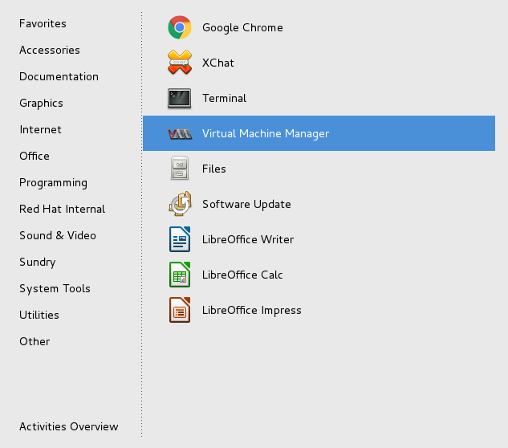
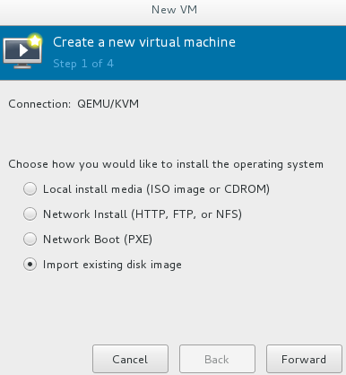
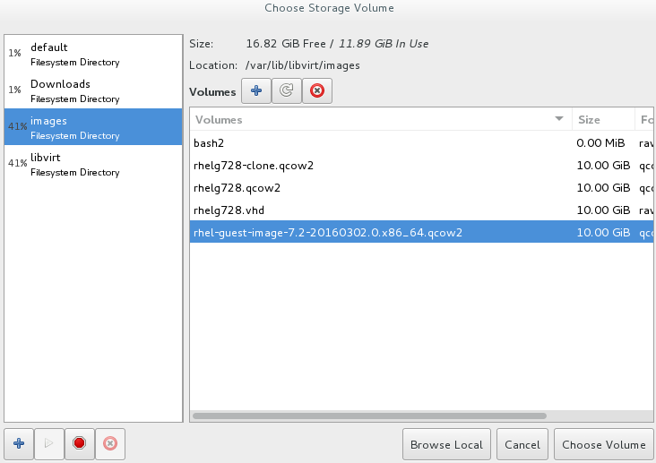
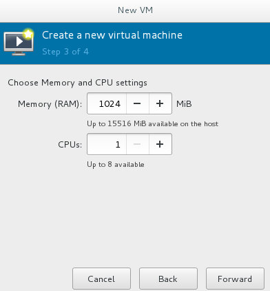
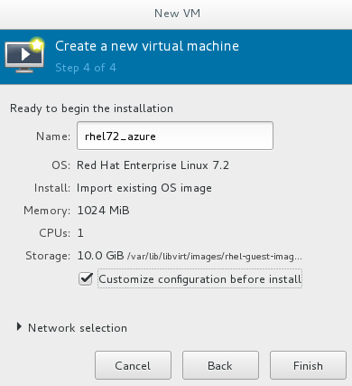
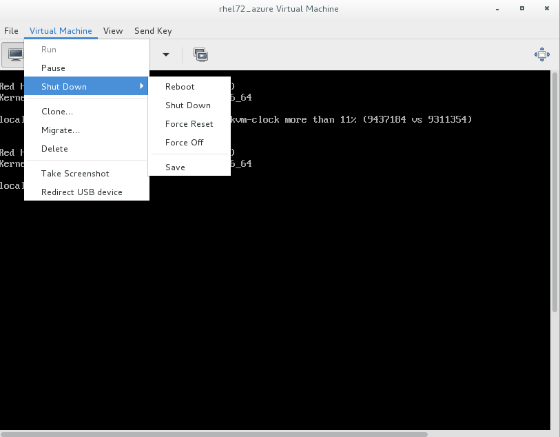
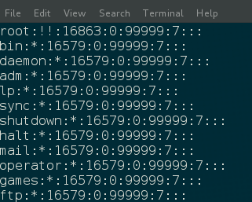
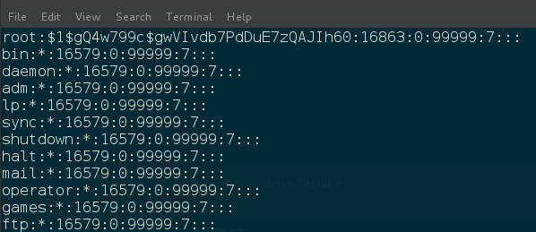

:data-uri:

= Building a RHEL gold image for Azure

== Introduction and Lab Outline

This lab walks you through the process of building a RHEL "gold image" that can be used in a Microsoft Azure cloud environment. 

This process is necessary if your organisation wants to use Cloud Access, and not Marketplace images, as marketplace images are only available on a Pay As You Go basis, and not via existing Cloud Access subscriptions.

If you're not familiar with Cloud Access, it's a feature of most existing Red Hat subscriptions for RHEL, JBoss, CloudForms, OpenShift and Gluster that allow Enterprise subscriptions to be moved to a public cloud provider.

=== Red Hatters assisting the lab

This lab is being supported by several people who can help out with the lab if you any any questions problems, familiarize yourself with your happy coffee-fueled helpers right here!;

|===
| image:labImages/jreadProfile.jpg[]                               |  | 
| EMEA Solution Architect for Cloud & Service Providers, Lab author | job description placeholder            | job description placeholder
| Email: james@redhat.com                                           | email address placeholder              | email address placeholder 
|===

=== Outline

1. You'll start this lab by SSHing into a workstation
2. Create a local virtual machine from the standard RHEL qcow2 image and boot it up
3. Perform standard installation settings changes like network, bootloader and
removes SSH keys necessary for Azure.
4. Several parts of Azure best practice are covered in this guide
5. The image is then prepared (like Windows Sysprep) so that multiple new images can be created from this template. 
6. Review how the Azure tools work

The **lab code** is: `**L1071**`.

[NOTE]
Because this lab produces a virtual machine that is approximately 10Gb in size,
which is unpractical to upload to Azure during the Red Hat Summit, we will
provide USB sticks to take your image with you to upload in your own time if
you wish. This lab includes instructions on how you would upload the image using the
Azure tools, but you will not practically take that step during this lab.

=== What skills do I need for this lab? 

It's recommended that you have some basic Linux skills - Red Hat Certified
Systems Administrator level will be absolutely fine to complete this lab.

Please do ask if you have questions, Red Hatters are always nearby to
help out!

=== After completing this lab, you should be able...

- To understand how to build a RHEL gold image for Azure
- To understand the reasons behind some of the changes we make for Azure
- Be able to build your own Azure image for use in Cloud Access

== Lab Orientation 
=== Environment

In this lab, we'll be using the lab laptop only. No connection details or
networking details or Azure deatails are needed, no Red Hat subscriptions are
needed either. Very simple really!

=== Errata

This lab was taken from a similar excellent knowledge base article on the Red Hat
customer portal.

Small changes to those instructions to that document have been made to convert
it to a Red Hat Summit lab, so if you do find spelling mistakes or
glitches, please do point them out and we'll correct them through the Red Hat Summit!

Be sure to add the following article to your bookmarks **for reference after the Red Hat Summit**!

image::labImages/article.png[]
https://access.redhat.com/articles/uploading-rhel-image-to-azure

Also, many of the best practices we talk about in this lab are well documented on the Red Hat Customer Portal, see https://access.redhat.com/articles/2758981

=== Packages used in this lab

The following packages are used in this lab. Below, there is a brief
description of what the packages do, and in which repository to find them.

All of these packages are preinstalled for you, this information is provided
just for your reference and to get you familiar with the packages that we'll be
using.

|===
| Package	| Repository | Description
| libvirt	|rhel-7-server-rpms	|Open source API, daemon, and management tool for managing platform virtualization.
| virt-manager	|rhel-7-server-rpms |	A command line and Gnome desktop virtual machine manager used to create and manage KVM virtual machines.
| libguestfs	| rhel-7-server-rpms	| A library for accessing and modifying virtual machine file systems.
| libguestfs-tools	| rhel-7-server-rpms	| System administration tools for virtual machines; includes the guestfish utility.
|===

== Create the RHEL VM from a RHEL KVM Guest Image

Red Hat and the open source community optimized this image for virtualization. Once you have the image configured, you can use this image as a template for creating subsequent VMs in Microsoft Azure. Note the following configuration settings before you create the RHEL VM.

=== VM Configuration Settings

Microsoft Azure VMs must have the following configuration settings. Some of these settings are enabled during the initial VM creation. Other settings are set when provisioning the VM image for Microsoft Azure. Keep these in mind as you move through the procedure and refer back to it if you need to.

|===
| Option | Recommendation
| LVM	| Do not use Logical Volume Management (LVM) on the operating system disk. Instead, use regular partitions and format the disk using ext3, ext4, or xfs. LVM or RAID can be used for data disks.
| ssh	| ssh must be enabled to provide remote access to your Azure VMs.
| dhcp	| The primary virtual adapter should be configured for dhcp (IPv4 only).
| Network Manager	| This service should be disabled on RHEL 6.x images.
| Swap Space	| Do not create a dedicated swap file or swap partition. Swap space may be configured in the Azure Linux agent.
| NIC	| Choose virtio device for the primary virtual network adapter.
| encryption	| Do not use full disk encryption for the operating system disk. Data disks can be encrypted.
|===

== Find the KVM Guest Image

We will now find the latest KVM Guest Image that is pre-downloaded for you on
your workstation. Normally, you can find KVM Guest Images on the Red Hat Customer Portal, but we've cached them locally to save download times. 

[NOTE]
We recommend downloading the latest minor version of each major version of RHEL. Even though we support RHEL 6.7, we prefer you use RHEL 6.9. Likewise, even though RHEL 7.1 is supported, you should use RHEL 7.5. RHEL 7.0 is not supported in Microsoft Azure.

On your lab laptop, run the following command in a terminal to find the pre-downloaded image; 

	cd /opt
    ll

Copy the image to `/var/lib/libvirt/images/`; We create a copy of this image because if we break something during the install, we can just make a new copy without having to download the image again.

	cp rhel-guest-image-7.3-35.x86_64.qcow2 /var/lib/libvirt/images/

== Create a Local RHEL VM from this image

We are now going to create a new virtual machine on the laptop, based on this standard KVM guest image. We will customize this image, then prepare it to upload to Azure.

virt-manager is a virtual machine manager used to create and manage your VMs. It is available to run from the command line and from the Gnome desktop. Enter `virt-manager` at a terminal prompt or select **Virtual Machine Manager** from the Gnome GUI.

Create a new VM and select **Import existing disk image.**

Select the **qcow2** KVM Guest Image from the `/var/lib/libvirt/images` directory. (Choose OS type **Linux** and the appropriate RHEL version in the subsequent dialog box.)

Select the capacity (RAM and CPUs) you want set for your VM. The default **1024mb** of RAM and **1 CPU** is fine for this activity.

Review the settings and choose a name for this image. Select the **Customize configuration before install** check box.

On the custom configuration dialog box, make sure that **virtio** is set as the NIC Device model.

image::labImages/virtio2.png[] 

Click Begin **Installation.**

Once installation begins, the VM console appears and boots to a login prompt. (You may have to press Enter a couple of times to get the prompt to show up.)

Once the login prompt appears, **Shut Down** the VM.

Once you have shut down the VM, we will now set up root access to the image.

=== Set Up Root Access to the RHEL VM Image

Before transferring the RHEL VM image to Microsoft Azure, you need to set up root access to the VM. You can do this by using a public/private key generator like ssh-keygen, or you can set up a root password by completing the steps below. The VM must be shut down.

On your Azure administration server, use openssl to generate a new encrypted password for the root account on the new VM.

	$ openssl passwd -1 <password>

Copy the encrypted password string.

Because of SELinux limitations on the laptops, as you are not the root user, you must temporarily move the image out of it's default directory and work on it in your home directory;

	mv /var/lib/libvirt-images/<image-name> ~/

Launch the guestfish utility to access the etc/shadow file on the image.

	$ guestfish -a ~/<image_name>

Enter the following commands at the guestfish command prompt.

	><fs> run
	><fs> list-filesystems
	><fs> mount /dev/sda1 /

Edit the shadow file using vi (or another text editor). Replace the root password value with the encrypted password generated by the openssl command.

	><fs> vi /etc/shadow

When you edit the **shadow** file, you replace the root password null value that is represented by !! in the unedited file. The first example below is unedited, and the second contains the new root password (encrypted).

Save your changes to /etc/shadow.

Exit the guestfish utility.

	><fs> quit

Now, we can move the image back to it's propper location;

	mv ~/<image-name> /var/lib/libvirt/images/

=== Start the VM in virt-manager again

Verify root access by starting the RHEL VM and logging in as root from the VM running in virt-manager. Use the root password you created earlier. If the root password does not work, check the /etc/shadow file to make sure the password was set up properly.

Once you are logged in using the root account, you're ready to configure the image.

== Configure and Convert the Image
Complete the procedures in the following sections to finalize the image configuration.

=== Install Hyper-V Device Drivers on the RHEL VM (if needed)
Microsoft provides network and storage device drivers as part of their Linux Integration Services for Hyper-V package. Hyper-V device drivers may need to be installed on the RHEL VM prior to importing it to Microsoft Azure. Use the `lsinitrd | grep hv` command to verify that the drivers are installed. If they are not installed, complete the following steps to manually configure the Hyper-V device drivers.

Note the spaces before and after the quotes. For example, add_drivers+=" hv_vmbus ". This ensures that unique drivers are loaded in the event that other Hyper-V drivers already exist in the environment.

On the RHEL VM, add the driver parameters to the /etc/dracut.conf file.

	add_drivers+=" hv_vmbus "
	add_drivers+=" hv_netvsc "
	add_drivers+=" hv_storvsc "

Regenerate the intramfs image.

	dracut -f -v

Verify the configuration changes.

	lsinitrd | grep hv

You should see a list of Hyper-V drivers similar to the following drivers.

image::labImages/virt-manager_5.png[]

== Configure the RHEL VM Image
The RHEL VM requires further configuration changes to serve as your gold RHEL VM image in Microsoft Azure. Complete the following steps to make these changes. 

If you are unfamiliar with this service, it's used to do the initial setup of virtual machines from generic images. OpenStack, and some other cloud platforms host a metadata server, which give images their initial hostname, username, ssh keys and similar. 

Azure does not support `cloud-init`, instead the Windows Azure Live Agent (WALA) does most of the tasks that `cloud-init` normally does. 

Stop the cloud-init service (if present).

	systemctl stop cloud-init

Remove the cloud-init software.

	yum remove cloud-init

Edit the /etc/ssh/sshd_config file and enable password authentication. This allows you to use SSH password authentication without using public key authentication. 

	PasswordAuthentication yes

Set a generic host name.

	hostnamectl set-hostname localhost.localdomain

Edit /etc/sysconfig/network-scripts/ifcfg-eth0 so it matches the following list of configuration details.

	DEVICE="eth0"
	BOOTPROTO="dhcp"
	ONBOOT="yes"
	TYPE="Ethernet"
	USERCTL="no"
	PEERDNS="yes"
	IPV6INIT="no"

Remove any persistent network device rules.

	rm -f /etc/udev/rules.d/70-persistent-net.rules
	rm -f /etc/udev/rules.d/75-persistent-net-generator.rules

Set the network service to start automatically.

	chkconfig network on

Set ssh to start automatically.

	systemctl enable sshd
	systemctl is-enabled sshd

Modify the kernel boot parameters.

a. Add the following options to the end of the GRUB_CMDLINE_LINUX line in the `/etc/default/grub` file.

	earlyprintk=ttyS0
	console=ttyS0
	rootdelay=300
	grub changes

- The the `console` and `earlyprintk` statements allow the Azure diagnostics to pick up early bootup messages from the virtual machine in Azure. Note the Azure does not provide console access, however, so this is read-only.

b. Remove the following options, if they are present.

	rhgb
	quiet
	crashkernel=auto

- The `rhgb` statement normally is used to show a pretty/graphical boot. This won't be seen in Azure, and the diagnostic logs are more useful to us.

- Removing the quiet option will show us more log messages.

- `crashkernel=auto` tells the kernel to use the automatic mode in a crash, rather than choosing another option.

Regenerate the grub.cfg file. This updates the grub configuration with the changes we made above.

	grub2-mkconfig -o /boot/grub2/grub.cfg

In a production environment, it's necessary to register RHEL instances using `subscription-manager` to receive updates. It might seem like a good idea to do this in your gold image, but for the following reasons this isn't recommended;

- Your machine ID will be duplicated, causing problems when you launch 2x instances.

- A subscription will be consumed for your gold-image, which is in storage, doing nothing.

- If your subscriptions expire or change, you would need to update your gold image.

== Install the Windows Azure Linux Agent (WALinuxAgent/WALA).

Enable the following repository, which contains the agent;

	cd /etc/yum.repos.d/
	wget http://192.168.103.200/files/rhel-image-azure-lab-repo/rhel-image-azure-lab-repo.conf

[NOTE]
For production environments, the `rhel-7-server-extras-rpms` includes the Windows Azure Linux Agent.

It's always a good idea to clean the yum cache after repos change;

	yum clean all

Install the agent, and configure it to start on boot;

	yum -y install WALinuxAgent
	systemctl enable waagent.service

Edit the following lines in the /etc/waagent.conf file to configure swap space for provisioned VMs. Set swap space for whatever is appropriate for your provisioned VMs.

	Provisioning.DeleteRootPassword=n
	ResourceDisk.Filesystem=ext4
	ResourceDisk.EnableSwap=y
	ResourceDisk.SwapSizeMB=2048

Take a snapshot of the VM.

From the VM menu:

a. Select View.

b. Select Snapshots.

c. Click the plus symbol and create the snapshot.

Prepare the VM for Azure provisioning by cleaning up the existing provisioning details; Azure will reprovision the VM in Azure. This command generates warnings, which is expected.

	waagent -force -deprovision

Clean the shell history and shut down the VM.

	export HISTSIZE=0
	poweroff

== Convert the RHEL VM Image to VHD

All Azure VM images must be in vhd format. This section describes how to convert your template image from qcow2 to vhd format. Once you have converted the image to vhd using one of the conversion procedures below, proceed to the following section and authenticate your server.

Important: The resulting vhd file must be sized to the nearest 1 MB boundary for Microsoft Azure. The Indirect Method of conversion below has been thoroughly tested. You can use one of the Direct Methods for a 7.x or 6.x KVM Guest Image. Note that the Indirect Method should be used if the Azure VM does not start in Microsoft Azure after using one of the other methods of conversion.

=== Indirect Method

Convert the qcow2 image to raw format, resize it, and convert the raw image to vhd.

Convert the image from qcow2 to raw.

	qemu-img convert -f qcow2 -O raw <image-xxx.qcow2> <image-xxx.raw>

Save the following as a script. (These steps use aligned-size.sh.) The script will calculate the size of the raw image to the nearest 1 MB boundary.

	#!/bin/bash
	rawdisk="image-xxx.raw"
	MB=$((1024 * 1024))
	size=$(qemu-img info -f raw --output json "$rawdisk" | gawk 'match($0, /"virtual-size": ([0-9]+),/, val) {print val[1]}')
	rounded_size=$((($size/$MB + 1) * $MB))
	echo "rounded size = $rounded_size"
	export rounded_size

Run the script.

	sh aligned-size.sh

Resize the raw image using the rounded size.

	qemu-img resize -f raw <image-xxx.raw> <rounded-size>

Convert the raw disk image to vhd format.

Important: qemu-img version 1.5.3 is used in this procedure. Check the qemu-img version using yum info qemu-img (or dnf info qemu-img for Fedora 22 or later). If the version is 2.2.1 or later, add the option force_size in the conversion command, for example, subformat=fixed,force_size. All other command options remain the same.

	qemu-img convert -f raw -o subformat=fixed -O vpc <image-xxx.raw> <image-xxx.vhd>

To verify the file is resized correctly, show the virtual-size using the following command.

	qemu-img info --output=json -f vpc <path-to-image>

	Divide the virtual-size value by 1024, twice. If the result is a whole number, the vhd file is aligned properly.

	<virtual-size> / 1024 / 1024

== RHEL 7.2 and 7.3 Direct Method

By default, the RHEL 7.2 or 7.3 KVM Guest Image is already sized to an even 1 MB boundary and can be converted directly from qcow2 to vhd.

Use the following command to directly convert the file.

	qemu-img convert -f qcow2 -o subformat=fixed -O vpc <rhel-guest-image-7.2-xxx.qcow2> <rhel-guest-image-7.2-xxx.vhd>

To verify the file is resized correctly, show the virtual-size using the following command.

	qemu-img info --output=json -f vpc <path-to-image>

Divide the virtual-size value by 1024, twice. If the result is a whole number, the vhd file is aligned properly. If the result has a decimal point, the file is not sized correctly and you should use the Indirect Method.

	<virtual-size> / 1024 / 1024

Resize the image using the rounded size.

	qemu-img resize -f qcow2 <rhel-guest-image-6.8-xxx.qcow2> <rounded_size>

Convert the image to vhd format.

	qemu-img convert -f qcow2 -o subformat=fixed -O vpc <rhel-guest-image-6.8-xxx.qcow2> <rhel-guest-image-6.8-xxx.vhd>

To verify the file is resized correctly, show the virtual-size using the following command.

	qemu-img info --output=json -f vpc <path-to-image>

Divide the virtual-size value by 1024, twice. If the result is a whole number, the vhd file is aligned properly. If the result has a decimal point, the file is not sized correctly and you should use the Indirect Method.

	<virtual-size> / 1024 / 1024

This completes the first part of this procedure.

Provision the VM in Microsoft Azure
Complete the procedures in the following sections to upload, provision, and start a RHEL VM in Microsoft Azure.

== Read-Only: How it would work with Azure

[NOTE]
We cannot actually run these commands in this lab, because 20+ people uploading 
10Gb images would consume all the bandwidth at Red Hat Summit, and would 
also take quite some time. This section of the lab is for reading only, we cannot
do these steps on the laptops. 

Enter az login to authenticate your Azure administration server and log in.

	az login

Example:

	[clouduser@localhost]$ az login
	To sign in, use a web browser to open the page https://aka.ms/devicelogin and enter the code FDMSCMETZ to authenticate.
	  [
		{
		  "cloudName": "AzureCloud",
		  "id": "",
		  "isDefault": true,
		  "name": "",
		  "state": "Enabled",
		  "tenantId": "",
		  "user": {
			"name": "",
			"type": "user"
		  }
		}
	  ]

===  Export a Storage Account Key

Important: The following steps are only for users that have existing resources for the VM in Microsoft Azure. If you need to create new Azure resources, go to Set Up New Resources in Microsoft Azure.

Complete the steps below to get your storage account key and export it to Microsoft Azure.

Get the storage account connection string.

	az storage account show-connection-string -n <storage-account-name> -g <resource-group>

Example:

	[clouduser@localhost]$ az storage account show-connection-string -n azrhelclistact -g azrhelclirsgrp
	{
	  "connectionString": "DefaultEndpointsProtocol=https;EndpointSuffix=core.windows.net;AccountName=azrhelclistact;AccountKey=NreGk...=="
	}

Export the connection string. Copy the connection string and paste it into the following command. This connects your system to the storage account.

	export AZURE_STORAGE_CONNECTION_STRING="<storage-connection-string>"

Example:

	[clouduser@localhost]$ export AZURE_STORAGE_CONNECTION_STRING="DefaultEndpointsProtocol=https;EndpointSuffix=core.windows.net;AccountName=azrhelclistact;AccountKey=NreGk...=="

Once you have exported the storage connection string, go to Upload and Provision the Azure RHEL VM.

Set Up New Resources in Microsoft Azure
Complete the following steps to create resources in Microsoft Azure.

Create a resource group in an Azure region.

	az group create --name <resource-group> --location <azure-region>

Example:

	[clouduser@localhost]$ az group create --name azrhelclirsgrp --location southcentralus
	{
	  "id": "/subscriptions//resourceGroups/azrhelclirsgrp",
	  "location": "southcentralus",
	  "managedBy": null,
	  "name": "azrhelclirsgrp",
	  "properties": {
		"provisioningState": "Succeeded"
	  },
	  "tags": null
	}

Create a storage account. Refer to Storage SKU Types for SKU type descriptions.

	az storage account create -l <azure-region> -n <storage-account-name> -g <resource-group> --sku <sku_type>

Example:

	[clouduser@localhost]$ az storage account create -l southcentralus -n azrhelclistact -g azrhelclirsgrp --sku Standard_LRS
	{
	  "accessTier": null,
	  "creationTime": "2017-04-05T19:10:29.855470+00:00",
	  "customDomain": null,
	  "encryption": null,
	  "id": "/subscriptions//resourceGroups/azrhelclirsgrp/providers/Microsoft.Storage/storageAccounts/azrhelclistact",
	  "kind": "Storage",
	  "lastGeoFailoverTime": null,
	  "location": "southcentralus",
	  "name": "azrhelclistact",
	  "primaryEndpoints": {
		"blob": "https://azrhelclistact.blob.core.windows.net/",
		"file": "https://azrhelclistact.file.core.windows.net/",
		"queue": "https://azrhelclistact.queue.core.windows.net/",
		"table": "https://azrhelclistact.table.core.windows.net/"
	},
	"primaryLocation": "southcentralus",
	"provisioningState": "Succeeded",
	"resourceGroup": "azrhelclirsgrp",
	"secondaryEndpoints": null,
	"secondaryLocation": null,
	"sku": {
	  "name": "Standard_LRS",
	  "tier": "Standard"
	},
	"statusOfPrimary": "available",
	"statusOfSecondary": null,
	"tags": {},
	  "type": "Microsoft.Storage/storageAccounts"
	}

Get the storage account connection string.

	az storage account show-connection-string -n <storage-account-name> -g <resource-group>

Example:

	[clouduser@localhost]$ az storage account show-connection-string -n azrhelclistact -g azrhelclirsgrp
	{
	  "connectionString": "DefaultEndpointsProtocol=https;EndpointSuffix=core.windows.net;AccountName=azrhelclistact;AccountKey=NreGk...=="
	}

Export the connection string. Copy the connection string and paste it into the following command. This connects your system to the storage account.

	export AZURE_STORAGE_CONNECTION_STRING="<storage-connection-string>"

Example:

	[clouduser@localhost]$ export AZURE_STORAGE_CONNECTION_STRING="DefaultEndpointsProtocol=https;EndpointSuffix=core.windows.net;AccountName=azrhelclistact;AccountKey=NreGk...=="

Create the storage container.

	$ az storage container create -n <container-name>

Example:

	[clouduser@localhost]$ az storage container create -n azrhelclistcont
	{
	  "created": true
	}

Create a virtual network.

	az network vnet create -g <resource group> --name <vnet-name> --subnet-name <subnet-name>

Example:

	[clouduser@localhost]$ az network vnet create --resource-group azrhelclirsgrp --name azrhelclivnet1 --subnet-name azrhelclisubnet1
	{
	  "newVNet": {
		"addressSpace": {
		  "addressPrefixes": [
		  "10.0.0.0/16"
		  ]
	  },
	  "dhcpOptions": {
		"dnsServers": []
	  },
	  "etag": "W/\"\"",
	  "id": "/subscriptions//resourceGroups/azrhelclirsgrp/providers/Microsoft.Network/virtualNetworks/azrhelclivnet1",
	  "location": "southcentralus",
	  "name": "azrhelclivnet1",
	  "provisioningState": "Succeeded",
	  "resourceGroup": "azrhelclirsgrp",
	  "resourceGuid": "0f25efee-e2a6-4abe-a4e9-817061ee1e79",
	  "subnets": [
		{
		  "addressPrefix": "10.0.0.0/24",
		  "etag": "W/\"\"",
		  "id": "/subscriptions//resourceGroups/azrhelclirsgrp/providers/Microsoft.Network/virtualNetworks/azrhelclivnet1/subnets/azrhelclisubnet1",
		  "ipConfigurations": null,
		  "name": "azrhelclisubnet1",
		  "networkSecurityGroup": null,
		  "provisioningState": "Succeeded",
		  "resourceGroup": "azrhelclirsgrp",
		  "resourceNavigationLinks": null,
		  "routeTable": null
		}
	  ],
	  "tags": {},
	  "type": "Microsoft.Network/virtualNetworks",
	  "virtualNetworkPeerings": null
	  }
	}

=== Upload and Provision the Azure RHEL VM
Complete the following steps to upload and provision the VM. Note that the exported storage connection string does not persist after a system reboot. If any of commands in the following steps fail, export the storage connection string again. (See Steps 3 and 4 in the previous section.)

Upload the image to the storage container. It may take several minutes.

Note: Enter az storage container list to get the list of storage containers.

	az storage blob upload --account-name <storage-account-name> --container-name <container-name> --type page --file <path-to-vhd> --name <image-name>.vhd

Example:

	[clouduser@localhost]$ az storage blob upload --account-name azrhelclistact --container-name azrhelclistcont --type page --file rhel-image-7.3.vhd --name rhel-image-7.3.vhd
	Percent complete: %100.0

Get the URL for the uploaded vhd file. You will need to use this URL in the following step.

	az storage blob url -c <container-name> -n <image-name>.vhd

Example:

	[clouduser@localhost]$ az storage blob url -c azrhelclistcont -n rhel-image-7.3.vhd
	"https://azrhelclistact.blob.core.windows.net/azrhelclistcont/rhel-image-7.3.vhd"

=== Create the VM.

Note: The following command uses the option --generate-ssh-keys, which creates a private/public key pair. The private and public key files are created in ~/.ssh on your local machine. The public key is added to the authorized_keys file on the VM for the user specified by the --admin-username option.

	az vm create --resource-group <resource-group> --location <azure-region> --use-unmanaged-disk --name <vm-name> --storage-account <storage-account-name> --os-type linux --admin-username <administrator-name> --generate-ssh-keys --image <URL>

Example:

	[clouduser@localhost]$ az vm create --resource-group azrhelclirsgrp --location southcentralus --use-unmanaged-disk --name rhel-azure-vm-1 --storage-account azrhelclistact --os-type linux --admin-username clouduser --generate-ssh-keys --image https://azrhelclistact.blob.core.windows.net/azrhelclistcont/rhel-image-7.3.vhd

	{
	  "fqdns": "",
	  "id": "/subscriptions//resourceGroups/azrhelclirsgrp/providers/Microsoft.Compute/virtualMachines/rhel-azure-vm-1",
	  "location": "southcentralus",
	  "macAddress": "",
	  "powerState": "VM running",
	  "privateIpAddress": "10.0.0.4",
	  "publicIpAddress": "12.84.121.147",
	  "resourceGroup": "azrhelclirsgrp"

Note the public IP address. You will need this to log in to the VM in the next step.

Start an SSH session and log in to the appliance.

	ssh -i <path-to-ssh-key> <admin-username@public-IP-address>

Example:

	[clouduser@localhost]$ ssh  -i /home/clouduser/.ssh/id_rsa clouduser@12.84.121.147
	The authenticity of host '12.84.121.147' can't be established.
	Are you sure you want to continue connecting (yes/no)? yes
	Warning: Permanently added '12.84.121.147' (ECDSA) to the list of known hosts.

	[clouduser@rhel-azure-vm-1 ~]$

If you see your user login, you have successfully deployed your Azure RHEL VM.

You can now go to the Microsoft Azure portal and check the audit logs and properties of your resources. You can manage your VMs directly in the Microsoft Azure portal. If you are managing multiple VMs, you should use the ARM CLI. The ARM CLI provides a powerful interface to your resources in Microsoft Azure. Enter az --help in the CLI or go to Azure CLI 2.0 Command Reference to learn more about the commands you use to manage your VMs in Microsoft Azure.

Using other Authentication Methods
While recommended for increased security, the use of the Azure-generated public key file in the example above is not a requirement. The following examples show two other methods for SSH authentication.

Example 1: These command options provision a new Azure VM without generating a public key file. They allow SSH authentication using a password.

	az vm create --resource-group <resource-group> --location <azure-region> --use-unmanaged-disk --name <vm-name> --storage-account <storage-account-name> --os-type linux --admin-username <administrator-name> --admin-password <ssh-password> --image <URL>

Authentication command: ssh <admin-username@public-ip-address>

Example 2: These command options provision a new Azure VM that you can use the SSH protocol to access using an existing public key file.

	az vm create --resource-group <resource-group> --location <azure-region> --use-unmanaged-disk --name <vm-name> --storage-account <storage-account-name> --os-type linux --admin-username <administrator-name> --ssh-dest-key-path <path-to-existing-ssh-key> --image <URL>

Authentication command: ssh -i <path-to-existing-ssh-key> <admin-username@public-ip-address>

== Summary

In this lab we've run through most of the basic steps needed to create a Red Hat Enterprise Linux image for Azure. We covered why the Windows Azure live agent needs to be installed, as well as common configuration changes necessary.

We hope that you are now more familiar with the process, please do review the recommended links below to learn more.

Any feedback, comments about this lab guide, please email james@redhat.com ,
and enjoy the rest of the Red Hat Summit!

=== Recommended Links

Original lab guide document, also explains how to build images from ISOs and more; 
https://access.redhat.com/articles/uploading-rhel-image-to-azure

FAQ and Best Practices;
https://access.redhat.com/articles/2758981
