<h2>Red Hat Summit, San Francisco 2018</h2>
**Title**: First time hands-on with Red Hat OpenStack Platform (**L1009**) 
**Date**: 9th May 2018 

**Authors/Lab Owners**:
<ul class="tab">
<li>Rhys Oxenham <<roxenham@redhat.com>></li>
<li>Jacob Liberman <<jliberma@redhat.com>></li>
</ul>

#**Lab Contents**#

1. **Getting Started**
2. **Creating Users, Roles, Tenants, and policies via Keystone (Identity Service)**
3. **Creating/Adding Images into Glance (Image Service)**
4. **Creation and configuration of Networks in Neutron (Networking Service)**
5. **Creation of Instances in Nova (Compute Service)**
6. **Creation and Attachment of Block Devices with Cinder (Volume Service)**
7. **Deployment of Application Stacks using Heat (Orchestration)**
8. **Deployment of Load Balancers using Neutron's LBaaS feature**

<!--BREAK-->

#**Lab Overview**

First of all, it's my pleasure to welcome you to the Red Hat Summit 2018, here at the San Francisco Moscone Centre! The past few years have been an exciting time for both Red Hat and the OpenStack community; we've seen unprecedented interest and development in this new revolutionary technology and we're proud to be at the heart of it all. Red Hat is firmly committed to the future of OpenStack; our goal is to continue to enhance the technology, make it more readily consumable and to enable our customers to be successful when using it.

This hands-on lab aims to get you, the attendees, a bit closer to Red Hat OpenStack Platform. It's comprised of a number of individual steps inside of this lab-guide that will run you through some of the more common tasks, such as initial configuration, network management, image deployment, block storage assignment, and virtual machine provisioning; giving you a hands-on overview of OpenStack, how the components fit together, and how to use it. We will use a combination of command-line tools and interaction via the OpenStack Dashboard (Horizon).

Whilst you'll be asked to configure some fundamental components within OpenStack, you won't need to install OpenStack from scratch within this lab, we've provided a pre-installed OpenStack environment with a simple configuration - a one controller, one networker, and two compute node layout. These machines will be virtual machines themselves, running on-top of a shared public cloud environment. You will have been provided with the necessary connection details on-screen and the first lab will demonstrate how to connect into the environment and how to get started with the lab sections.

> **NOTE**: If you've **not** been provided with connection details or you do not see your unique session information on-screen, please ask and we'll ensure that access is provided.

If you have any problems at all or have any questions about Red Hat or our OpenStack distribution, please put your hand-up and a lab moderator will be with you shortly to assist - we've asked many of our OpenStack experts to be here today, so please make use of their time. If you have printed materials, they're yours to take away with you, otherwise the online copy will be available for the foreseeable future; I hope that they'll be useful assets in your OpenStack endeavours.

#**Lab 1: Getting Started**

The OpenStack environment that we're going to be using has been preinstalled and largely preconfigured for the purposes of this lab. We've done our best to preconfigure the classroom and ensure that the cloud-based virtual machines that make up the infrastruture are ready to go at the start of the lab, but we need to ensure that you're able to log in to the environment, as the workstation you're at will be used for multiple different labs during the Red Hat Summit.

# Lab Environment

The environment, despite running in the public cloud, has been deployed with OSP director, Red Hat's deployment and lifecycle management platform for OpenStack. As such, it's been deployed with the TripleO methodology, i.e. a smaller 'bootstrap' OpenStack cloud, known as the **undercloud** deploys the 'production' cloud known as the **overcloud**, i.e. where your workloads would actually run. The overcloud that has been deployed in the lab environment is a simple configuration, comprising of a single controller, single networker, and dual compute node setup. All of these nodes, the undercloud, and all overcloud nodes are virtual machines running within a unique session on-top of the public-cloud ready for your consumption, roughly looking like the following:

> **NOTE**: In the above image you'll see the **bastion** host is the one that we'll be using as a jump host, i.e. the machine that we connect to first to establish a connection into the lab environment that we'll be using for the rest of the labs; this is the only virtual machine in your unique environment that has secure shell access exposed to the public internet.

In this lab, you **won't** be utilising the undercloud platform to deploy any overcloud infrastructure - this has already been done for you, but you will be using it as the base in which we carry out our labs. If you're interested in learning more, there's a later lab today, **L1010** ([Hands on with Red Hat OpenStack Platform director](https://agenda.summit.redhat.com/SessionDetail.aspx?id=153520)) in the same room, which will allow you to build upon your OpenStack knowledge and experience the deployment side.

Using a virtualised infrastructure inside of the public cloud allows us to have full control over all of the network and storage without impacting other lab users, and whilst we won't be running any intensive workloads, it allows us to build up and test OpenStack in a short amount of time and with great flexibility. To re-iterate, we'll first be connecting to the **jump host**, and then further connecting to our **undercloud** machine as the conduit into our overcloud OpenStack environment. The undercloud will be used for both executing commands on the overcloud, and also as a conduit for connecting to our overcloud nodes and any deployed resources when required to do so.

# Connecting

As previously highlighted, the workstation you're sat at will be used by many different lab sessions, yet each of you will have been allocated a unique environment based within the public cloud for you to use to complete the lab steps associated with each session. On screen you should already have a tab open to the lab request form where we need to select the correct lab. If you don't have this in front of you, it's available [here](https://www.opentlc.com/guidgrabber/guidgrabber.cgi).

What you should see is as follows, noting that I've already selected the correct lab (**'L1009 - First time hands-on with Red Hat OpenStack Platform'**) and have entered the activation key '**openstack**', which you will need to do too:

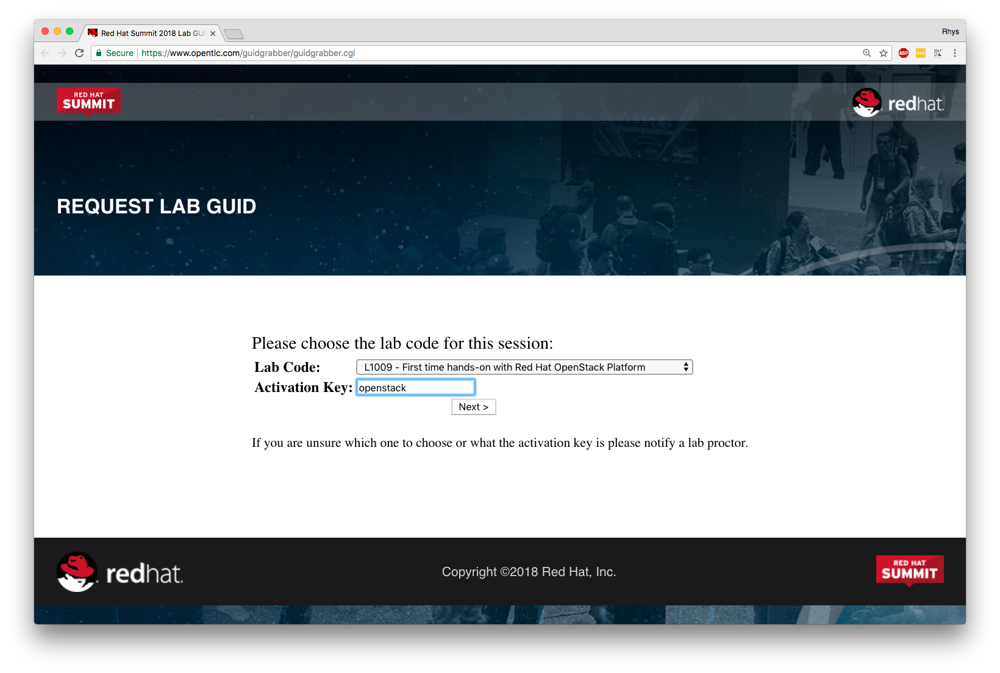

This will allocate a pre-deployed session for your usage with **GUID** that's used to uniquely identify your session, and will provide you with instructions on how to connect to the **jumphost** that we discussed above. Here's an example below:

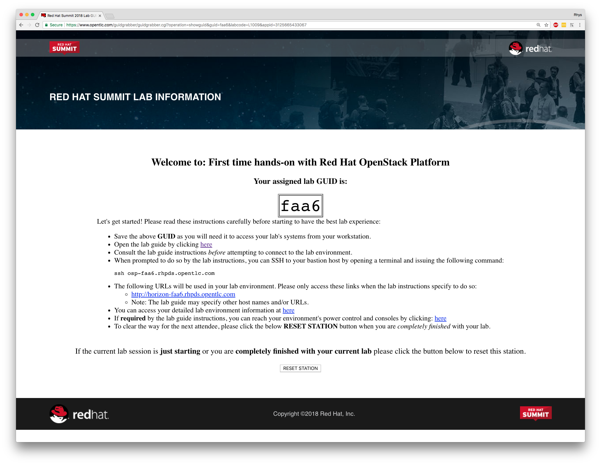

You'll see that my assigned lab GUID is '**faa6**' and is used to uniquely identify my session, and is used as part of the connection address. Halfway down the page you'll see an ssh command that you'll need to use to connect to the environment. The environment takes around 20 minutes to power-up, and this should have already been done for you prior to the session starting, but don't be alarmed if you cannot connect in straight away, it may just require a few more minutes. Use the exact connection address that it provides you on your screen by copying and pasting the text from the webpage into a terminal emulator, here I'm using my example but you'll need to **replace** this with your own:

	$ ssh osp-faa6.rhpds.opentlc.com
	The authenticity of host 'osp-faa6.rhpds.opentlc.com (129.146.91.32)' can't be established.
	ECDSA key fingerprint is SHA256:SqbVF0TGdHuTsoDChp6/cw4jFHqwJlBWFOeqwd88Bi4.
	Are you sure you want to continue connecting (yes/no)? yes
	(...)

> **NOTE**: If you lose your connection details you can return [here](https://www.opentlc.com/guidgrabber/guidgrabber.cgi) at any time.

 
Next, we can jump straight to our **undercloud** machine, as this is the one that we're going to be using for all of the lab sections, note that we're using sudo below as the root user on the jump host is the only one configured with the ssk-keys:

	$ sudo ssh stack@undercloud

**Only** if this is unsuccessful (e.g. for some reason that there's no entry in /etc/hosts), attempt the following:

	$ sudo ssh stack@192.168.122.253
	
You will have full root access (via sudo) and control over this virtual machine, and we'll run our tasks directly here. If you're still unable to connect into your environment after a few minutes, please ask for assistance.

#**Lab 2: Creating Users, Roles and Tenants via Keystone (Identity Service)**

##**Introduction**

Keystone is the identity management component of OpenStack, a common authentication and authorisation store. It's primarily responsible for managing users, their roles and the projects (tenants) that they belong to, in other words - who's who, what can they do, and to which groups they belong to; essentially a centralised directory of users mapped to the services they are granted to use. In addition to providing a centralised repository of users, Keystone provides a catalogue of services deployed in the environment, allowing service discovery with their endpoints (or API entry-points) for access. Keystone is responsible for governance in an OpenStack cloud, it provides a policy framework for allowing fine grained access control over various components and responsibilities.

As a crucial and critical part of OpenStack infrastructure, Keystone is used to verify *all* requests from end-users to ensure that what clients are trying to do is both authenticated and authorised. In modern day implementations of Keystone, we rely on non-persistent **tokens** that are issued to authenticated users; these are signed by Keystone and contain all of the necessary information for all OpenStack components to validate the users authority over the tasks that they're being asked to perform.

##**Creating Users**

As part of the lab we're going to allow you to create your own user and project using Keystone.

As we highlighted previously, we're going to use the **undercloud** machine as our 'command and control' system, and will be used to carry out all tasks. So, once you've logged onto your undercloud lab machine, you'll notice that there are a number of files sitting within the 'stack' users home directory. There are two (but really three) primary files that we need to be concerned with:

* **~/stackrc** - the environment 'source' file in which we can load in environment variables to configure the **undercloud** with the OpenStack command line tools (we won't be using this file during this particular session, but if you join for the OSP director lab later in the day, you will use this file extensively)  
* **~/overcloudrc** - the primary environment 'source' file that contains the OpenStack environment variables that will allow us to use the OpenStack command line tools against our **overcloud** deployment.  
* **~/overcloudrc.v3** - Essentially the same as the above, but uses Keystone v3 API as opposed to v2 by default; Red Hat OpenStack Platform is almost entirely utilising v3 at present, but some things still require v2, hence why we provide both of these files.  

The **overcloudrc** file will allow you to have admin access to the environment so that you can create your own user and project - just like Linux administration, the root user is not used for day-to-day tasks, hence why we're going to create our own one. Note that we're only going to be using this overcloudrc file for the purpose of this lab, we'll generate our own 'rc file' later on. First, let's source that file:

	$ source ~/overcloudrc
	
> **NOTE**: This file allows users to **administratively** control the overcloud, we'll need to use this with caution.
	
By running the above command, you will have configured environment variables that the OpenStack command line tools will use, e.g. the API location of Keystone, and the admin username and password. You'll also notice that the command line has the "**(overcloud)**" prefix to signify that you'll be issuing OpenStack commands against the overcloud by default.

The next few steps create a '**user**' account, a '**project**' (or 'tenant') which is a group of users, and a '**role**' which is used to determine permissions across the stack. You can choose your own username and password here, just remember what they are as we'll use them later, and choose something **generic** (i.e. not your usual password) as it'll be used in plaintext later in the lab. I've used my initials '**rdo**' for my user below:

	$ openstack user create --password-prompt <your username>
	User Password:
	Repeat User Password:
	+----------+----------------------------------+
	| Field    | Value                            |
	+----------+----------------------------------+
	| email    | None                             |
	| enabled  | True                             |
	| id       | 2c580c9e773143f5b4d82b9a6131b47a |
	| name     | rdo                              |
	| options  | {}                               |
	| username | rdo                              |
	+----------+----------------------------------+

> **NOTE**: The command shown above will ask you to choose a new password, but it will not be visible, even when typing it out.

Next, create a project for your user to reside in, let's use the project name '**demo**':

	$ openstack project create demo
	+-------------+----------------------------------+
	| Field       | Value                            |
	+-------------+----------------------------------+
	| description | None                             |
	| enabled     | True                             |
	| id          | f991d44fac91419c8e6016184381871a |
	| name        | demo                             |
	+-------------+----------------------------------+

Finally we can give the user a role and assign that user to the project we just created. Note that we're using usernames, roles and projects by their name here, but it's possible to use their id's instead. Let's assign our user the '**admin**' role, and place them into our new project, remebering to use the username and project name from the earlier commands:

	$ openstack role add --user <your username> --project demo admin
	+-----------+----------------------------------+
	| Field     | Value                            |
	+-----------+----------------------------------+
	| domain_id | None                             |
	| id        | 221700f25ec24d94b69fea75b6141da1 |
	| name      | admin                            |
	+-----------+----------------------------------+

To save time and to not have to worry about specifying usernames/passwords on the command-line, it's prudent to create another 'rc' or 'source' file which will load in environment variables as we used previously for the main admin user. Let's do the same for your new user. We first need to set some temporary environment variables, making sure that you substitute these values with your own:

	$ export USERNAME=<your username>
	$ export PASSWORD=<your password>
	
Now we can create our file:

	$ cat > ~/demorc <<EOF
	export OS_USERNAME=$USERNAME
	export OS_PROJECT_NAME=demo
	export OS_PASSWORD=$PASSWORD
	export OS_AUTH_URL=http://192.168.122.100:5000/v2.0/
	export NOVA_VERSION=1.1
	export OS_NO_CACHE=True
	export COMPUTE_API_VERSION=1.1
	export no_proxy=,192.168.122.100,172.16.0.30
	export OS_VOLUME_API_VERSION=3
	export OS_IMAGE_API_VERSION=2
	export OS_AUTH_TYPE=password
	export PS1="[\u@\h \W]\$ "
	export PS1="(overcloud-demo) \$PS1"
	EOF

You can test the file by logging out of your ssh session to the OpenStack virtual machine, logging back in and trying the following-

	$ logout
	$ ssh stack@undercloud

	$ openstack token issue
	Missing value auth-url required for auth plugin password
	
As you can see, without setting the environment variables, the authentication token request has failed. Now let's try it again when sourcing our new **demo** environment file for our new user:

	$ source ~/demorc
	$ openstack token issue
	+------------+-----------------------------------------------------------------------------------------------------------------------------------------------------------------------------------------+
	| Field      | Value                                                                                                                                                                                   |
	+------------+-----------------------------------------------------------------------------------------------------------------------------------------------------------------------------------------+
	| expires    | 2018-04-09T14:28:04+0000                                                                                                                                                                |
	| id         | gAAAAABay2pkh0i9AQQJyNolx7zkdFQ-3xg102pW2aatmTjutWkl9TX5tV6_pcMxUraCZUCtnWOOIfgRnGt4zvhAQ3G9oks_c4aMHfBaXvyjSDKcj2-aotiT5YicrF5tLnrk-iE2cJbTi7iKbPnjljF7t6Pobf2sj2u3n8lknHynOpzEXqqU-Zs |
	| project_id | f991d44fac91419c8e6016184381871a                                                                                                                                                        |
	| user_id    | 2c580c9e773143f5b4d82b9a6131b47a                                                                                                                                                        |
	+------------+-----------------------------------------------------------------------------------------------------------------------------------------------------------------------------------------+

Note that the first attempt at running the "**openstack token issue**" command failed; it was either expecting you to specify the authorisation credentials as parameters or via environment variables. The second time it should have succeeded (and you'll be presented with a token id starting "**gAAA...**", if not, please check the contents of your **~/demorc** file, and ensure they match the username and password you created earlier in the lab. Once you save the file, you'll need to run '**source ~/demorc**' again to use the new environment variables.

#**Lab 3: Adding Images into Glance (Image Service)**

##**Introduction**

Glance is OpenStack's image service, it provides a mechanism for discovering, registering and retrieving virtual machine images. These images are typically standardised and generalised so that they will require post-boot configuration applied. Glance supports a wide variety of disk image formats, including raw, qcow2, vmdk, ami and iso, all of which can be stored in multiple types of backends, including OpenStack Swift, Ceph, or basic implementations such as NFS, although by default it will use the local filesystem. When a user requests an instance with OpenStack, it's Glance's responsibility to provide that image and allow it to be retrieved prior to instantiation.

Glance stores metadata alongside each image which helps identify it and describe the image, it accomodates multiple container types, e.g. an image could be completely self contained such as a qcow2 image, or it could be a separate kernel and initrd file which need to be tied together to successfully boot an instance of that machine. Glance is made up of two components, the glance-registry which is the actual image registry service and glance-api which provides the RESTful API end-point to the rest of the OpenStack services.

##**Adding an image to Glance**

As previously mentioned, images uploaded to Glance should be 're-initialised' or 'sysprepped' so that any system-specific configuration is wiped away, this ensures that there are no conflicts between instances that are started. It's common practice to find pre-defined virtual machine images online that contain a base operating system and perhaps a set of packages for a particular purpose. The next few steps will allow you to take such an image and upload it into the Glance registry. 

As part of the lab, we'll use an image already residing on the filesystem for you (although with the CLI tools, it's possible to point to a URL) and upload it as our own. Let's verify that the disk image is as expected and has the correct properties:

	$ qemu-img info ~/labs/rhel-server-7.4-x86_64-kvm.qcow2
	image: /home/stack/labs/rhel-server-7.4-x86_64-kvm.qcow2
	file format: qcow2
	virtual size: 10G (10737418240 bytes)
	disk size: 538M
	cluster_size: 65536
	Format specific information:
	    compat: 0.10
	    refcount bits: 16

Next we can create a new image within Glance and import its contents, it may take a few minutes to copy the data. Let's ensure that we've sourced our demo user environment file (noting that it doesn't matter if you've already sourced this file - repeating the source command is safe), and proceed with the image creation:

	$ source ~/demorc

	$ openstack image create rhel7 --public \
		--disk-format qcow2 --container-format bare \
		--file ~/labs/rhel-server-7.4-x86_64-kvm.qcow2
	+------------------+------------------------------------------------------------------------------+
	| Field            | Value                                                                        |
	+------------------+------------------------------------------------------------------------------+
	| checksum         | 2065a01cacd127c2b5f23b1738113325                                             |
	| container_format | bare                                                                         |
	| created_at       | 2018-04-09T13:35:25Z                                                         |
	| disk_format      | qcow2                                                                        |
	| file             | /v2/images/4568dd3f-b6f6-4a8e-b551-473e885cf7c5/file                         |
	| id               | 4568dd3f-b6f6-4a8e-b551-473e885cf7c5                                         |
	| min_disk         | 0                                                                            |
	| min_ram          | 0                                                                            |
	| name             | rhel7                                                                        |
	| owner            | f991d44fac91419c8e6016184381871a                                             |
	| properties       | direct_url='swift+config://ref1/glance/4568dd3f-b6f6-4a8e-b551-473e885cf7c5' |
	| protected        | False                                                                        |
	| schema           | /v2/schemas/image                                                            |
	| size             | 564330496                                                                    |
	| status           | active                                                                       |
	| tags             |                                                                              |
	| updated_at       | 2018-04-09T13:35:34Z                                                         |
	| virtual_size     | None                                                                         |
	| visibility       | public                                                                       |
	+------------------+------------------------------------------------------------------------------+	

The container format is '**bare**' because it doesn't require any additional images such as a kernel or initrd to support it, it's completely self-contained. The '**--public**' option allows any projects to use the image rather than locking it down for the specific project uploading the image. We could have used the parameter '**--private**' to set the opposite if we would have preferred.

In our environment, we use **Swift** as a backing store for our Glance images; Swift is an OpenStack project that provides RESTful object storage, and is deployed automatically with Red Hat OpenStack Platform by default, and provides resiliency and load-balancing for objects right out of the box. When we uploaded our image to Glance, it automatically stored it as an object, the location of which is reflected in the output:

> **direct_url='swift+config://ref1/glance/4568dd3f-b6f6-4a8e-b551-473e885cf7c5'**

If we had multiple OpenStack Controllers, Swift would ensure that this object was replicated across multiple nodes, ensuring that the Glance image (and any other objects held by Swift) are highly available. There are many other storage backends that can be used for image storage with Glance; **Ceph** is one of the most common.

Finally, vertify that the image is available in the repository, and it's status is set to 'active':

	$ openstack image list
	+--------------------------------------+-------+--------+
	| ID                                   | Name  | Status |
	+--------------------------------------+-------+--------+
	| 4568dd3f-b6f6-4a8e-b551-473e885cf7c5 | rhel7 | active |
	+--------------------------------------+-------+--------+

#**Lab 4: Creation of Tenant Networks in Neutron (Networking Service)**

##**Introduction**

Neutron is OpenStack's Networking service and provides an abstract virtual networking API, enabling administrators and end-users to manage both virtual and physical networks for their instances on-top of OpenStack. Neutron simply provides an API for self-service and management but relies on underlying technologies for the actual implementation via Neutron-plugins. The class environment makes use of Open vSwitch, but there are many other plugins available upstream such as Nuage, Juniper Contrail, etc. Neutron allows users to create rich networking topologies within their own projects - having full control over their networks.

We're going to be starting our first instances in the next lab, but for an instance to start, it must be assigned a network to attach to (amongst other configuration requirements, such as the image you want to use). These are typically private networks, i.e. have no public connectivity and is primarily used for virtual machine interconnects and private networking - called a "**tenant network**". Within OpenStack we bridge the private network out to the real world via a public (or 'external') network, it is simply the network interface in which public traffic will connect into, and is typically where you'd assign "**floating IP's**", i.e. IP addresses that are dynamically assigned to instances so that external traffic can be routed through correctly. Instances don't typically have direct access to the public network interface, they only see the private network and the user is responsible for optionally connecting a virtual router to interlink the two networks for both external access and inbound access from outside the private network.

There are many other options for networking configuration with Neutron that does allow instances to be directly connected to an external network (e.g. provider networks, or SR/IOV), but for the purpose of this lab we're going to keep things relatively simple and use the tenant network construct with floating IP's for inbound routing via Neutron's L3 agent.

Neutron's internal to external network architecture (with the L3 agent) looks like the following:

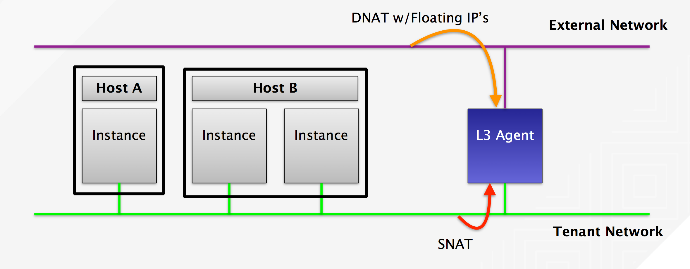

##**Configuring the External Network**

As we mentioned before, external networks provide a mechanism for OpenStack instances to communicate to the outside, but critically to allow instances to have inbound connectivity from the outside via the mechanism of a floating IP. These external networks are typically existing datacentre networks, and OpenStack administrators will need to tell Neutron how to utilise such networks. An administrator must define a name for the network, a subnet (including address ranges), and advise Neutron of which networking bridge (which would be associated with a physical interface) to route external traffic to. It's possible to have multiple external networks within OpenStack, and users can select which networks they want their instance to be able to see, and also which networks they want a floating IP to be listening on.

For the purpose of this lab, we're going to create an external network that is connected to the dedicated public-cloud based environment that you're using (**192.168.122.0/24**). This will allow us to connect directly into instances via floating IP's during a later lab. The first thing we need to do is make sure that we've sourced our environment file for our demo user, noting that the default security policy only allows administrators to define external networks, but we gave our demo user 'admin' privileges in an earlier lab (even though that's not strictly best practice):

	$ source ~/demorc

Next, we need to start defining our external network. This follows the same logical steps as creating _any_ network, regardless of whether you're an administrator or not. However, we need to specify a number of parameters, specifically advising Neutron that this is an external network, and defining exactly how it connects to the outside world. Let's first see all of the networking agents and services that are running within our environment:

	$ openstack network agent list
	+--------------------------------------+----------------------+------------------------------+-------------------+-------+-------+---------------------------+
	| ID                                   | Agent Type           | Host                         | Availability Zone | Alive | State | Binary                    |
	+--------------------------------------+----------------------+------------------------------+-------------------+-------+-------+---------------------------+
	| 124371fc-1bce-48a8-af61-cde99b83e74f | Open vSwitch agent   | summit-networker.localdomain | None              | :-)   | UP    | neutron-openvswitch-agent |
	| 247d49b7-537e-44d9-a3c6-19844be5da88 | Loadbalancerv2 agent | summit-networker.localdomain | None              | :-)   | UP    | neutron-lbaasv2-agent     |
	| 25bd6fe6-b29c-4d0f-9d49-7d7ee0f7d820 | L3 agent             | summit-networker.localdomain | nova              | :-)   | UP    | neutron-l3-agent          |
	| 7bbb6b31-c10c-49f5-a6da-fe50e1670ee7 | Open vSwitch agent   | summit-compute2.localdomain  | None              | :-)   | UP    | neutron-openvswitch-agent |
	| a0ec6b56-bb99-449b-829b-0ee0ab9cf138 | Open vSwitch agent   | summit-compute1.localdomain  | None              | :-)   | UP    | neutron-openvswitch-agent |
	| b5c90ce6-af7f-44c4-aaf5-5beb5afddddd | DHCP agent           | summit-networker.localdomain | nova              | :-)   | UP    | neutron-dhcp-agent        |
	| fd82f7f7-e7fe-4741-93e9-db0484192531 | Metadata agent       | summit-networker.localdomain | None              | :-)   | UP    | neutron-metadata-agent    |
	+--------------------------------------+----------------------+------------------------------+-------------------+-------+-------+---------------------------+

What you'll see is that we have three systems that have networking functions, the '**summit-networker**' machine, and the '**summit-computeX**' machines. The **compute** machines only need to worry about connectivity of virtual machine networks, whereas the dedicated networker machine has to also worry about providing things like external network routing and DHCP services for OpenStack networks and the instances that run on-top of them.

On each of these nodes you'll see '**neutron-openvswitch-agent**' running - this is the agent that's responsible for configuring Open vSwitch on each machine, and setting up traffic flows for each virtual machine and all related services like DHCP, etc. As the **networker** machine is also responsible for network routing (via the L3 agent), it needs to know how to route traffic between administratively-defined external networks and internal tenant networks that the users have control over, hence why you can see the '**neutron-l3-agent**' running on the networker node.

The important thing to understand here is that Neutron only understands **logical** "physical network" names - these logical network names are translated into real underlying networks via a network bridge by the plugin that we're using (in our case, Open vSwitch). To understand how this works, we need to look at the defined logical networks that Open vSwitch is exposing to Neutron via the '**bridge_mappings**' extension. Select the 'id' for the Open vSwitch agent running on '**summit-networker**' in the following command, and it will show you the current bridge mappings:

	$ openstack network agent show 9c2d624f-e009-4910-bb20-36a5973f2a9e -f json | grep -A2 bridge_mappings
		"bridge_mappings": {
			"datacentre": "br-ex"
		}

What this shows it that we have a physical network name of "**datacentre**", which if used, would tell Neutron to route all external traffic for that network onto the Open vSwitch bridge "**br-ex**". If we look at the "br-ex" bridge on our **summit-networker** machine we can see that it is already attached to a real world physical network interface, **"eth1"**. To do this, we'll need to briefly ssh to that machine:

	$ ssh root@summit-networker sudo ovs-vsctl show | grep -A20 "Bridge br-ex"
    Bridge br-ex                                                        <--- the bridge name
        Controller "tcp:127.0.0.1:6633"
            is_connected: true
        fail_mode: secure
        Port br-ex
            Interface br-ex
                type: internal
        Port "eth1"                                                     <--- the physical ethernet connection
            Interface "eth1"
        Port "vlan201"                                                  <--- additional VLANs for other traffic
            tag: 201
            Interface "vlan201"
                type: internal
        Port phy-br-ex
            Interface phy-br-ex
                type: patch
                options: {peer=int-br-ex}
        Port "vlan101"                                                 <--- additional VLANs for other traffic
            tag: 101
            Interface "vlan101"
                type: internal

> **NOTE:** We don't need to specify a password to execute remote commands on the networker node - we've already pre-populated the overcloud nodes with a secure shell key for convenience. We've also highlighted certain sections in the OVS output above to make things clear.

To summarise, if we define an external network with the Neutron logical name **"datacentre"**, the traffic will utilise **"eth1"** as a physical network via the Open vSwitch bridge **"br-ex"**.

Let's tie this together and create our external network:

	$ openstack network create external --external \
	--provider-physical-network datacentre \
	--provider-network-type flat \
	--project admin
	
	+---------------------------+--------------------------------------+
	| Field                     | Value                                |
	+---------------------------+--------------------------------------+
	| admin_state_up            | UP                                   |
	| availability_zone_hints   |                                      |
	| availability_zones        |                                      |
	| created_at                | 2018-04-09T14:10:15Z                 |
	| description               |                                      |
	| dns_domain                | None                                 |
	| id                        | d5bfe8ac-d26c-4db3-b9ca-6459426f6362 |
	| ipv4_address_scope        | None                                 |
	| ipv6_address_scope        | None                                 |
	| is_default                | False                                |
	| is_vlan_transparent       | None                                 |
	| mtu                       | 1500                                 |
	| name                      | external                             |
	| port_security_enabled     | True                                 |
	| project_id                | 9eb95e04cff34482b44b8672b65caac9     |
	| provider:network_type     | flat                                 |   <--- Note the 'flat' type
	| provider:physical_network | datacentre                           |   <--- Note the 'datacentre' mapping
	| provider:segmentation_id  | None                                 |
	| qos_policy_id             | None                                 |
	| revision_number           | 4                                    |
	| router:external           | External                             |
	| segments                  | None                                 |
	| shared                    | False                                |
	| status                    | ACTIVE                               |
	| subnets                   |                                      |
	| tags                      |                                      |
	| updated_at                | 2018-04-09T14:10:16Z                 |
	+---------------------------+--------------------------------------+	
There are a number of key parameters here, for reference use the table below:

| Parameter  | Details  |
|---|---|
| --provider-physical-network  |  This defines the **logical** physical network name that Neutron uses to look up the bridge mapping |
| --provider-network-type  | This sets the network type, e.g. if it's flat, or VLAN tagged  |
| --external  | This tells Neutron that this is an **external** network and can be used for routing (e.g. floating IP's) |
| --project X | We specifially tell Neutron to assign ownership of this network to the '**admin**' project, i.e. not our new users project. External networks should always be owned by the admin project, or a dedicated project, not a normal user project. |

Let's associate a subnet to our external network so that Neutron knows what IP ranges to use for outbound routing (SNAT) and inbound routing via floating IP's (DNAT), noting that this coincides with our virtualised default network, accessible from our workstation:

	$ openstack subnet create external_subnet --network external \
	--subnet-range 192.168.122.0/24 \
	--allocation-pool start=192.168.122.200,end=192.168.122.249 \
	--no-dhcp --dns-nameserver 192.168.122.1 --gateway 192.168.122.1 \
	--project admin

	+-------------------------+--------------------------------------+
	| Field                   | Value                                |
	+-------------------------+--------------------------------------+
	| allocation_pools        | 192.168.122.200-192.168.122.249      |
	| cidr                    | 192.168.122.0/24                     |
	| created_at              | 2018-04-09T14:11:09Z                 |
	| description             |                                      |
	| dns_nameservers         | 192.168.122.1                        |
	| enable_dhcp             | False                                |
	| gateway_ip              | 192.168.122.1                        |
	| host_routes             |                                      |
	| id                      | f1b165b1-f839-469f-b649-4ed2cc71b873 |
	| ip_version              | 4                                    |
	| ipv6_address_mode       | None                                 |
	| ipv6_ra_mode            | None                                 |
	| name                    | external_subnet                      |
	| network_id              | d5bfe8ac-d26c-4db3-b9ca-6459426f6362 |
	| project_id              | 9eb95e04cff34482b44b8672b65caac9     |
	| revision_number         | 0                                    |
	| segment_id              | None                                 |
	| service_types           |                                      |
	| subnetpool_id           | None                                 |
	| tags                    |                                      |
	| updated_at              | 2018-04-09T14:11:09Z                 |
	| use_default_subnet_pool | None                                 |
	+-------------------------+--------------------------------------+

As previously, there are a number of key parameters here, for reference use the table below:

| Parameter  | Details  |
|---|---|
|--subnet-range  |  This defines the CIDR of the network that we're wanting to create |
|--allocation-pool  |  This sets the range of IP's within the CIDR that we can use to allocate as floating IP's, or to use as SNAT IP's |
|--no-dhcp  |  This disables any form of DHCP service for this network - this is an external network that we use for bridging traffic between internal and external networks. In this lab, instances cannot be directly connected to the external network without routing (NAT) taking place via the L3 agent, although it is possible to establish this type of alternative configuration. Therefore, as instances won't be DHCP'ing on this network, we disable this functionality. |
|--dns-nameserver  |  This defines the nameserver that instances can use, although this is not required as it's provided only when DHCP is enabled. It's shown here for completeness. |
|--gateway  |  This defines the upstream network gateway for the external network, i.e. the next-hop that would be used within that external network. This corresponds to the virtualised network gateway provided by the underlying host |
| --project X | We specifially tell Neutron to assign ownership of this subnet to the '**admin**' project, i.e. not our new users project. Just like external networks, their associated subnets should always be owned by the admin project, or a dedicated project, not a normal user project. |

Now that we've got the external network configured we need to create internal networks for our instances as they won't have direct access to this network. This is the responsibility of a user within a project, the external network is just exposed to all of the projects that are created; whilst they cannot modify it, they can attach a virtual router to it for routing and floating IP access.

##**Creating Tenant Networks**

Next, let's create a tenant network for our instances to use. If we create a network and don't specify any additional parameters, Neutron assumes that it's a private tenant network that uses some form of network isolation mechanism (to isolate tenant networks between other projects) such as VLAN, or VXLAN. In our environment we're defaulting to **VXLAN**:

	$ openstack network create internal
	+---------------------------+--------------------------------------+
	| Field                     | Value                                |
	+---------------------------+--------------------------------------+
	| admin_state_up            | UP                                   |
	| availability_zone_hints   |                                      |
	| availability_zones        |                                      |
	| created_at                | 2018-04-09T14:11:52Z                 |
	| description               |                                      |
	| dns_domain                | None                                 |
	| id                        | 68abade7-ce4c-4592-9128-25d52e95a21a |
	| ipv4_address_scope        | None                                 |
	| ipv6_address_scope        | None                                 |
	| is_default                | False                                |
	| is_vlan_transparent       | None                                 |
	| mtu                       | 1450                                 |
	| name                      | internal                             |
	| port_security_enabled     | True                                 |
	| project_id                | f991d44fac91419c8e6016184381871a     |
	| provider:network_type     | vxlan                                |   <--- Note the 'vxlan' type
	| provider:physical_network | None                                 |
	| provider:segmentation_id  | 3                                    |
	| qos_policy_id             | None                                 |
	| revision_number           | 3                                    |
	| router:external           | Internal                             |
	| segments                  | None                                 |
	| shared                    | False                                |
	| status                    | ACTIVE                               |
	| subnets                   |                                      |
	| tags                      |                                      |
	| updated_at                | 2018-04-09T14:11:53Z                 |
	+---------------------------+--------------------------------------+

> **NOTE:** As we're using VXLAN, it's assumed that we're using the default frame size of 1500bytes, and has automatically reduced the MTU given to instances to 1450 to accomodate the VXLAN header.
	
Next, associate a subnet with this network as before, but using a completely different subnet CIDR:
	
	$ openstack subnet create internal_subnet --network internal \
		--subnet-range 172.16.1.0/24 --dns-nameserver 192.168.122.1
	
	+-------------------------+--------------------------------------+
	| Field                   | Value                                |
	+-------------------------+--------------------------------------+
	| allocation_pools        | 172.16.1.2-172.16.1.254              |
	| cidr                    | 172.16.1.0/24                        |
	| created_at              | 2018-04-09T14:12:36Z                 |
	| description             |                                      |
	| dns_nameservers         | 192.168.122.1                        |
	| enable_dhcp             | True                                 |
	| gateway_ip              | 172.16.1.1                           |
	| host_routes             |                                      |
	| id                      | 4d38f43b-402e-48a5-b048-3092d6f7da02 |
	| ip_version              | 4                                    |
	| ipv6_address_mode       | None                                 |
	| ipv6_ra_mode            | None                                 |
	| name                    | internal_subnet                      |
	| network_id              | 68abade7-ce4c-4592-9128-25d52e95a21a |
	| project_id              | f991d44fac91419c8e6016184381871a     |
	| revision_number         | 0                                    |
	| segment_id              | None                                 |
	| service_types           |                                      |
	| subnetpool_id           | None                                 |
	| tags                    |                                      |
	| updated_at              | 2018-04-09T14:12:36Z                 |
	| use_default_subnet_pool | None                                 |
	+-------------------------+--------------------------------------+	
This means that any instances that we start on this internal network will receive an IP address (via DHCP) on the **172.16.1.0/24** network, noting that by default, Neutron assumes that you want to have DHCP enabled, and will automatically assign an address to use for the default gateway (this will be the address that the L3 agent uses as a gateway for NAT).

At the moment, any instances attached to this network will be completely **isolated**; there's no routing between the internal and the external network - despite having a gateway defined we cannot get out, and we cannot get in. Neutron allows you to bridge tenant networks and external networks via the concept of virtual **routers**, and is what gets implemented by the L3 agent to perform such capabilities. Let's create a virtual router for our network:

	$ openstack router create demo_router
	+-------------------------+--------------------------------------+
	| Field                   | Value                                |
	+-------------------------+--------------------------------------+
	| admin_state_up          | UP                                   |
	| availability_zone_hints |                                      |
	| availability_zones      |                                      |
	| created_at              | 2018-04-09T14:13:18Z                 |
	| description             |                                      |
	| distributed             | False                                |
	| external_gateway_info   | None                                 |
	| flavor_id               | None                                 |
	| ha                      | False                                |
	| id                      | f8d34761-f57b-4697-8e37-741f274c4ff4 |
	| name                    | demo_router                          |
	| project_id              | f991d44fac91419c8e6016184381871a     |
	| revision_number         | None                                 |
	| routes                  |                                      |
	| status                  | ACTIVE                               |
	| tags                    |                                      |
	| updated_at              | 2018-04-09T14:13:18Z                 |
	+-------------------------+--------------------------------------+	
Now let's associate a gateway for this router, in other words, to which external network do we want outbound traffic to route through? That'll be our '**external**' network...

	$ openstack router set demo_router --external-gateway external
	
Then we need to add an interface to the internal network that we created in a previous step, noting that we need to associate it to the subnet, and not the network (as a network may have multiple subnets associated with it):
	
	$ openstack router add subnet demo_router internal_subnet

> **NOTE**: The above two commands produce no output unless there have been any errors.

In conclusion, we've created a private 'tenant network', called **'internal'** for our instances to use and have created a virtual router for our internal network to route traffic to the outside; onto the administratively defined external network called **"external"**. In a later lab we'll demonstrate how routing works and how we can associate floating IP's to our instances for inbound connectivity.

#**Lab 5: Creation of Instances in Nova (Compute Service)**

##**Introduction**

Nova is OpenStack's compute service, it's responsible for scheduling and lifecycle management of compute resource, e.g. instances (note it's called an instance as it's not explicit that OpenStack provisions a virtual machine, it could be a baremetal node, or indeed a container). Nova is undoubtably one of the most important parts of the OpenStack project and is indeed where the vast majority of the original OpenStack code was implemented.

Nova schedules virtual machines to run on a set of nodes by defining drivers that interact with underlying virtualisation mechanisms, and by exposing the functionality to the other OpenStack components. It's responsible for ensuring that an instance continues to run, can have networking interfaces attached, access to storage devices, and provides full control over the lifecycle to the project that owns the instance.

Nova supports a wide variety of drivers, but we're going to be focussing on the libvirt driver that uses KVM as the hypervisor. This lab enables us to start instances based on the previous two labs; each instance requires an image to boot from and a network to attach to at the very least.

##**Starting instances via the console**

Let's launch our first instance in OpenStack using the command line. The first task that we'll do is create our own custom flavor; flavors define the specification of the instance in terms of vCPUs, memory, disk space, etc. Given that we have to run all of this on a workstation, we have to create our own specific flavor to match the needs of our image, but also to fit within the constraints of the environment.

First, make sure we've sourced our environment file (with administrative access):

	$ source ~/demorc
	
Then, create a new flavor for us to use:

	$ openstack flavor create --ram 2048 --disk 10 --vcpus 2 --id 6 m1.labs
	+----------------------------+---------+
	| Field                      | Value   |
	+----------------------------+---------+
	| OS-FLV-DISABLED:disabled   | False   |
	| OS-FLV-EXT-DATA:ephemeral  | 0       |
	| disk                       | 10      |
	| id                         | 6       |
	| name                       | m1.labs |
	| os-flavor-access:is_public | True    |
	| properties                 |         |
	| ram                        | 2048    |
	| rxtx_factor                | 1.0     |
	| swap                       |         |
	| vcpus                      | 2       |
	+----------------------------+---------+

What we've done there is to create a new flavor, with the name "m1.labs" with 2048MB RAM, 2 vCPU's, and 10GB of disk space; this matches the requirements of our booting RHEL7 image, where all other flavors wouldn't have sufficed. Any instance that we create with this flavor profile will be assigned this specification.

Next, boot a new instance on OpenStack using our new flavor and the image we uploaded earlier ("**rhel7**"), ensure you specify a name for the instance, below we use "**my_vm**":

	$ openstack server create --flavor m1.labs --image rhel7 my_vm
	+-------------------------------------+----------------------------------------------+
	| Field                               | Value                                        |
	+-------------------------------------+----------------------------------------------+
	| OS-DCF:diskConfig                   | MANUAL                                       |
	| OS-EXT-AZ:availability_zone         |                                              |
	| OS-EXT-SRV-ATTR:host                | None                                         |
	| OS-EXT-SRV-ATTR:hypervisor_hostname | None                                         |
	| OS-EXT-SRV-ATTR:instance_name       |                                              |
	| OS-EXT-STS:power_state              | NOSTATE                                      |
	| OS-EXT-STS:task_state               | scheduling                                   |
	| OS-EXT-STS:vm_state                 | building                                     |
	| OS-SRV-USG:launched_at              | None                                         |
	| OS-SRV-USG:terminated_at            | None                                         |
	| accessIPv4                          |                                              |
	| accessIPv6                          |                                              |
	| addresses                           |                                              |
	| adminPass                           | Qk7M9caVyjQT                                 |
	| config_drive                        |                                              |
	| created                             | 2018-04-09T14:38:25Z                         |
	| flavor                              | m1.labs (6)                                  |
	| hostId                              |                                              |
	| id                                  | e11dba06-cccf-47ce-b6e2-8c2d425d382a         |
	| image                               | rhel7 (4568dd3f-b6f6-4a8e-b551-473e885cf7c5) |
	| key_name                            | None                                         |
	| name                                | my_vm                                        |
	| progress                            | 0                                            |
	| project_id                          | f991d44fac91419c8e6016184381871a             |
	| properties                          |                                              |
	| security_groups                     | name='default'                               |
	| status                              | BUILD                                        |
	| updated                             | 2018-04-09T14:38:25Z                         |
	| user_id                             | 2c580c9e773143f5b4d82b9a6131b47a             |
	| volumes_attached                    |                                              |
	+-------------------------------------+----------------------------------------------+
	
Note that because we only have one private network ("**internal**" as created earlier), it assumes we want to join this one. Otherwise we would have had to specify a network to use. We can verify that our system has been started successfully with the following command, noting that it may take a few minutes to become active:

	$ openstack server list
	+--------------------------------------+-------+--------+---------------------+-------+---------+
	| ID                                   | Name  | Status | Networks            | Image | Flavor  |
	+--------------------------------------+-------+--------+---------------------+-------+---------+
	| e11dba06-cccf-47ce-b6e2-8c2d425d382a | my_vm | ACTIVE | internal=172.16.1.9 | rhel7 | m1.labs |
	+--------------------------------------+-------+--------+---------------------+-------+---------+
	
> **NOTE**: You may see that the system is in a **"SPAWNING"** state for a few minutes, this is to be expected as the machine provisions itself. Please be patient and allow it to start. We want to make sure that it goes into an **"ACTIVE"** state.

##**Viewing Console Output (VNC)**

It's critical to ensure that our virtual machine has started successfully. Nova provides us with two main ways of checking this without relying on networking being available - the console output, and the VNC console output. During this section, we'll demonstrate how to access the VNC console of the booting VM. OpenStack provides a component called novncproxy; this brokers connections from clients to the compute nodes running the instances - connections come into the novncproxy service only, it then creates a tunnel through to the VNC server, meaning VNC servers need not be open to everyone, only to the proxy service.

Using a web-browser, we can view the VNC console via an HTML5 viewer. We can get the URL via the following command:

	$ openstack console url show my_vm --novnc
	+-------+--------------------------------------------------------------------------------------+
	| Field | Value                                                                                |
	+-------+--------------------------------------------------------------------------------------+
	| type  | novnc                                                                                |
	| url   | http://129.146.150.142:6080/vnc_auto.html?token=1991f8b8-1de0-427e-a9e4-56effdc938aa |
	+-------+--------------------------------------------------------------------------------------+

**WARNING**: You may find that if you run the above command before the machine has booted, you'll receive the following error. Simply wait a minute or two for the instance to boot.

	$ openstack console url show my_vm --novnc
	ERROR: Instance not yet ready (HTTP 409) (Request-ID: req-da372916-10ba-4158-91a2-0cc10f4d083e)

You should be able to open this URL directly from your workstation and view the VM's VNC console; you can also login should you wish, the **root** password is **'redhat'**.

Close down the web browser window before continuing.

##**Attaching Floating IP's to Instances**

According to Nova, our machine has been given a network address of **172.16.1.5** and has been started; the IP address that you receive may be slightly different. You'll note that the IP address of this system is on the private **internal** network, and you won't be able to access it - remember that despite us attaching a router to get to the outside, this machine doesn't have a floating IP yet, and as such we cannot get to it from the outside.

OpenStack allows us to assign 'floating IPs' to instances to allow network traffic from any **external** network to be routed to a specific instance, running on a private tenant network, or in our case the **internal** network. Behind the scenes Neutron's L3-agent listens on an additional IP address based on the network bridge and physical interface we configured in an earlier lab and uses NAT to tunnel the traffic to the correct instance on the private/internal network.

##**Creating and Assigning Floating IP's**

For this task you'll need an instance running first, if you don't have one running revisit the previous section and start an instance. We'll request floating IP's from a pool that we've already created, this is known as the allocation pool on the **external** network.

OpenStack makes you 'claim' an IP from the available list of IP addresses for the tenant (project) you're currently running in before you can assign it to an instance, we specify the 'ext' network to claim from:

	$ openstack floating ip create external
	+---------------------+--------------------------------------+
	| Field               | Value                                |
	+---------------------+--------------------------------------+
	| created_at          | 2018-04-09T14:44:38Z                 |
	| description         |                                      |
	| fixed_ip_address    | None                                 |
	| floating_ip_address | 192.168.122.210                      |
	| floating_network_id | d5bfe8ac-d26c-4db3-b9ca-6459426f6362 |
	| id                  | 88d118f7-daad-4fa0-b94c-37158e98ab59 |
	| name                | 192.168.122.210                      |
	| port_id             | None                                 |
	| project_id          | f991d44fac91419c8e6016184381871a     |
	| revision_number     | 0                                    |
	| router_id           | None                                 |
	| status              | DOWN                                 |
	| updated_at          | 2018-04-09T14:44:38Z                 |
	+---------------------+--------------------------------------+
	
You can see that it's reserved **192.168.122.210** for our project, although it's not attached to an instance *yet* and therefore is not much use. Next, we can assign our claimed IP address to an instance:

	$ openstack server add floating ip my_vm 192.168.122.210	
> **NOTE:** If the command is successful it has no output, and your IP address may vary from the one displayed above - use the IP address that the create command allocated to you.

You can now verify that the IP address was assigned to your node with the following:

	$ openstack server list
	+--------------------------------------+-------+--------+--------------------------------------+-------+---------+
	| ID                                   | Name  | Status | Networks                             | Image | Flavor  |
	+--------------------------------------+-------+--------+--------------------------------------+-------+---------+
	| e11dba06-cccf-47ce-b6e2-8c2d425d382a | my_vm | ACTIVE | internal=172.16.1.9, 192.168.122.210 | rhel7 | m1.labs |
	+--------------------------------------+-------+--------+--------------------------------------+-------+---------+

> **NOTE**: It may take a while for the floating IP to show up here, so keep trying the above command. 

For those of you that may have already tried to ping or SSH into the node using this IP address may be confused as to why this is not working. By default, OpenStack's security group rules will prevent **all** inbound access, so we'll need to open these up before we confirm that our instance is working properly.

##**OpenStack Security Groups**

By default, OpenStack Security Groups prevent any inbound access to instances, including ICMP/ping! Therefore, we have to edit the security group policy to ensure that the firewall is opened up for us. If you don't believe me, try ping'ing your instance:

	$ ping 192.168.122.210
	PING 192.168.122.210 (192.168.122.210) 56(84) bytes of data.
	^C
	--- 192.168.122.210 ping statistics ---
	14 packets transmitted, 0 received, 100% packet loss, time 13005ms

> **NOTE**: You'll likely need to Ctrl-C the above ping command to get back out.

Let's add two rules, firstly for all instances to have ICMP and SSH access. By default, Neutron ships with a 'default' security group, it's possible to create new groups and assign custom rules to these groups and then assign these groups to individual servers. For this lab, we'll just configure the default group. The problem is that there are multiple default groups, and as an administrator you can see them all, noting that they're project-specific, and the ID for your project will be different than the ones in the example below as we created it in an earlier step:

	$ openstack security group list -c ID -c Project
	+--------------------------------------+----------------------------------+
	| ID                                   | Project                          |
	+--------------------------------------+----------------------------------+
	| 13f8b461-0a66-4c1d-ba81-9bd53b16c31a | 9eb95e04cff34482b44b8672b65caac9 |
	| 69f49751-975f-412b-a21f-765b6e7715a4 | f991d44fac91419c8e6016184381871a |
	| 6f2a4119-fc40-434e-8b71-f9796cd4d9cc |                                  |
	| c9fcfba4-5788-4f50-b4f9-2bffd398feb3 | ae16125945e84ecbb09f81e6ec102649 |
	+--------------------------------------+----------------------------------+

So, let's look at enabling ICMP for *every* node within the default group, using the security group ID as the unique identifier for our '**default**' group within the demo project that we're using (and that our instance is booted onto):

	$ openstack project list
	+----------------------------------+---------+
	| ID                               | Name    |
	+----------------------------------+---------+
	| 9eb95e04cff34482b44b8672b65caac9 | admin   |
	| ae16125945e84ecbb09f81e6ec102649 | service |
	| f991d44fac91419c8e6016184381871a | demo    |          <--- this is the project we're concerned with
	+----------------------------------+---------+

If we take the the project ID of our demo project (**9eb95e04cff34482b44b8672b65caac9**) we can see that it maps to security group ID **13f8b461-0a66-4c1d-ba81-9bd53b16c31a** from the output of 'openstack security group list' as shown above. We can now create the rules in the correct group, for convenience we'll ensure we grab the correct one:

	$ export MY_PROJECT=$(openstack project list | awk '$4 == "demo" {print $2};')
	$ export SEC_GROUP_ID=$(openstack security group list | grep $MY_PROJECT | awk '{print $2;}')
	$ echo $SEC_GROUP_ID
	69f49751-975f-412b-a21f-765b6e7715a4
	
Now we can use this ID to create our security group rules, noting that your ID *will* be different from the one above, hence why we used the export commands above to ensure that we're using the correct ID's for your environment:

	$ openstack security group rule create --proto icmp $SEC_GROUP_ID
	+-------------------+--------------------------------------+
	| Field             | Value                                |
	+-------------------+--------------------------------------+
	| created_at        | 2018-04-09T15:14:29Z                 |
	| description       |                                      |
	| direction         | ingress                              |
	| ether_type        | IPv4                                 |
	| id                | 2546ea92-3417-44e3-a4ed-e7d4e4849637 |
	| name              | None                                 |
	| port_range_max    | None                                 |
	| port_range_min    | None                                 |
	| project_id        | f991d44fac91419c8e6016184381871a     |
	| protocol          | icmp                                 |
	| remote_group_id   | None                                 |
	| remote_ip_prefix  | 0.0.0.0/0                            |
	| revision_number   | 0                                    |
	| security_group_id | 69f49751-975f-412b-a21f-765b6e7715a4 |
	| updated_at        | 2018-04-09T15:14:29Z                 |
	+-------------------+--------------------------------------+
	
> **NOTE:** These security group rules can be configured with a lot more granularity, e.g. specifying from which subnets we allow from, etc, but here we allow from all as we didn't specify any limitations.

Within a few seconds (for the hypervisor to pick up the changes) you should be able to ping your floating IP:

	$ ping -c4 192.168.122.210
	PING 192.168.122.210 (192.168.122.210) 56(84) bytes of data.
	64 bytes from 192.168.122.210: icmp_seq=1 ttl=63 time=3.82 ms
	64 bytes from 192.168.122.210: icmp_seq=2 ttl=63 time=1.34 ms
	64 bytes from 192.168.122.210: icmp_seq=3 ttl=63 time=1.16 ms
	(...)

We can ping, but we can't SSH yet, as that's still not allowed (**Ctrl-C** to stop this command if you don't want to wait for it to timeout):

	$ ssh -v root@192.168.122.210
	OpenSSH_7.4p1, OpenSSL 1.0.2k-fips  26 Jan 2017
	debug1: Reading configuration data /etc/ssh/ssh_config
	debug1: /etc/ssh/ssh_config line 58: Applying options for *
	debug1: Connecting to 192.168.122.210 [192.168.122.210] port 22.
	debug1: connect to address 192.168.122.210 port 22: Connection timed out
	ssh: connect to host 192.168.122.210 port 22: Connection timed out

Next, let's try adding another rule, to allow SSH access for all instances in the 'default' group, but restrict access to ssh from the **192.168.122.0/24** source network only:

	$ openstack security group rule create --proto tcp --dst-port 22:22 $SEC_GROUP_ID
	+-------------------+--------------------------------------+
	| Field             | Value                                |
	+-------------------+--------------------------------------+
	| created_at        | 2018-04-09T15:16:03Z                 |
	| description       |                                      |
	| direction         | ingress                              |
	| ether_type        | IPv4                                 |
	| id                | 425f092a-901f-4e9a-b241-b01f325bbd85 |
	| name              | None                                 |
	| port_range_max    | 22                                   |
	| port_range_min    | 22                                   |
	| project_id        | f991d44fac91419c8e6016184381871a     |
	| protocol          | tcp                                  |
	| remote_group_id   | None                                 |
	| remote_ip_prefix  | 0.0.0.0/0                            |
	| revision_number   | 0                                    |
	| security_group_id | 69f49751-975f-412b-a21f-765b6e7715a4 |
	| updated_at        | 2018-04-09T15:16:03Z                 |
	+-------------------+--------------------------------------+

Let's now retry the SSH connection.. (The root password is **'redhat'**)

	$ ssh root@192.168.122.210
	The authenticity of host '192.168.122.210 (192.168.122.210)' can't be established.
	ECDSA key fingerprint is SHA256:+uZc8kjyYfBW5RRV67kbpbaESKrard1XuosJDkpy0s0.
	ECDSA key fingerprint is MD5:01:d6:c8:87:8a:5e:34:cf:35:95:1c:df:1f:b5:15:1c.
	Are you sure you want to continue connecting (yes/no)? yes
	Warning: Permanently added '192.168.122.210' (ECDSA) to the list of known hosts.
	Password:
	Last login: Mon Apr  9 10:42:28 2018
	[root@my-vm ~]#
	
When you see the "**[root@my-vm ~]#**" prompt, you're connected into your instance successfully. Check the network configuration within the instance, note that it is *not* aware of the "192.168.122.210" address - this is being NAT'd by the L3 agent from the outside **external** network:

	[root@my-vm ~]# ip address show eth0
	2: eth0: <BROADCAST,MULTICAST,UP,LOWER_UP> mtu 1450 qdisc pfifo_fast state UP qlen 1000
	    link/ether fa:16:3e:8e:25:34 brd ff:ff:ff:ff:ff:ff
	    inet 172.16.1.9/24 brd 172.16.1.255 scope global dynamic eth0
	       valid_lft 84123sec preferred_lft 84123sec
	    inet6 fe80::f816:3eff:fe8e:2534/64 scope link
	       valid_lft forever preferred_lft forever

Press "Ctrl+d", or simply type "**exit**" to return to your OpenStack environment:

	[root@my-vm ~]# exit
	Connection to 192.168.122.210 closed.
	$

Before we move on, let's open up one more security group rule for HTTP traffic. It will become clear as to why we're doing this during a later lab:

	$ openstack security group rule create --proto tcp --dst-port 80:80 $SEC_GROUP_ID
	+-------------------+--------------------------------------+
	| Field             | Value                                |
	+-------------------+--------------------------------------+
	| created_at        | 2018-04-09T15:19:08Z                 |
	| description       |                                      |
	| direction         | ingress                              |
	| ether_type        | IPv4                                 |
	| id                | 5190f741-c731-4a23-abf1-adeb911d3719 |
	| name              | None                                 |
	| port_range_max    | 80                                   |
	| port_range_min    | 80                                   |
	| project_id        | f991d44fac91419c8e6016184381871a     |
	| protocol          | tcp                                  |
	| remote_group_id   | None                                 |
	| remote_ip_prefix  | 0.0.0.0/0                            |
	| revision_number   | 0                                    |
	| security_group_id | 69f49751-975f-412b-a21f-765b6e7715a4 |
	| updated_at        | 2018-04-09T15:19:08Z                 |
	+-------------------+--------------------------------------+

##**Networking under the Covers**

So we know that we can connect from our workstation to our instances, demonstrating that security groups (ip filtering/firewalling) is working, and that routing (NAT based L3) is working. But how does it actually work under the covers? Let's briefly explore this - security groups and routing are both performed by iptables, but at different places.

Security groups are implemented by the hypervisor, and assuming the instance has a single network interface, the virtual NIC (a tap device) is attached into a Linux bridge, and filtering is imposed at the bridge level where specific iptables chains are configured for each virtual interface on a per-port basis. Ideally, we wouldn't want to go through a Linux bridge to do the filtering as it's additional overhead and has a slight performance impact; longer term we're looking to implement Open vSwitch based filtering (and OVS based routing) instead.

As mentioned, the chains are constructed based on the security group applied to each port (when we say port we mean Neutron port, i.e. a virtual interface), as such all iptables chains are named after the respective Neutron port-id. As security groups are implemented at the hypervisor, the port we're interested in is the internal network port, i.e. the **internal** network that the instances vNIC is associated to. Remember that the floating IP's are handled by the dedicated network node(s) where the L3 agent resides by default, and the hypervisors or the instances themselves have no visibility into the external routing.

So, let's first remind ourselves of the internal IP address assigned to our instance:

	$ openstack server list -c Name -c Networks
	+-------+--------------------------------------+
	| Name  | Networks                             |
	+-------+--------------------------------------+
	| my_vm | internal=172.16.1.9, 192.168.122.210 |
	+-------+--------------------------------------+

Take the IP address that we've been assigned (yours will be slightly different) and get the Neutron port-id 

	$ export IP_ADDR=172.16.1.5
	$ openstack port list | awk -v ip_addr="$IP_ADDR" '$7 ~ ip_addr {print $2;}'
	6b9ccfcf-91ac-43f5-aa4b-51d455030d40

> **NOTE**: Your IP address may be different, and the port-number will almost certainly be different. Do not copy the 'export' command above, this is just an example based on the test environment used to build this lab.
	
Now that we've got the port-id, we can take a look on the hypervisor itself and dump the iptables chains for that port, noting that the chain names take the first ten characters of the port-id, so in our case "**6b9ccfcf-9**", but as highlighted earlier yours will be different as they're unique identifiers, so make sure to edit the following lines accordingly. We need to establish which host our instance is running on to ensure we execute the commands on the correct node:

	$ openstack server show my_vm -c name -c OS-EXT-SRV-ATTR:hypervisor_hostname
	+-------------------------------------+-----------------------------+
	| Field                               | Value                       |
	+-------------------------------------+-----------------------------+
	| OS-EXT-SRV-ATTR:hypervisor_hostname | summit-compute2.localdomain |         <--- it's on this node.
	| name                                | my_vm                       |
	+-------------------------------------+-----------------------------+

In the above example it shows that our instance is running on 'summit-compute2', but please adjust to your environment, as the scheduler may have chosen 'summit-compute1' instead.

We need to view the individual rules inside of two important chains-

* neutron-openvswi-**i**6b9ccfcf-9 (note highlighted 'i' for input/inbound)
* neutron-openvswi-**o**6b9ccfcf-9 (note highlighted 'o' for output/outbound)

Let's take a look at the rules that exist for the input chain, as we've only created entries in our security groups for inbound traffic, noting that we're remotely executing these commands on the compute node that our instance is running on, adjust this to suit your environment:

	$ ssh root@summit-compute2 iptables -S | grep 6b9ccfcf-9
	-N neutron-openvswi-i6b9ccfcf-9
	-N neutron-openvswi-o6b9ccfcf-9
	-N neutron-openvswi-s6b9ccfcf-9
	(snip)
	-A neutron-openvswi-i6b9ccfcf-9 -p icmp -j RETURN                        <-- here's our icmp rule
	-A neutron-openvswi-i6b9ccfcf-9 -p tcp -m tcp --dport 22 -j RETURN       <-- here's our ssh rule
	-A neutron-openvswi-i6b9ccfcf-9 -p tcp -m tcp --dport 80 -j RETURN       <-- here's our http rule
	(snip)

> **NOTE**: I've slightly modified the output above to show the most important rules as dictated by the security group choices that we made before, primarily allowing port 22/tcp and 80/tcp, and ICMP (ping) from everywhere. Your output will show a lot more rules, primarily for things like allowing DHCP, preventing spoofing, and allowing existing connections. I've annotated the above too.

As you can see, it's relatively easy to view the iptables rules that are governed by Neutron's security group rules. These are dynamically updated upon security group modification so that any security changes are almost instantaneously reflected in the configuration.

Next, let's check out how the NAT-based routing is implemented by the L3 agent on the dedicated network node (**summit-networker**). It's possible to have multple L3 agents for high availability and load sharing, and it's also possible to have the L3 functionality being taken care of by the compute nodes themselves, which we call Distributed Virtual Routing (DVR), but we're using the legacy approach here with a single L3 agent for simplicity.

Earlier in this lab we configured a virtual router, this is what the L3 agent is responsible for creating and maintaining. The virtual routers are scheduled across any nodes within the cluster that are both running the L3 agent daemon, and have connectivity to the external network being requested. Within our environment we only have one L3 agent daemon running on a single system, so we know where the virtual router will be scheduled.

Each virtual router runs within its own network namespace on the host in which it has been schedule to run on, with the namespace being uniquely identified by the ID of the virtual router itself:

	$ openstack router list
	+--------------------------------------+-------------+--------+-------+-------------+-------+----------------------------------+
	| ID                                   | Name        | Status | State | Distributed | HA    | Project                          |
	+--------------------------------------+-------------+--------+-------+-------------+-------+----------------------------------+
	| f8d34761-f57b-4697-8e37-741f274c4ff4 | demo_router | ACTIVE | UP    | False       | False | f991d44fac91419c8e6016184381871a |
	+--------------------------------------+-------------+--------+-------+-------------+-------+----------------------------------+
	
	$ ssh root@summit-network ip netns list | grep router
	qrouter-808f8855-0e10-4749-ba2f-bff9ebacb102

> **NOTE:** In the above output, note that the qrouter namespace matches to the router ID

Inside of this namespace is where iptables is used to perform both DNAT (destination NAT, i.e. inbound traffic) and SNAT (source NAT, i.e. outbound traffic) based on floating IP's that have been allocated to instances. Note that if a floating IP hasn't been allocated to an instance, SNAT still works but it goes through another,  dedicated IP address that would be shared by multiple instances that don't have their own IP.

If we view the iptables NAT rules within the dedicated network namespace on the networker node, we can see the NAT rules present. First, let's verify the IP addresses that we're working with, both our internal IP and the floating IP that we allocated:

	$ openstack server list -c Name -c Networks
	+-------+--------------------------------------+
	| Name  | Networks                             |
	+-------+--------------------------------------+
	| my_vm | internal=172.16.1.9, 192.168.122.210 |
	+-------+--------------------------------------+

Now, let's look within our namespace, and specifically ask for iptables NAT rules associated with our floating IP (192.168.122.210 in the example environment), noting that we're executing this command remotely on the **summit-networker** machine:

	$ ssh root@summit-networker ip netns exec \
		qrouter-808f8855-0e10-4749-ba2f-bff9ebacb102 \
		iptables -L -n -t nat | grep 192.168.122.210
	
	DNAT       all  --  0.0.0.0/0            192.168.122.210      to:172.16.1.9
	DNAT       all  --  0.0.0.0/0            192.168.122.210      to:172.16.1.9
	SNAT       all  --  172.16.1.9           0.0.0.0/0            to:192.168.122.210

As you can see, there are specific entries for both **DNAT** from floating IP 192.168.122.210 to 172.16.1.9, our internal port, and SNAT from the internal port out to the same external IP.

Before moving onto the next section, clean-up the environment by removing this instance:

	$ openstack server delete my_vm

**NOTE**: There is no output from the delete command, you can run the 'openstack server list' command again to verify that it has been removed.

##**Starting instances via the Dashboard**

The vast majority of this lab guide focusses on the command line, but many tasks can also be completed via the OpenStack Web-based user interface (Horizon). Let's log in and take a look, we'll demonstate the launching of an instance via the dashboard also. Follow these options to complete this section of the lab:

1. Firstly, open up a web-browser and navigate to the Horizon dashboard. 

	The URL for this can be found on the lab's landing page which can be found [here](https://www.opentlc.com/guidgrabber/guidgrabber.cgi), see the hyperlink in the middle that looks like this - [http://horizon-REPL.rhpds.opentlc.com/dashboard](http://horizon-REPL.rhpds.opentlc.com/dashboard) (where REPL is your GUID that was allocated to you when we started), once opened you should see the following:

	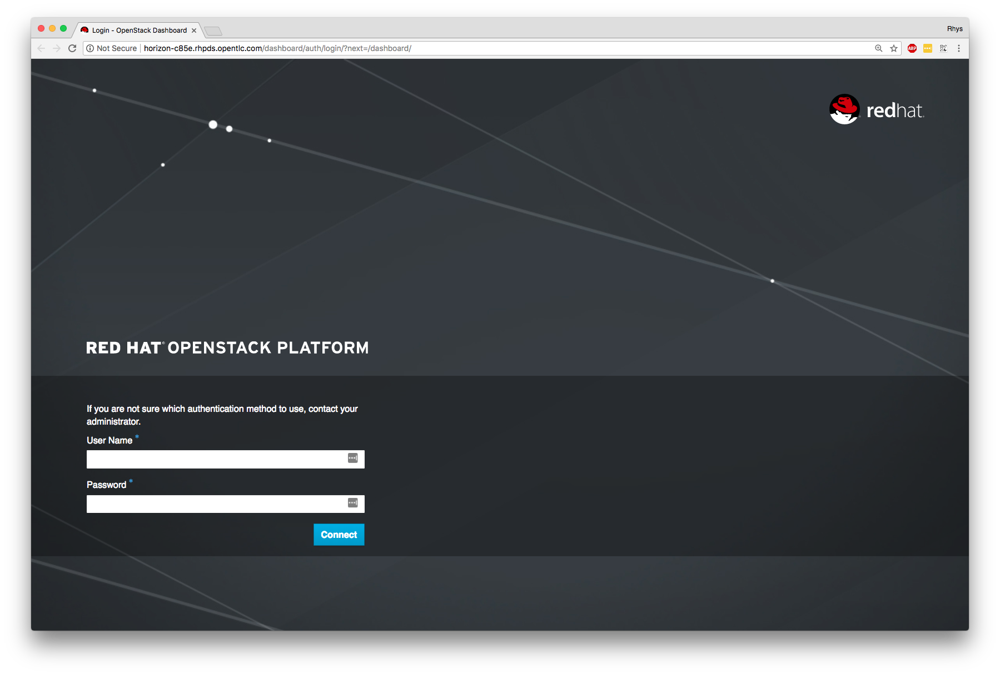

2. Login to the dashboard with your own credentials (remembering that you created this username and password, if you need to confirm them, look at the **~/demorc** file we created earlier.
3. Our user has administrative rights, and therefore it automatically positions you to the 'admin' tab of Horizon, but as we're wanting to launch instances, we need to move to the **"Project"** tab by selecting the appropriate tab underneath the URL and next to the "Red Hat OpenStack Platform" image in the top-left hand corner:

	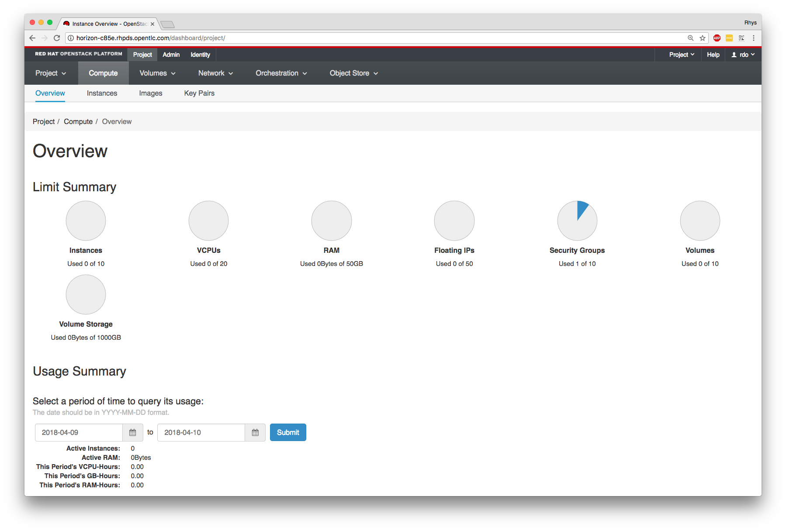

4. Next, select '**Compute**' and then '**Instances**' and you should be provided with an **empty** list of machines (if it lists a machine already running, perhaps you forgot to delete the one that we created earlier?)...

	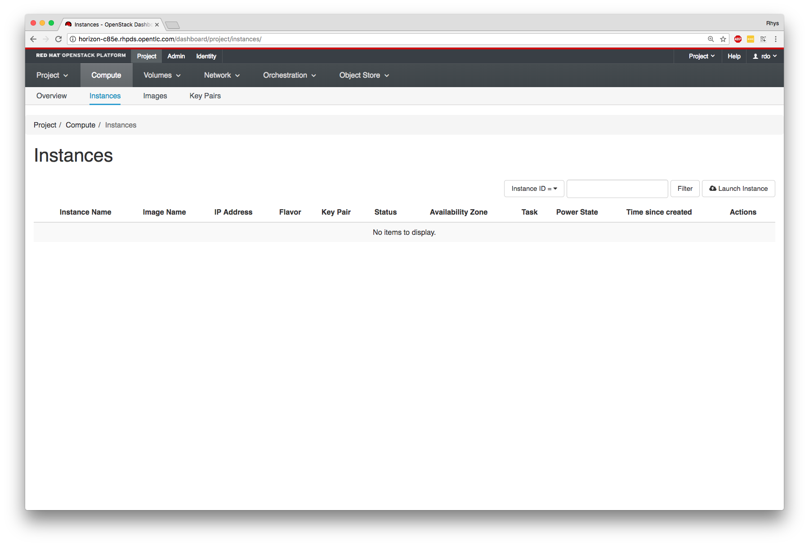

4. Select 'Launch Instance' in the top-right corner of this page, and you should be presented with a pop-up window:

	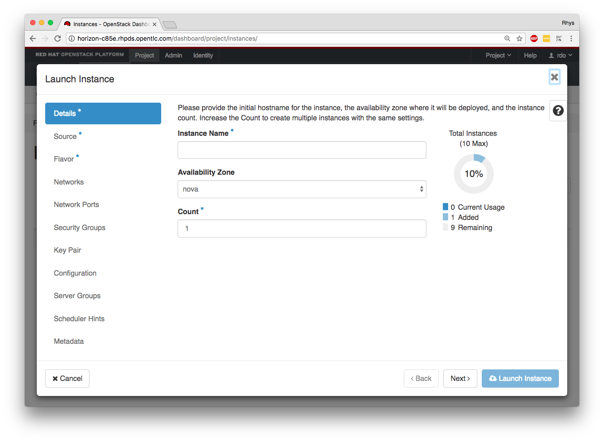

5. Next, in the **Details** pane you'll need to provide your instance with a name, I've chosen "**new_vm**", you can ignore the availability zone and instance count here, as the defaults are just fine - we only want one instance, and we only have one availability zone in our environment.

6. In the **Source** pane you'll need to ensure that the '**Boot Source**' is set to '**Image**' as we want to boot from our RHEL7 image that we uploaded previously, and we want to make sure that we have selected **NO** to '**Create New Volume**'. This means that we're asking the OpenStack platform to utilise ephemeral storage, and not persistent storage backed by Cinder (we'll use this in a later lab). You'll also need to ensure that you select the '**rhel7**' image by clicking the "**+**" symbol to the right hand side of the image at the bottom of the pane.

	The completed dialog should look like this:

	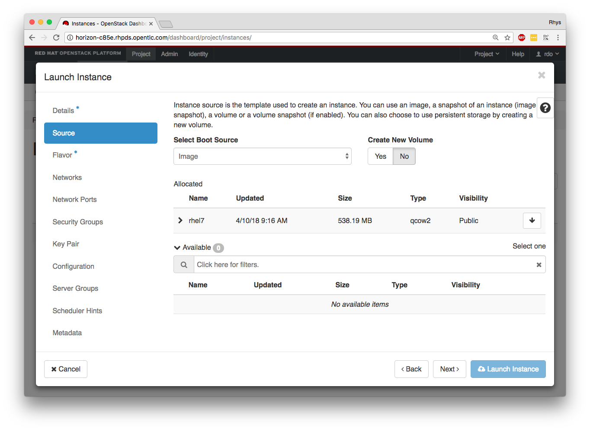
	
7. Next, move to the '**Flavor**' pane and ensure that our "**m1.labs**" flavor is selected, as shown below:

	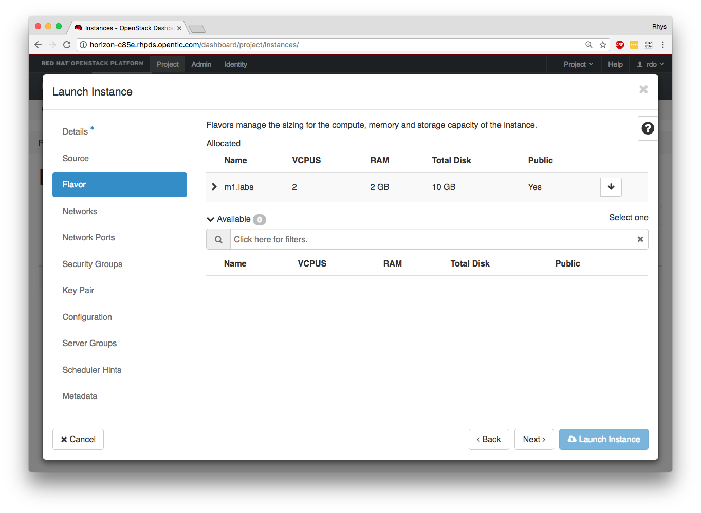
	
8. Now move onto the '**Networks**' pane and you'll see that our one **'internal'** network has already been selected for us by default:

	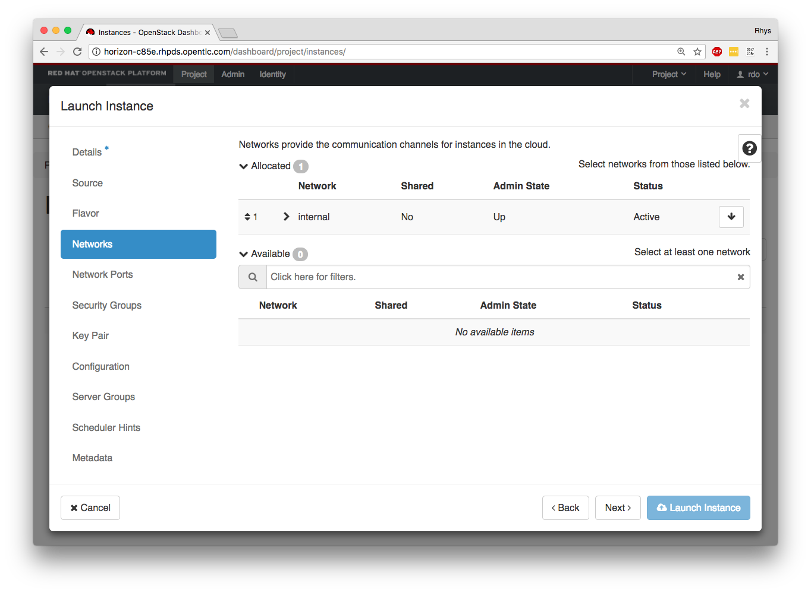

8. Finally, select '**Launch Instance**' in the bottom right-hand corner of the pop-up window.

9. The machine should now be scheduled and started as a nested virtual machine; the dashboard will monitor progress for you.

	* Spawning/building the machine:

	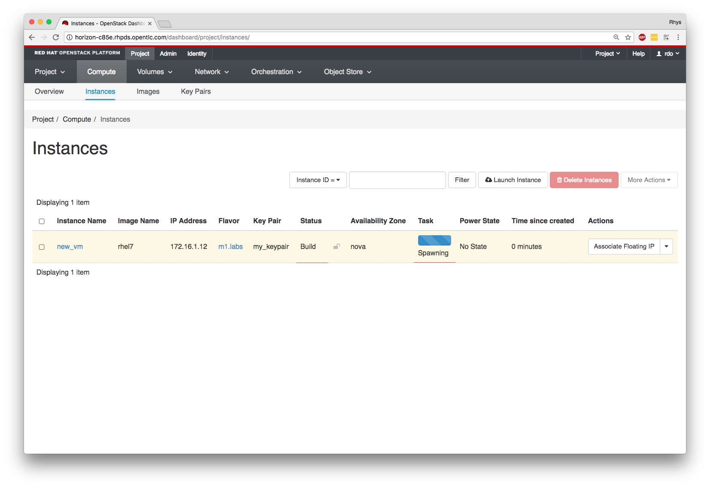
	
	* Once successful, the machine should go into an **ACTIVE** state, like we saw before via the CLI:

	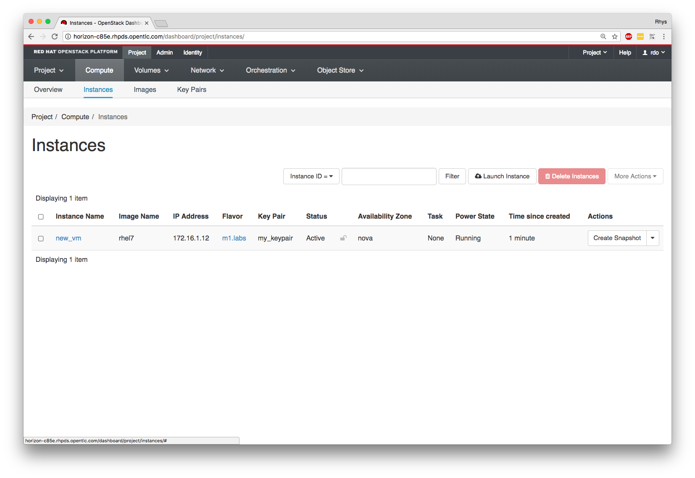
	
10. In the above image you'll see that there's a drop-down box underneath **Actions** on the right hand side of each instance running. Have a look in here - you can view the startup log via "**View Log**" or view the VNC console via "**Console**":

	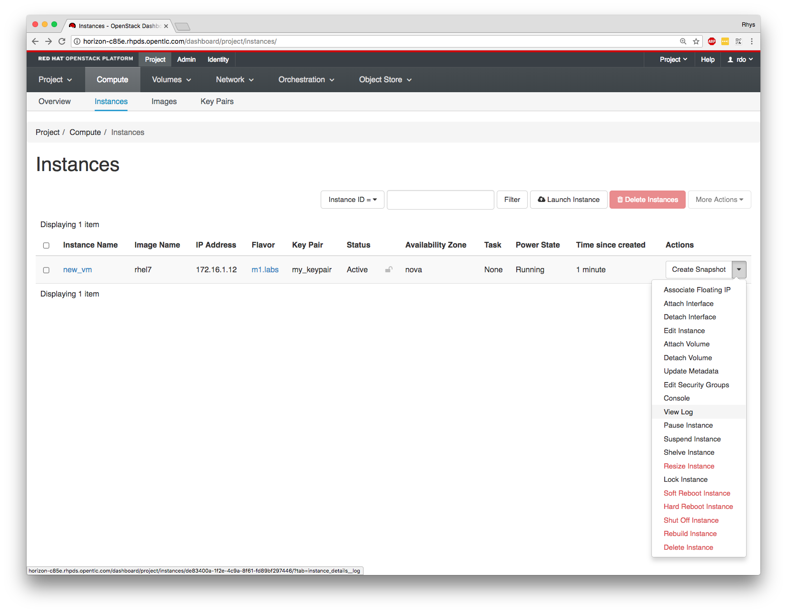
	
	Here's an example of the console log being shown directly in the Horizon dashboard:
	
	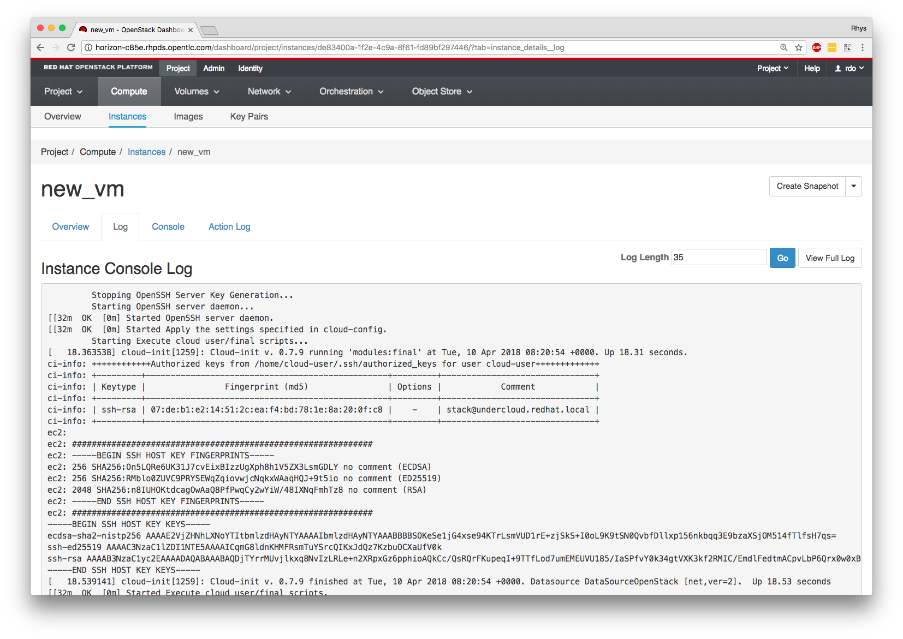

11. Finally, once you're happy with how this works, reteurn back to the instances tab and shut down the instance via the same **Actions** drop-down menu, then select **Delete Instance**. You'll be asked to confirm, as this is a permenant deletion, **NOT a shutdown**:

	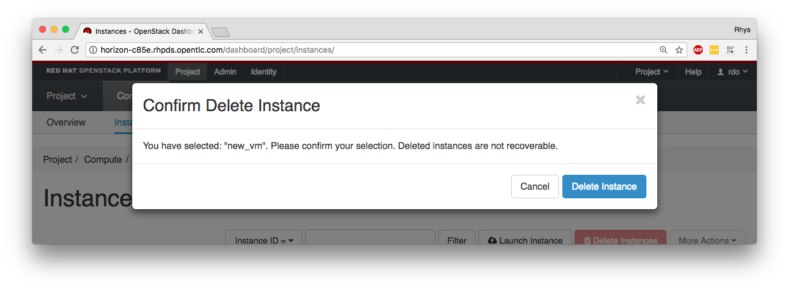

> **NOTE**: Make sure that you delete all instances that may be available before proceeding with the next section of this lab.

##**Uploading public keys**

Public keys are used in OpenStack (and other cloud platforms) to uniquely identify a user, avoiding any password requirements. It's also useful when you have passwords installed by users in their VM images but they aren't shared; with a key a user can log-in and change the password to something they're happy with. When an instance is first initialised, one of the options is to select a public key that should be injected into the image at boot time. With the image that we have been using we already know the root password, but it's good practice to demonstrate how we can use them with images that do not permit root login, or don't allow password-based authentication.

Note that for public key injection to work, the guest must have **cloud-init** installed; an in-guest agent that contacts OpenStack's metadata service to check whether there are any tasks for the guest to perform, e.g. public key injection, software installation, arbitrary code execution, etc. For the rest of this lab we're going to be returning to our command line, and the next steps **assume** that you're logged into your OpenStack environment.

We should already have a public key created for us that we can utilise:

	$ cat ~/.ssh/id_rsa.pub
	ssh-rsa AAAAB3NzaC1yc2EAAAADAQABAAABAQDJ3FaJmZqjBD94oRh8SIxqjpWs[...]
	
Next, upload the public keypair into OpenStack - this ensures that Nova has a record of the keypair so it can be injected when required. We'll call our keypair "**my_keypair**":

	$ source ~/demorc
	$ openstack keypair create my_keypair --public-key ~/.ssh/id_rsa.pub
	+-------------+-------------------------------------------------+
	| Field       | Value                                           |
	+-------------+-------------------------------------------------+
	| fingerprint | 9f:f4:27:53:8e:2b:1c:d8:cf:79:1f:ee:79:00:8b:67 |
	| name        | my_keypair                                      |
	| user_id     | 19af400bc0e4445eb96879b1e718072b                |
	+-------------+-------------------------------------------------+

##**Launching an Instance with a Keypair**

Next, launch an instance and ensure that you specify your keypair to use (note that if you do this via the dashboard it will automatically select it if it's the **only** one available):

	$ openstack keypair list
	+------------+-------------------------------------------------+
	| Name       | Fingerprint                                     |
	+------------+-------------------------------------------------+
	| my_keypair | 9f:f4:27:53:8e:2b:1c:d8:cf:79:1f:ee:79:00:8b:67 |
	+------------+-------------------------------------------------+

Let's now boot up another RHEL 7 instance with the previously used flavor, but this time we'll specify our keypair:

	$ openstack server create --flavor m1.labs --image rhel7 --key-name my_keypair my_vm
	(... output omitted...)

Next, request an additional floating IP address for our instance and assign it:

	$ openstack floating ip create external
	+---------------------+--------------------------------------+
	| Field               | Value                                |
	+---------------------+--------------------------------------+
	| created_at          | 2018-04-09T21:55:38Z                 |
	| description         |                                      |
	| fixed_ip_address    | None                                 |
	| floating_ip_address | 192.168.122.206                      |
	| floating_network_id | d5bfe8ac-d26c-4db3-b9ca-6459426f6362 |
	| id                  | d82569c0-631a-48d3-a39c-83e208498479 |
	| name                | 192.168.122.206                      |
	| port_id             | None                                 |
	| project_id          | f991d44fac91419c8e6016184381871a     |
	| revision_number     | 0                                    |
	| router_id           | None                                 |
	| status              | DOWN                                 |
	| updated_at          | 2018-04-09T21:55:38Z                 |
	+---------------------+--------------------------------------+

	$ openstack server add floating ip my_vm 192.168.122.206
	
> **NOTE**: Your IP address may vary from the output shown above, use the IP as listed when requesting the IP address

If the metadata server worked correctly you should be able to **ssh** into the machine without requiring the password. If you cannot login, ensure that you associated your instance with the keypair as above.

	$ ssh root@192.168.122.206
	The authenticity of host '192.168.122.206 (192.168.122.206)' can't be established.
	ECDSA key fingerprint is SHA256:ALlJOwHLgobeacRyYpkkq+NLQHBGmASeaF2qdoKf+yI.
	ECDSA key fingerprint is MD5:c1:26:eb:d2:d1:dd:64:87:35:b5:9c:2d:6c:48:12:ea.
	Are you sure you want to continue connecting (yes/no)? yes
	Warning: Permanently added '192.168.122.206' (ECDSA) to the list of known hosts.
	[root@my-vm ~]#

	[root@my-vm ~]# uname -a
	Linux my-vm 3.10.0-693.el7.x86_64 #1 SMP Thu Jul 6 19:56:57 EDT 2017 x86_64 x86_64 x86_64 GNU/Linux
	
Let's now delete this machine now we've confirmed the metadata service and keypair injection is working. You'll need to disconnect from this machine first:

	# exit
	logout
	Connection to 192.168.122.206 closed.
	$
	
Then, delete the machine, remembering that unless there's an error, this call provides no output:

	$ openstack server delete my_vm

##**Executing boot-time scripts**

In addition to injecting public keys, the **cloud-init** guest agent can request executable code (and other instructions) from OpenStack's metadata service. In this section of the lab we're going to provide a demonstration of an instance retrieving a script and executing it at boot time, and we'll demonstrate exactly how **cloud-init** and the metadata service works.

First, we need a script to execute, let's create one that makes some basic system calls and writes the output to a text file on the instance's filesystem:

	$ cat > ~/user-script.sh << EOF
	#!/usr/bin/env bash
	uname -a > /tmp/uname
	date > /tmp/date
	EOF

Next, create another instance, but pass the script as **user-data** to the instance with the parameter **"--user-data"**:

	$ openstack server create --flavor m1.labs --image rhel7 \
		--key-name my_keypair --user-data user-script.sh my_vm
	(...)
	
> **NOTE**: It's also possible to inject user-data via the OpenStack Dashboard

Now, create and assign a floating IP so that we can check that our script worked...

	$ openstack floating ip create external
	+---------------------+--------------------------------------+
	| Field               | Value                                |
	+---------------------+--------------------------------------+
	| created_at          | 2018-04-09T21:58:55Z                 |
	| description         |                                      |
	| fixed_ip_address    | None                                 |
	| floating_ip_address | 192.168.122.202                      |
	| floating_network_id | d5bfe8ac-d26c-4db3-b9ca-6459426f6362 |
	| id                  | 05138ed3-632b-49b3-8070-d6d8cfb87cfa |
	| name                | 192.168.122.202                      |
	| port_id             | None                                 |
	| project_id          | f991d44fac91419c8e6016184381871a     |
	| revision_number     | 0                                    |
	| router_id           | None                                 |
	| status              | DOWN                                 |
	| updated_at          | 2018-04-09T21:58:55Z                 |
	+---------------------+--------------------------------------+

	$ openstack server add floating ip my_vm 192.168.122.202
	
> **NOTE**: Your IP address may vary from the output shown above, use the IP as listed when requesting the IP address

Once your machine goes active, you may have to wait a little while for it to actually boot up. You can attempt to SSH into it (noting that we also asked it to inject our keypair) with the following command, if it gives you the following error, the machine is still booting up:

	$ ssh root@192.168.122.202
	ssh: connect to host 192.168.122.202 port 22: Connection refused

Once you're able to successfully SSH into your machine, we can check for success:

	$ ssh root@192.168.122.202
	The authenticity of host '192.168.122.202 (192.168.122.202)' can't be established.
	ECDSA key fingerprint is SHA256:yHv+iwMxE+g9BlEQX3aiOM+FJNfJ0jPdu+eQ/OMx3nI.
	ECDSA key fingerprint is MD5:be:32:63:36:c7:50:18:ca:14:bd:bf:eb:99:92:06:07.
	Are you sure you want to continue connecting (yes/no)? yes
	Warning: Permanently added '192.168.122.202' (ECDSA) to the list of known hosts.
	[root@my-vm ~]#

	[root@my-vm ~]# cat /tmp/date; cat /tmp/uname
	Mon Apr  9 17:59:21 EDT 2018
	Linux my-vm 3.10.0-693.el7.x86_64 #1 SMP Thu Jul 6 19:56:57 EDT 2017 x86_64 x86_64 x86_64 GNU/Linux

> **NOTE**: If you receive any empty files, or not files not found, it's likely that the user data was not retrieved successfully.

So, our script ran successfully, but how does the user-data get delivered to the instance? Well, cloud-init is designed to work across multiple cloud platforms, OpenStack, EC2, etc, all of which support the metadata service. This metadata service "listens" on a specific IP address **169.254.169.254**, which we can interrogate from our instance to see what data it provides. **cloud-init** simply provides a mechanism and hierarchy for executing and applying data that is found within the metadata service. The metadata service provides instance-specific data by uniquely identifying each machine.

Assuming that you're still connected to your instance, run the following commands to demonstrate the metadata functionality (**within our instance**):

	[root@my-vm ~]# curl http://169.254.169.254
	1.0
	2007-01-19
	2007-03-01
	2007-08-29
	2007-10-10
	2007-12-15
	2008-02-01
	2008-09-01
	2009-04-04
	latest
	
	[root@my-vm ~]# curl http://169.254.169.254/latest
	meta-data/
	user-data
	
	[root@my-vm ~]# curl http://169.254.169.254/latest/user-data
	#!/bin/sh
	uname -a > /tmp/uname
	date > /tmp/date
	
Now we can see where our script came from. **cloud-init** simply downloads the user-data and executes it as part of a module. You can check out **/etc/cloud/cloud.cfg** to see what modules this instance is configured to use.

For now, disconnect from the machine, but **don't delete it**, we'll need this machine for a later lab:

	[root@my-vm ~]# exit
	logout
	Connection to 192.168.122.202 closed.
	$

#**Lab 6: Creation and Attachment of Block Devices with Cinder (Volume Service)**

##**Introduction**

Cinder is OpenStack's volume service, it's responsible for managing persistent block storage, i.e. the creation of a block device, it's lifecycle, connections to instances and it's eventual deletion. Block storage is an optional requirement in OpenStack but has many advantages, firstly persistence but also for performance scenarios, e.g. access to data backed by tiered storage. We call it optional because by default, an instances root disk space is provided by the hypervisor and resides on a local disk; it's tied to the lifecycle of an instance - if you remove the instance, this disk also gets removed, whereas with a Cinder it's external to the hypervisor and provides persistence. There are two main reasons why people would want to use a Cinder volume-

* To remove the reliance on the underlying hypervisor storage (i.e. the root disk of an instance resides on a storage volume), which may be capacity-limited, is not necessarily **performant**, is **ephemeral** by default - there's no **persistence**, and if the hypervisor is lost, so is your data!

* To provide **additional** storage, either in the situation where you are using default hypervisor storage space, or the root disk is also a Cinder volume. In this scenario, additional volumes can be provides from one or more backend storage types to provide additional capacity for an instance that isn't tied to the flavor size of an instance.

Cinder supports many different back-ends (with various protocols, e.g. iSCSI, FC, and file) in which it can connect to and manage storage for OpenStack, including a wide variety of hardware arrays, e.g. EMC, 3PAR, NetApp, etc, as well as software implementations such as Ceph. However, for testing, Cinder provides support for a basic Linux storage model, based on exposing logical volumes (LVM) via iSCSI - as we're doing this on our workstations, we'll be using this model, and has already been configured for you.

##**Testing Cinder**

Let's test our Cinder configuration, making sure that it can create a volume, note that you'll need to be authenticated with Keystone for this to work:

	$ source ~/demorc
	$ openstack volume create --size 5 my_volume
	+---------------------+--------------------------------------+
	| Field               | Value                                |
	+---------------------+--------------------------------------+
	| attachments         | []                                   |
	| availability_zone   | nova                                 |
	| bootable            | false                                |
	| consistencygroup_id | None                                 |
	| created_at          | 2018-04-09T22:04:31.013598           |
	| description         | None                                 |
	| encrypted           | False                                |
	| id                  | da6c2b7b-d10c-4171-89e3-e2e76e7638f0 |
	| migration_status    | None                                 |
	| multiattach         | False                                |
	| name                | my_volume                            |
	| properties          |                                      |
	| replication_status  | None                                 |
	| size                | 5                                    |
	| snapshot_id         | None                                 |
	| source_volid        | None                                 |
	| status              | creating                             |
	| type                | None                                 |
	| updated_at          | None                                 |
	| user_id             | 2c580c9e773143f5b4d82b9a6131b47a     |
	+---------------------+--------------------------------------+

The above command will create a 5GB block device within the test environment although it won't be attached to any instances yet. The volume is created based on a type, or backend, and as we only have one type (LVM-backed iSCSI, or as we've configured it, "**tripleo_iscsi**") it default to this type, hence we don't have to specifically set it on the command line. Each backend is fullfilled by a **cinder-volume** service, and it's possible to view all of these services with the following command:

	$ openstack volume service list
	+------------------+-------------------------+------+---------+-------+----------------------------+
	| Binary           | Host                    | Zone | Status  | State | Updated At                 |
	+------------------+-------------------------+------+---------+-------+----------------------------+
	| cinder-scheduler | hostgroup               | nova | enabled | up    | 2018-04-09T22:04:45.000000 |
	| cinder-volume    | hostgroup@tripleo_iscsi | nova | enabled | up    | 2018-04-09T22:04:52.000000 |
	+------------------+-------------------------+------+---------+-------+----------------------------+

In our environment, this cinder-volume service is running on the **summit-controller**, and we'll explore how it creates and implements volumes over the next few sections. After a minute or so, our created volume should become available:

	$ openstack volume list
	+--------------------------------------+-----------+-----------+------+-------------+
	| ID                                   | Name      | Status    | Size | Attached to |
	+--------------------------------------+-----------+-----------+------+-------------+
	| da6c2b7b-d10c-4171-89e3-e2e76e7638f0 | my_volume | available |    5 |             |
	+--------------------------------------+-----------+-----------+------+-------------+

Now that's been created, let's see if we can find the logical volume that backs that Cinder volume on our **summit-controller** machine, noting that we're executing this command remotely:

	$ ssh root@summit-controller lvscan
	  ACTIVE            '/dev/cinder-volumes/cinder-volumes-pool' [<9.54 GiB] inherit
	  ACTIVE            '/dev/cinder-volumes/volume-da6c2b7b-d10c-4171-89e3-e2e76e7638f0' [5.00 GiB] inherit

OK, so that volume corresponds with our UUID for our Cinder volume (note that your ID will be different to the above example). When we attach this to a volume, the node that runs the **cinder-volume** service will expose the LVM over iSCSI to the hypervisor running the instance, which, in turn, will attach it to the virtual machine as a local SCSI disk.

Let's attach our volume to the running instance from the previous lab; if you don't have this - create a new instance as part of the previous lab before you proceed. The following also assumes that you have called your VM "**my_vm**" as per the previous instructions. You can verify that your VM is still running with this command:

	$ openstack server list
	+--------------------------------------+-------+--------+--------------------------------------+-------+---------+
	| ID                                   | Name  | Status | Networks                             | Image | Flavor  |
	+--------------------------------------+-------+--------+--------------------------------------+-------+---------+
	| 9f5c7572-f64b-4509-8522-ad2b39fe65c5 | my_vm | ACTIVE | internal=172.16.1.9, 192.168.122.202 | rhel7 | m1.labs |
	+--------------------------------------+-------+--------+--------------------------------------+-------+---------+
##**Attaching your volume**

We'll use the command line to attach this volume to our running instance:

	$ openstack server add volume my_vm my_volume

> **NOTE**: Unless there was an error, this command provides no feedback.

Verify that it has been successfully attached with the following, noting that it may take a minute or so to appear as **in-use**:

	$ openstack volume list
	+--------------------------------------+-----------+--------+------+--------------------------------+
	| ID                                   | Name      | Status | Size | Attached to                    |
	+--------------------------------------+-----------+--------+------+--------------------------------+
	| da6c2b7b-d10c-4171-89e3-e2e76e7638f0 | my_volume | in-use |    5 | Attached to my_vm on /dev/vdb  |
	+--------------------------------------+-----------+--------+------+--------------------------------+

So, OpenStack is telling us that the volume has been created and attached, but there's one way to test that the instance can see it. Note that in the output you'll see that it has attached the volume to **'/dev/vdb'**, the second interface for that machine; the first (**'/dev/vda'**) will be the default ephemeral hypervisor storage, which resides in '**/var/lib/nova/instances/[uuid]/disk**' on the hyperisor as shown below. First get the uuid of your instance and the compute node it's running on:

	$ openstack server show my_vm -c id -c OS-EXT-SRV-ATTR:host
	+----------------------+--------------------------------------+
	| Field                | Value                                |
	+----------------------+--------------------------------------+
	| OS-EXT-SRV-ATTR:host | summit-compute2.localdomain          |
	| id                   | 9f5c7572-f64b-4509-8522-ad2b39fe65c5 |
	+----------------------+--------------------------------------+

Now take a look at the instance's ephemeral disk on our dedicated hypervisor/compute node (**summit-compute2** in my example, yours may be different), noting that we'll be running this command remotely:

	$ ssh root@summit-compute2 \
		qemu-img info /var/lib/nova/instances/9f5c7572-f64b-4509-8522-ad2b39fe65c5/disk
		
	image: /var/lib/nova/instances/9f5c7572-f64b-4509-8522-ad2b39fe65c5/disk
	file format: qcow2
	virtual size: 10G (10737418240 bytes)
	disk size: 42M
	cluster_size: 65536
	backing file: /var/lib/nova/instances/_base/fd2beb46d533a0209d6e0be31715938351ed7dde
	Format specific information:
	    compat: 1.1
	    lazy refcounts: false
	    refcount bits: 16
	    corrupt: false

> **NOTE:** For reference, you'll see that there's a **'backing_file'** listed above. This is used by OpenStack to layer a much smaller file (in our case 41MB) on-top of the Glance image and is used as a template. This allows us to be very efficient with storage utilisation by using copy-on-write (COW).

Let's reconnect back into our instance and verify that the new volume is available, replace the IP address as necessary for your machine:

	$ ssh root@192.168.122.202
	
Once connected, let's ensure that the block device is available for us to use:

	[root@my-vm ~]# fdisk -l
	Disk /dev/vda: 10.7 GB, 10737418240 bytes, 20971520 sectors
	Units = sectors of 1 * 512 = 512 bytes
	Sector size (logical/physical): 512 bytes / 512 bytes
	I/O size (minimum/optimal): 512 bytes / 512 bytes
	Disk label type: dos
	Disk identifier: 0x000a73bb
	
	   Device Boot      Start         End      Blocks   Id  System
	/dev/vda1   *        2048    20971486    10484719+  83  Linux
	
	Disk /dev/vdb: 5368 MB, 5368709120 bytes, 10485760 sectors
	Units = sectors of 1 * 512 = 512 bytes
	Sector size (logical/physical): 512 bytes / 512 bytes
	I/O size (minimum/optimal): 512 bytes / 512 bytes

So we can see the second disk that it can see is **/dev/vdb** at a size of **5GB**, proving that Nova has successfully attached our Cinder volume to our instance. Next, we can create a filesystem and mount that up:

	[root@my-vm ~]# mkfs.xfs /dev/vdb
	meta-data=/dev/vdb               isize=512    agcount=4, agsize=327680 blks
	         =                       sectsz=512   attr=2, projid32bit=1
	         =                       crc=1        finobt=0, sparse=0
	data     =                       bsize=4096   blocks=1310720, imaxpct=25
	         =                       sunit=0      swidth=0 blks
	naming   =version 2              bsize=4096   ascii-ci=0 ftype=1
	log      =internal log           bsize=4096   blocks=2560, version=2
	         =                       sectsz=512   sunit=0 blks, lazy-count=1
	realtime =none                   extsz=4096   blocks=0, rtextents=0	
	[root@my-vm ~]# mount /dev/vdb /mnt
	[root@my-vm ~]# df -Th
	Filesystem     Type      Size  Used Avail Use% Mounted on
	/dev/vda1      xfs        10G  885M  9.2G   9% /
	devtmpfs       devtmpfs  900M     0  900M   0% /dev
	tmpfs          tmpfs     920M     0  920M   0% /dev/shm
	tmpfs          tmpfs     920M  8.4M  912M   1% /run
	tmpfs          tmpfs     920M     0  920M   0% /sys/fs/cgroup
	tmpfs          tmpfs     184M     0  184M   0% /run/user/0
	/dev/vdb       xfs       5.0G   33M  5.0G   1% /mnt

Next unmount your volume and disconnect from the VM:

	[root@my-vm ~]# umount /mnt
	[root@my-vm ~]# exit
	logout
	Connection to 192.168.122.202 closed.
	
Let's confirm how the iSCSI export has worked to our hypervisor via **targetcli**, noting that in the printout this information will have gone off the page in the printed version, but the electronic HTML copy should allow you to scroll through. We'll need to execute this command on our controller node (**summit-controller**) as this is where the volume resides, and is where it's exported from, hence we're executing this command remotely:

	$ ssh root@summit-controller targetcli ls
	o- / ......................................................................................................................... [...]
	  o- backstores .............................................................................................................. [...]
	  | o- block .................................................................................................. [Storage Objects: 1]
	  | | o- iqn.2010-10.org.openstack:volume-da6c2b7b-d10c-4171-89e3-e2e76e7638f0  [/dev/cinder-volumes/volume-da6c2b7b-d10c-4171-89e3-e2e76e7638f0 (5.0GiB) write-thru activated]
	  | |   o- alua ................................................................................................... [ALUA Groups: 1]
	  | |     o- default_tg_pt_gp ....................................................................... [ALUA state: Active/optimized]
	  | o- fileio ................................................................................................. [Storage Objects: 0]
	  | o- pscsi .................................................................................................. [Storage Objects: 0]
	  | o- ramdisk ................................................................................................ [Storage Objects: 0]
	  o- iscsi ............................................................................................................ [Targets: 1]
	  | o- iqn.2010-10.org.openstack:volume-da6c2b7b-d10c-4171-89e3-e2e76e7638f0 ............................................. [TPGs: 1]
	  |   o- tpg1 .......................................................................................... [no-gen-acls, auth per-acl]
	  |     o- acls .......................................................................................................... [ACLs: 1]
	  |     | o- iqn.1994-05.com.redhat:1fa3396fe29e ...................................................... [1-way auth, Mapped LUNs: 1]
	  |     |   o- mapped_lun0 ................. [lun0 block/iqn.2010-10.org.openstack:volume-da6c2b7b-d10c-4171-89e3-e2e76e7638f0 (rw)]
	  |     o- luns .......................................................................................................... [LUNs: 1]
	  |     | o- lun0  [block/iqn.2010-10.org.openstack:volume-da6c2b7b-d10c-4171-89e3-e2e76e7638f0 (/dev/cinder-volumes/volume-da6c2b7b-d10c-4171-89e3-e2e76e7638f0) (default_tg_pt_gp)]
	  |     o- portals .................................................................................................... [Portals: 1]
	  |       o- 172.17.3.13:3260 ................................................................................................. [OK]
	  o- loopback ......................................................................................................... [Targets: 0]
	  o- xen_pvscsi ....................................................................................................... [Targets: 0]  
What this shows is that we're currently exporting one block device **"/dev/cinder-volumes/volume-da6c2b7b-d10c-4171-89e3-e2e76e7638f0 (5.0GiB)"**, with one connected node (restricted via ACL's), **"iqn.1994-05.com.redhat:1fa3396fe29e"**. Non LVM/iSCSI Cinder backends have their own way of exporting and providing/zoning the volumes to necessary nodes for utilisation.

Let's now clean up by detaching the volume from the instance:

	$ openstack server remove volume my_vm my_volume
	
And then remove our volume and the instance before we move onto the next lab:

	$ openstack volume delete my_volume
	$ openstack server delete my_vm

After a minute or so the following should be empty:

	$ openstack server list
	[Empty]

#**Lab 7: Deployment of Application Stacks using OpenStack Orchestration (Heat)**

##**Introduction**

OpenStack Heat is a feature that was originally designed as an orchestration engine, allowing organisations to pre-define which OpenStack resources to deploy for a given application. One would simply define a stack template, typically a set of yaml formatted text documents, outlining the requirement for a number of infrastructure resources (for example, instances, networks, floating IP's, storage volumes) along with a set of parameters for configuration. Heat would deploy the resources based on a given dependency chain, in other words, which resources need to be built before the others. Heat can then monitor such resources for availability, and scale them out where necessary. These templates enable application stacks to become portable and to achieve repeatability and predictability.

In this lab we'll deploy a simple resource-based stack, comprising of a single server, a port on our existing internal network, a floating IP address on the external network, and to install and configure a web server for us, based on packages exported from our workstation.

##**Getting the Heat Stack Definition**

For this lab, the instructor has provided a pre-defined template. It can be deployed either using the dashboard or via the command line tools. This lab will guide you through deploying via the command line. The file has already been placed within the home directory (**~/heat-demo.yaml**). If you don't have this file in your home directory, please let us know.

For your reference, the file contents look like the following:

	$ cat ~/labs/osp/heat-demo.yaml
	heat_template_version: 2015-04-30

	description: Red Hat Summit 2018 - Lab1009
	
	parameters:
	  key_name:
	    type: string
	    description:
	      Name of an existing key pair to enable SSH access to the instance.
	    default: default
	  image:
	    type: string
	    description: ID of the image to use for the instance to be created.
	    default: rhel7
	  instance_type:
	    type: string
	    description: Type of the instance to be created.
	    default: m1.labs
	  public_net:
	    type: string
	    description: >
	      Public network for which floating IP addresses will be allocated
	    default: external
	  private_net:
	    type: string
	    description: Private network into which servers get deployed
	    default: internal
	  private_subnet:
	    type: string
	    description: Private subnet into which servers get deployed
	    default: internal_subnet
	  my_name:
	    type: string
	    description: Enter your name here
	    default: Anonymous
	
	resources:
	  summit_srv:
	    type: OS::Nova::Server
	    properties:
	      key_name: { get_param: key_name }
	      image: { get_param: image }
	      flavor: { get_param: instance_type }
	      networks:
	        - port: { get_resource: summit_port }
	      user_data_format: RAW
	      user_data:
	        get_resource: summit_config
	
	  summit_port:
	    type: OS::Neutron::Port
	    properties:
	      network: { get_param: private_net }
	      fixed_ips:
	        - subnet: { get_param: private_subnet }
	      security_groups: [{ get_resource: summit_secgroup }]
	
	  summit_floating_ip:
	    type: OS::Neutron::FloatingIP
	    properties:
	      floating_network: { get_param: public_net }
	      port_id: { get_resource: summit_port }
	
	  summit_secgroup:
	    type: OS::Neutron::SecurityGroup
	    properties:
	      description: Add security group rules for server
	      name: heat-stack-secgroup
	      rules:
	        - remote_ip_prefix: 0.0.0.0/0
	          protocol: tcp
	          port_range_min: 22
	          port_range_max: 22
	        - remote_ip_prefix: 0.0.0.0/0
	          protocol: tcp
	          port_range_min: 80
	          port_range_max: 80
	        - remote_ip_prefix: 0.0.0.0/0
	          protocol: icmp
	
	  summit_config:
	    type: OS::Heat::SoftwareConfig
	    properties:
	      group: ungrouped
	      config:
	        str_replace:
	          template: |
	            #!/usr/bin/env bash
	            curl -o /etc/yum.repos.d/packages.repo http://192.168.122.253/packages.repo
	            yum install httpd -y
	            systemctl enable httpd
	            systemctl start httpd
	            MY_IP=$(/sbin/ifconfig eth0 | grep 'inet ' | awk '{ print $2}')
	            echo "Hello, $my_name, I am $(hostname -s) @ $MY_IP" > /var/www/html/index.html
	          params:
	            $my_name: {get_param: my_name}
	
	outputs:
	  instance_ip:
	    description: Public IP address of the newly created Nova instance.
	    value: { get_attr: [ summit_floating_ip, floating_ip_address ] }

##**What the Stack Definition does**

For those not familiar with the template language (HOT) used within OpenStack Heat, I suggest you take a look at the file, specifically where it lists the images used, the resources it requires, and any script data that the Heat tools execute upon boot. You will notice that the Heat definition deploys the following elements-

* A new security group to allow ICMP, TCP on port 22 (SSH), and TCP on port 80 (HTTP)
* An instance with a configuration script (that gets uploaded into the user-data)
* Finally, a floating IP address for external access

##**Deploying our Stack**

As you may have seen, each parameter in the Heat stack has a **default** value, which has been set according to the environment that you've been using, e.g. the name of the flavor to use, the name of the external network (for floating IP's), and the name of the image. Therefore, deploying this stack is very straight forward. We have, however, made a deliberate mistake in the template to demonstrate how parameters can be overridden via the CLI; we've got the keyname "default" listed as the default keypair to inject, but this doesn't exist. If you recall, we created one called "my_keypair", let's deploy our stack via Heat and specify the new keypair:

	$ source ~/demorc

	$ openstack stack create --template ~/labs/osp/heat-demo.yaml --parameter key_name=my_keypair demo
	+---------------------+--------------------------------------+
	| Field               | Value                                |
	+---------------------+--------------------------------------+
	| id                  | 5db87e43-6ed8-43c6-af89-a1adfebbe285 |
	| stack_name          | demo                                 |
	| description         | Red Hat Summit 2018 - Lab1009        |
	| creation_time       | 2018-04-09T22:15:31Z                 |
	| updated_time        | None                                 |
	| stack_status        | CREATE_IN_PROGRESS                   |
	| stack_status_reason | Stack CREATE started                 |
	+---------------------+--------------------------------------+

> **NOTE:** If you omit the **key_name** parameter, the stack will fail to create.
	
After a few minutes, it should have completed, you can view the progress using the following-

	$ openstack stack list
	+--------------------------------------+------------+----------------------------------+-----------------+----------------------+--------------+
	| ID                                   | Stack Name | Project                          | Stack Status    | Creation Time        | Updated Time |
	+--------------------------------------+------------+----------------------------------+-----------------+----------------------+--------------+
	| 5db87e43-6ed8-43c6-af89-a1adfebbe285 | demo       | f991d44fac91419c8e6016184381871a | CREATE_COMPLETE | 2018-04-09T22:15:31Z | None         |
	+--------------------------------------+------------+----------------------------------+-----------------+----------------------+--------------+
	
Once your stack has deployed successfully (with the stack status at **"CREATE_COMPLETE"**), simply use the following to find the output IP address for your instance. Within a Heat template you can specify a number of **outputs** that you can query Heat for, saving you from using other tooling to get the data you requested:

	$ openstack stack show demo | grep output_value
	|                       |   output_value: 192.168.122.205                                                                                                                  

In my example, the floating IP address that was allocated for my machine is **192.168.122.205**, you may receive a different one. Let's curl this machine on the http port and see what it displays:

	$ curl http://192.168.122.205
	Hello, Anonymous, I am demo-summit-srv-2d4cplvtrw5k @ 172.16.1.12

This has shown us that our script has worked properly (to install httpd and present a welcome message saying which server and IP address this machine is) and that our stack deployment was successful. An alternative way of checking that the machine is running successfully is to use the script **"~/labs/osp/server-check.sh"** in your home directory (**Ctrl-C** to stop it):

	$ sh ~/labs/osp/server-check.sh 192.168.122.205
	INFO: Using http://192.168.122.205:80... (Ctrl-c to stop)

	Tue  4 Apr 11:53:49 EDT 2017
	Hello, Anonymous, I am demo-summit-srv-2d4cplvtrw5k @ 172.16.1.12

The reason why this is a repeating script will become obvious in the next lab when we look at utilising load balancers. Finally, clean-up your deployment:

	$ openstack stack delete demo
	Are you sure you want to delete this stack(s) [y/N]? y

> **NOTE**: Make sure you enter 'y' above, otherwise it won't clean up the existing resources.

#**Lab 8: Deployment of Load Balancers using Neutron's LBaaS feature**

##**Introduction**

Today, LBaaS (Load Balancing-as-a-Service) is part of Neutron as an advanced extra component, providing both proprietary and open source load balancing technologies to end users via self-service. A user can simply request a load balancer via Neutron's RESTful API and Neutron is responsible for managing the lifecycle of such a load balancer to distribute requests amongst a group of instances.

In this lab we'll deploy a load balancer with the default **HAproxy** based backend, which is the default in Red Hat OpenStack Platform. We'll deploy multiple instances that we'll load balance across to demonstrate functionality, and to show how LBaaS can recover from situations in which a node may cease to exist.

##**Deploying Multiple Machines**

In the previous lab we deployed a single node with an httpd server (and a welcome message) via OpenStack Heat. For our LBaaS lab we'll need more than one machine to demonstrate its capabilities. Heat supports the concept of "**resource groups**" which allows us to deploy multiple OpenStack resources of the same type by simply specifying a quantity.

Via a simple Heat template we can point to our original stack template and call it multiple times using this concept, making it easy for us to deploy multiple machines. We've provided this file for you, and it looks like the following:

	$ cat ~/labs/osp/multiple-instances.yaml
	heat_template_version: 2013-05-23
	
	resources:
	  resource_group:
	    type: OS::Heat::ResourceGroup
	    properties:
	      count: 2
	      resource_def: {type: heat-demo.yaml}

This stack requests **two** (see **count**) of the stacks detailed in **heat-demo.yaml** (our original stack template) to form the constuct of **nested stacks**. We simply need to feed in the **multiple-instances.yaml** file to Heat, and it'll take care of pulling in the nested stack templates and build out the resources.

Let's deploy our nested Heat stack. As before, we need to provide our **key_name** parameter, but this time we'll use an environment file. An environment file allows us to provide parameters within a file, allowing configuration to become repeatable, portable, and versionable, just like the templates. You may remember that the message said "Hello, Anonymous", we can override this parameter at the same time as the name of the keypair to us.

But first, we need to make sure that we include **your** name (replace with your name):

	$ export MY_NAME=<your name>

	$ cat > ~/summit.yaml << EOF
	parameter_defaults:
	  key_name: my_keypair
	  my_name: $MY_NAME
	EOF

Now we can launch our multiple instances Heat stack:

	$ openstack stack create --template ~/labs/osp/multiple-instances.yaml \
		--environment ~/summit.yaml multiple
	+---------------------+--------------------------------------+
	| Field               | Value                                |
	+---------------------+--------------------------------------+
	| id                  | 5c8072ec-4ea4-4bea-a1e1-e9094723bbf9 |
	| stack_name          | multiple                             |
	| description         | No description                       |
	| creation_time       | 2018-04-09T22:20:40Z                 |
	| updated_time        | None                                 |
	| stack_status        | CREATE_IN_PROGRESS                   |
	| stack_status_reason | Stack CREATE started                 |
	+---------------------+--------------------------------------+

Once this has turned to a **CREATE_COMPLETE** state, we need to validate that multiple instances have been started (if you're reading this with the printed version, I apologise for the formatting):

	$ openstack stack list
	+--------------------------------------+------------+----------------------------------+-----------------+----------------------+--------------+
	| ID                                   | Stack Name | Project                          | Stack Status    | Creation Time        | Updated Time |
	+--------------------------------------+------------+----------------------------------+-----------------+----------------------+--------------+
	| 5c8072ec-4ea4-4bea-a1e1-e9094723bbf9 | multiple   | f991d44fac91419c8e6016184381871a | CREATE_COMPLETE | 2018-04-09T22:20:40Z | None         |
	+--------------------------------------+------------+----------------------------------+-----------------+----------------------+--------------+
	
	$ openstack server list
	+--------------------------------------+-------------------------------------------------------+--------+---------------------------------------+-------+---------+
	| ID                                   | Name                                                  | Status | Networks                              | Image | Flavor  |
	+--------------------------------------+-------------------------------------------------------+--------+---------------------------------------+-------+---------+
	| ebe48c72-ceec-4473-812c-c7171aac01bd | mu-cgmawqm6yiy-0-eoiv432ojknr-summit_srv-rxqhqfrgiq2h | ACTIVE | internal=172.16.1.9, 192.168.122.203  | rhel7 | m1.labs |
	| e1362b6d-b6d8-475b-92f6-001ecc0ed598 | mu-cgmawqm6yiy-1-2i2kn4aj3v5y-summit_srv-wjqclkn66vi7 | ACTIVE | internal=172.16.1.12, 192.168.122.205 | rhel7 | m1.labs |
	+--------------------------------------+-------------------------------------------------------+--------+---------------------------------------+-------+---------+

As before, we can test these instances with the **server-check.sh** script to ensure that firstly the software deployment and configuration was completed, and secondly that it took our name as configured. For this we'll need to take the floating IP's as per the output from '**openstack server list**', noting that your IP's will differ from the ones shown in the example below:

	$ sh ~/labs/osp/server-check.sh 192.168.122.203

	INFO: Using http://192.168.122.203:80... (Ctrl-c to stop)
	
	
	Mon  9 Apr 18:25:10 EDT 2018
	Hello, Rhys, I am mu-cgmawqm6yiy-0-eoiv432ojknr-summit-srv-rxqhqfrgiq2h @ 172.16.1.9
	
	
	Mon  9 Apr 18:25:13 EDT 2018
	Hello, Rhys, I am mu-cgmawqm6yiy-0-eoiv432ojknr-summit-srv-rxqhqfrgiq2h @ 172.16.1.9
	
	
	^C
	
Next try the other server:
	
	$ sh ~/labs/osp/server-check.sh 192.168.122.205

	INFO: Using http://192.168.122.205:80... (Ctrl-c to stop)
	
	
	Mon  9 Apr 18:25:52 EDT 2018
	Hello, Rhys, I am mu-cgmawqm6yiy-1-2i2kn4aj3v5y-summit-srv-wjqclkn66vi7 @ 172.16.1.12
	
	
	Mon  9 Apr 18:25:55 EDT 2018
	Hello, Rhys, I am mu-cgmawqm6yiy-1-2i2kn4aj3v5y-summit-srv-wjqclkn66vi7 @ 172.16.1.12
	
	
	^C

> **NOTE**: Your IP addresses will very likely be different to the ones in the lab guide, and you can use **Ctrl-C** to stop the server-check script. You may get some errors where it says that it cannot communicate with the server. It may be the case that the machines are still installing the required packages.
	
If both of these attempts succeeded, we know that both of the machines are up, and responding individually.

##**Creating a Loadbalancer**

Now we're actually going to create a load balancer that will balance traffic between our two instances that we launched via our Heat template. OpenStack Neutron has a built-in mechanism for automating the creation of load balancers and relies on a set of backend plugins for implementation. Out of the box, we ship with a HAproxy implementation and is what we're going to be using in this lab, although there are other plugins that organisations may want to use, e.g. to leverage existing investments from the likes of F5, etc.

The high level architecture looks like this:

 

  

> **NOTE**: The following instructions utilise the legacy Neutron command line tooling rather than the OpenStack command line tooling, this is only because certain syntax is not yet supported in the OpenStack command line replacement, hence we're falling back to the Neutron CLI for these steps only.

The first step is to create the top-level **load balancer** construct. This will allow us to select the type of loadbalancer that we want to create based on the backend and will allow us to choose the network in which we want the load balancer to live in. For our use-case we want to use HAproxy, and therefore given it's the default we don't need to specify it on the commandline, and for the network we want to select our **internal_subnet**:

	$ neutron lbaas-loadbalancer-create --name demo_lb internal_subnet
	
	neutron CLI is deprecated and will be removed in the future. Use openstack CLI instead.
	Created a new loadbalancer:
	+---------------------+--------------------------------------+
	| Field               | Value                                |
	+---------------------+--------------------------------------+
	| admin_state_up      | True                                 |
	| description         |                                      |
	| id                  | 18868c2f-3e5d-4a75-a568-f8bae2d7518c |
	| listeners           |                                      |
	| name                | demo_lb                              |
	| operating_status    | OFFLINE                              |
	| pools               |                                      |
	| provider            | haproxy                              |
	| provisioning_status | PENDING_CREATE                       |
	| tenant_id           | f991d44fac91419c8e6016184381871a     |
	| vip_address         | 172.16.1.13                          |
	| vip_port_id         | 726869e5-c519-41cc-abc0-868f885cb3f0 |
	| vip_subnet_id       | 4d38f43b-402e-48a5-b048-3092d6f7da02 |
	+---------------------+--------------------------------------+

> **NOTE**: Ignore the Neutron CLI warnings; the most important item above is to see the VIP that was created on the internal network, 172.16.1.0/24.

Next we'll need to create a **listener** for our load balancer, a listener is used to define what it is that we're load balancing, for example, on which port, over which protocol, and also some additional configurables such as connection limits. As we're going to be balancing requests between our two machines that are utilising port 80 for their web content (over HTTP) we need to build a listener as appropriate:

	$ neutron lbaas-listener-create --name demo_lb_http \
		--loadbalancer demo_lb --protocol HTTP --protocol-port 80
		
	neutron CLI is deprecated and will be removed in the future. Use openstack CLI instead.
	Created a new listener:
	+---------------------------+------------------------------------------------+
	| Field                     | Value                                          |
	+---------------------------+------------------------------------------------+
	| admin_state_up            | True                                           |
	| connection_limit          | -1                                             |
	| default_pool_id           |                                                |
	| default_tls_container_ref |                                                |
	| description               |                                                |
	| id                        | ece3a993-bdfc-4ca1-96d3-23cfb0c9346d           |
	| loadbalancers             | {"id": "18868c2f-3e5d-4a75-a568-f8bae2d7518c"} |
	| name                      | demo_lb_http                                   |
	| protocol                  | HTTP                                           |
	| protocol_port             | 80                                             |
	| sni_container_refs        |                                                |
	| tenant_id                 | f991d44fac91419c8e6016184381871a               |
	+---------------------------+------------------------------------------------+

Now we need to create a **pool** for our listener. A pool allows us to associate a set of **members**, i.e. the actual systems we want to load balance across and the method in which we balance, e.g. round-robin, or perhaps least number of connections. By default it selects round-robin based balancing, i.e. send each request to each node in sequence, ignoring the load-level on each node. Let's create our pool:

	$ neutron lbaas-pool-create --name demo_lb_pool_http \
		--lb-algorithm ROUND_ROBIN --listener demo_lb_http --protocol HTTP
		
	neutron CLI is deprecated and will be removed in the future. Use openstack CLI instead.
	Created a new pool:
	+---------------------+------------------------------------------------+
	| Field               | Value                                          |
	+---------------------+------------------------------------------------+
	| admin_state_up      | True                                           |
	| description         |                                                |
	| healthmonitor_id    |                                                |
	| id                  | 19ca4761-ab73-4577-8a0a-6a8fc3d8e421           |
	| lb_algorithm        | ROUND_ROBIN                                    |
	| listeners           | {"id": "ece3a993-bdfc-4ca1-96d3-23cfb0c9346d"} |
	| loadbalancers       | {"id": "18868c2f-3e5d-4a75-a568-f8bae2d7518c"} |
	| members             |                                                |
	| name                | demo_lb_pool_http                              |
	| protocol            | HTTP                                           |
	| session_persistence |                                                |
	| tenant_id           | f991d44fac91419c8e6016184381871a               |
	+---------------------+------------------------------------------------+

We've created our pool, but before we add our **members** we need to define how the pool should identify whether a node has failed or not, and how to avoid sending requests to any failed nodes. For this we need to create a **health monitor**. There are a number of ways of configuring the monitor depending on the type of application you're wanting to load balance. For example, you could perform a simple **ping** check, this pings each node to see if it's up, the problem with this test is that a ping doesn't tell you whether the application itself is running, just that the underlying node is responding; therefore, if the application dies, the load balancer will still point clients to it, which is not ideal. Therefore we should focus on application-specific checks, and utilise some of the other available checks such as a simple HTTP (or others) connection which should validate whether the application itself is running.

As our application is HTTP based, we're going to use the **http** test, as it's the most simple to demonstrate functionality. We're going to be using the following characteristics:

* A **delay** of 5 seconds
* A **timeout** of 5 seconds
* A max **retries** of 2
* Using the HTTP protocol to check node availability

This ensures that we check each node every 5 seconds, with a maximum timeout of 5000ms, and to attempt this two times before we assume that the node has be lost, and to no longer send any requests to it. Let's create the monitor based on these characteristics:

	$ neutron lbaas-healthmonitor-create --name demo_lb_http_monitor \
		--delay 5 --max-retries 2 --timeout 5 --type HTTP --pool demo_lb_pool_http
		
	neutron CLI is deprecated and will be removed in the future. Use openstack CLI instead.
	Created a new healthmonitor:
	+------------------+------------------------------------------------+
	| Field            | Value                                          |
	+------------------+------------------------------------------------+
	| admin_state_up   | True                                           |
	| delay            | 5                                              |
	| expected_codes   | 200                                            |
	| http_method      | GET                                            |
	| id               | ff371340-0f1c-45b4-bc26-9f62244828a1           |
	| max_retries      | 2                                              |
	| max_retries_down | 3                                              |
	| name             | demo_lb_http_monitor                           |
	| pools            | {"id": "19ca4761-ab73-4577-8a0a-6a8fc3d8e421"} |
	| tenant_id        | f991d44fac91419c8e6016184381871a               |
	| timeout          | 5                                              |
	| type             | HTTP                                           |
	| url_path         | /                                              |
	+------------------+------------------------------------------------+

Now we need to add our members to our pool, recall that the members are the instances/nodes themselves that we want to load balance across. We need to get the IP addresses of our two nodes on the **internal** network, lets quickly get these from Nova:

	$ openstack server list -c ID -c Networks
	+--------------------------------------+---------------------------------------+
	| ID                                   | Networks                              |
	+--------------------------------------+---------------------------------------+
	| ebe48c72-ceec-4473-812c-c7171aac01bd | internal=172.16.1.9, 192.168.122.203  |
	| e1362b6d-b6d8-475b-92f6-001ecc0ed598 | internal=172.16.1.12, 192.168.122.205 |
	+--------------------------------------+---------------------------------------+

In my environment you can see that we have **172.16.1.9**, and **172.16.1.12**. These are the two IP addresses that I need to add to the pool, and will become the two nodes that the health monitor will continually poll to ensure that only alive nodes are sent traffic. To save some time in creating the members, you can export these environment variables:

	$ export NODE1_INTERNAL=172.16.1.9
	$ export NODE2_INTERNAL=172.16.1.12

> **NOTE**: You'll need to specify **your** node IP's in the above command.

Next, create the members, making sure that we specify the subnet that they reside in, the internal port that they're listening on (for us the port doesn't deviate from the default port 80) and the pool that they're to be attached to (**demo_lb_pool_http**):

	$ neutron lbaas-member-create --name demo_lb_member1 --subnet internal_subnet \
		--address $NODE1_INTERNAL --protocol-port 80 demo_lb_pool_http

	neutron CLI is deprecated and will be removed in the future. Use openstack CLI instead.
	Created a new member:
	+----------------+--------------------------------------+
	| Field          | Value                                |
	+----------------+--------------------------------------+
	| address        | 172.16.1.9                           |
	| admin_state_up | True                                 |
	| id             | f8ad7143-67c9-42a2-8bc9-b8da0afa3d1a |
	| name           | demo_lb_member1                      |
	| protocol_port  | 80                                   |
	| subnet_id      | 4d38f43b-402e-48a5-b048-3092d6f7da02 |
	| tenant_id      | f991d44fac91419c8e6016184381871a     |
	| weight         | 1                                    |
	+----------------+--------------------------------------+
	
	$ neutron lbaas-member-create --name demo_lb_member2 --subnet internal_subnet \
		--address $NODE2_INTERNAL --protocol-port 80 demo_lb_pool_http

	neutron CLI is deprecated and will be removed in the future. Use openstack CLI instead.
	Created a new member:
	+----------------+--------------------------------------+
	| Field          | Value                                |
	+----------------+--------------------------------------+
	| address        | 172.16.1.12                          |
	| admin_state_up | True                                 |
	| id             | 7d11c195-a409-4cb7-bf3f-6cd6ff719049 |
	| name           | demo_lb_member2                      |
	| protocol_port  | 80                                   |
	| subnet_id      | 4d38f43b-402e-48a5-b048-3092d6f7da02 |
	| tenant_id      | f991d44fac91419c8e6016184381871a     |
	| weight         | 1                                    |
	+----------------+--------------------------------------+

Now we need to add a virtual IP for our loadbalancer that listens on the external network. This will provide a **frontend** virtual IP address to load balance across the nodes on the **internal** network (we won't be able to access the load balancer from the outside external network yet). The first step is to get the internal network Neutron port ID in which our load balancer is running on. The easiest way to get this port-id is to query the load-balancer object itself:

	$ neutron lbaas-loadbalancer-show demo_lb
	neutron CLI is deprecated and will be removed in the future. Use openstack CLI instead.
	+---------------------+------------------------------------------------+
	| Field               | Value                                          |
	+---------------------+------------------------------------------------+
	| admin_state_up      | True                                           |
	| description         |                                                |
	| id                  | 18868c2f-3e5d-4a75-a568-f8bae2d7518c           |
	| listeners           | {"id": "ece3a993-bdfc-4ca1-96d3-23cfb0c9346d"} |
	| name                | demo_lb                                        |
	| operating_status    | ONLINE                                         |
	| pools               | {"id": "19ca4761-ab73-4577-8a0a-6a8fc3d8e421"} |
	| provider            | haproxy                                        |
	| provisioning_status | ACTIVE                                         |
	| tenant_id           | f991d44fac91419c8e6016184381871a               |
	| vip_address         | 172.16.1.13                                    |
	| vip_port_id         | 726869e5-c519-41cc-abc0-868f885cb3f0           |
	| vip_subnet_id       | 4d38f43b-402e-48a5-b048-3092d6f7da02           |
	+---------------------+------------------------------------------------+

The ID we need here is **vip_port_id**, in my case this is **726869e5-c519-41cc-abc0-868f885cb3f0**. So, let's create a floating IP and associate it directly to this port:

	$ openstack floating ip create external --port 726869e5-c519-41cc-abc0-868f885cb3f0
	+---------------------+--------------------------------------+
	| Field               | Value                                |
	+---------------------+--------------------------------------+
	| created_at          | 2018-04-09T22:33:51Z                 |
	| description         |                                      |
	| fixed_ip_address    | 172.16.1.13                          |
	| floating_ip_address | 192.168.122.201                      |
	| floating_network_id | d5bfe8ac-d26c-4db3-b9ca-6459426f6362 |
	| id                  | e11c06cc-4b2d-4b3a-a912-13fd55cd589a |
	| name                | 192.168.122.201                      |
	| port_id             | 726869e5-c519-41cc-abc0-868f885cb3f0 |
	| project_id          | f991d44fac91419c8e6016184381871a     |
	| revision_number     | 0                                    |
	| router_id           | f8d34761-f57b-4697-8e37-741f274c4ff4 |
	| status              | DOWN                                 |
	| updated_at          | 2018-04-09T22:33:51Z                 |
	+---------------------+--------------------------------------+

In my case, this means that any inbound requests on my floating IP (**192.168.122.201**) should be directed to the load-balancers VIP (**172.16.1.13**).

##**Testing our Load Balancer**

Now we can test to see whether our load balancer is working as expected. Let's fire up our **server-check** script like before but provide it with the new floating IP we just associated:

	$ sh ~/labs/osp/server-check.sh 192.168.122.201
	INFO: Using http://192.168.122.201:80... (Ctrl-c to stop)

	Mon  9 Apr 18:35:18 EDT 2018
	Hello, Rhys, I am mu-cgmawqm6yiy-1-2i2kn4aj3v5y-summit-srv-wjqclkn66vi7 @ 172.16.1.12
	
	
	Mon  9 Apr 18:35:21 EDT 2018
	Hello, Rhys, I am mu-cgmawqm6yiy-0-eoiv432ojknr-summit-srv-rxqhqfrgiq2h @ 172.16.1.9
	
	
	Mon  9 Apr 18:35:24 EDT 2018
	Hello, Rhys, I am mu-cgmawqm6yiy-1-2i2kn4aj3v5y-summit-srv-wjqclkn66vi7 @ 172.16.1.12
	
	
	^C

> **NOTE**: Replace this IP address with your own as per the floating IP it created for you earlier.

The output of which shows that it's load balancing between both of the nodes at every connection attempt (it's doing this because we selected the **ROUND_ROBIN** allocation mechanism; other options would have likely confused us when it kept redirecting us to the **same** node.

Let's make sure that from a client perspective we're not interrupted by the loss of a node. Let's shut down on of our nodes. Firstly, bring up your Horizon dashboard again, recalling that the URL for which can be found [here](https://www.opentlc.com/guidgrabber/guidgrabber.cgi). You may have to login again using your **user** credentials, or it may let you proceed based on the existing login if your session hasn't already timed out:

The first thing you should see when you navigate to the **project** tab, and then navigate to the **Compute** tab, and **Instances** sub-tab, is the two virtual machines that were created by Heat in the previous step:

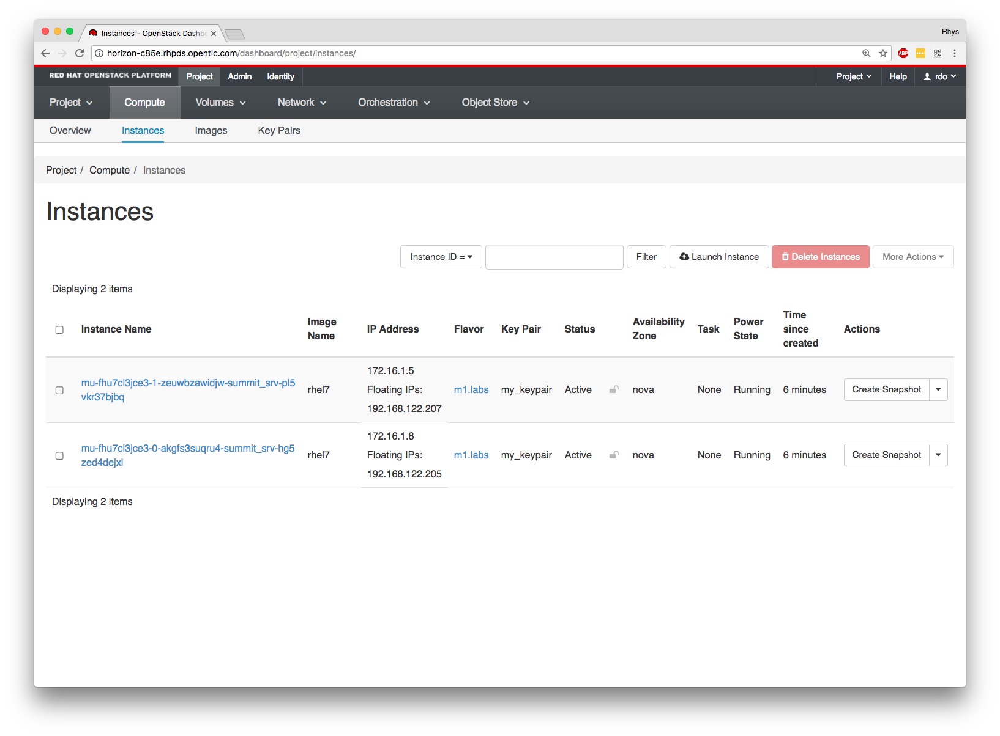

Let's shut the first node off - select the **Actions** menu for the first node in the list and select **"Shut Off Instance"** (this won't delete the instance, it will merely turn it off):

 
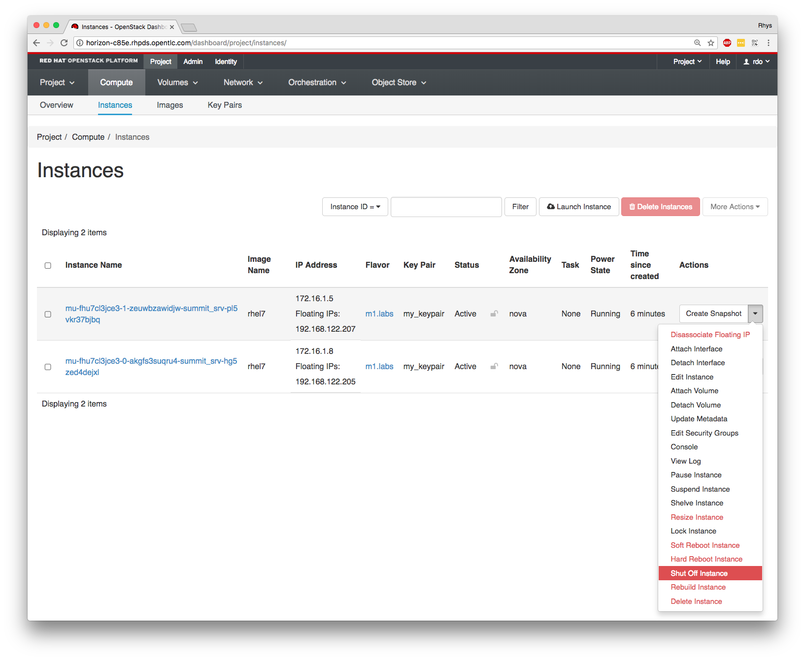

You'll be asked to confirm that you definitely want to do this, select "Shut Off Instance":

 
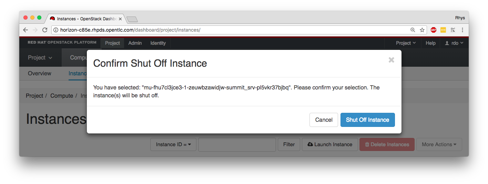

Now, if you immediately re-run your server-check script, you'll notice that the first few connections will likely swap between the two, but once the other node has been safely shut down, the load balancer starts pointing all requests to the only surviving node (in our case **172.16.1.12**), showing that our monitor is working properly and that our load balancer is able to recover efficiently with minimal client problems or downtime:

 
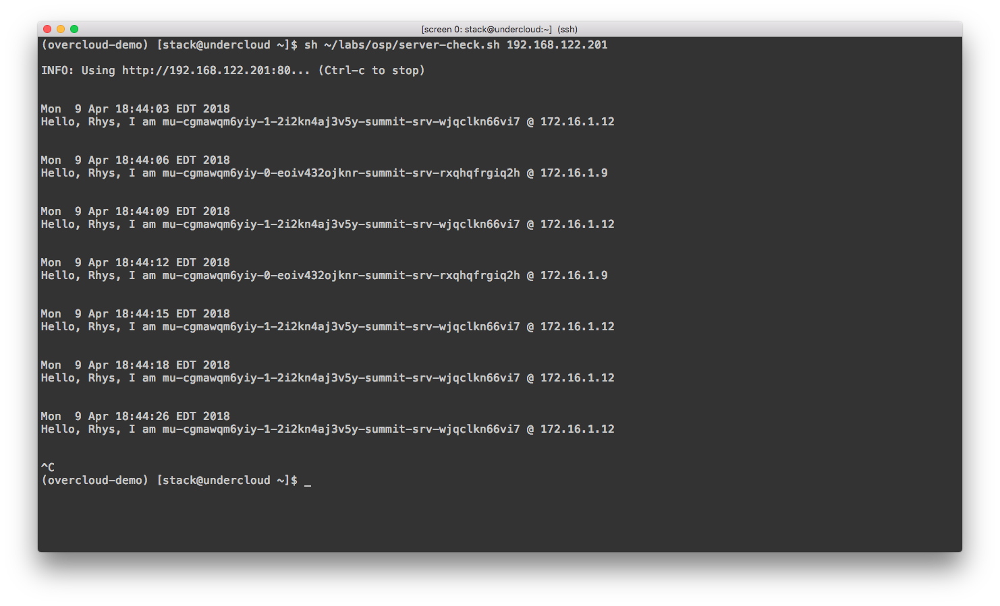

##**Cleaning up**

That's it! We're done! We need to clean up the Heat stack, and we'll take care of the rest before some of the other labs can proceed later in the day.

	$ openstack stack delete multiple
	Are you sure you want to delete this stack(s) [y/N]? y

Thank you very much for attending this lab, I hope that it gave you a bit of insight into how to use OpenStack, how its components fit together and how it all works with practical examples. If you have any feedback please share it with us, and if there's anything we can do to assist you in your OpenStack journey, please don't hesitate to ask!

