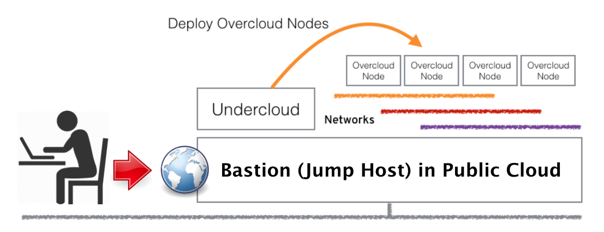
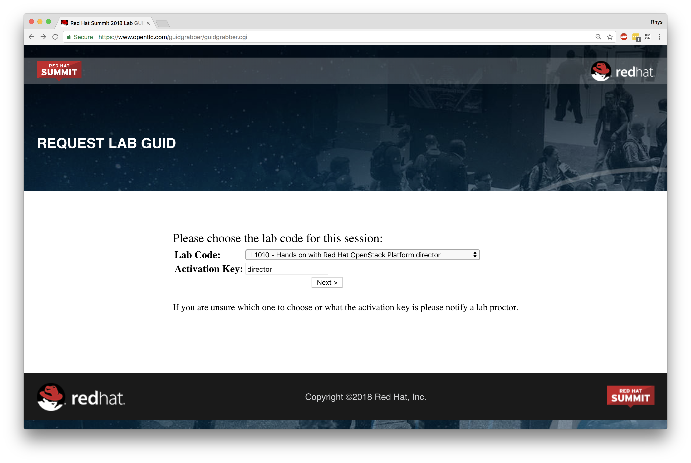
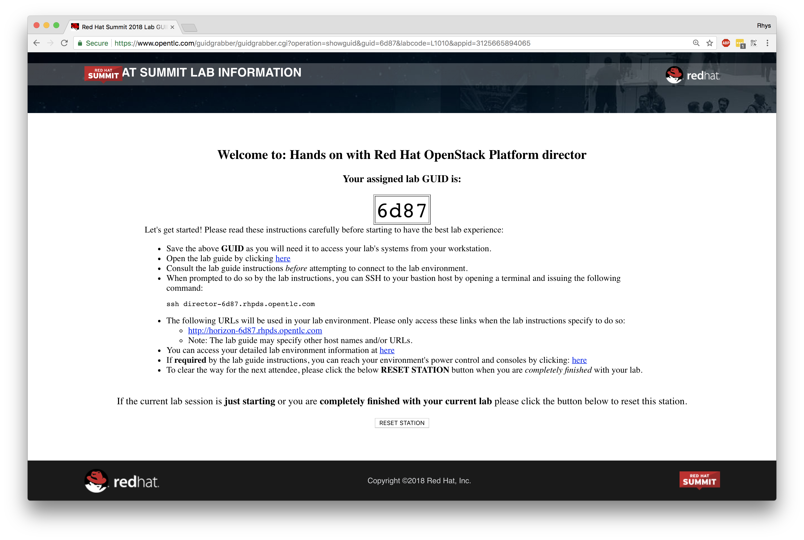

#**Lab 1: Getting Started**

The environment that we're going to be using has been partially pre-installed for our convenience and to maximise the tasks that we can accomplish in the amount of time that we've been allocated for the lab. We've done our best to preconfigure the classroom and ensure that the cloud-based virtual machines that make up the infrastruture are ready to go at the start of the lab, but we need to ensure that you're able to log in to the environment, as the workstation you're at will be used for multiple different labs during the Red Hat Summit.

# Lab Environment

As we know, we're going to be using Red Hat OpenStack Platform director which uses the TripleO methodology for deployment, i.e. a smaller 'bootstrap' OpenStack cloud, known as the **undercloud** deploys the 'production' cloud known as the **overcloud** (where your workloads would actually run). In our environment, the **undercloud** has already been deployed for you, and an additional set of virtual machines have been pre-defined (but not yet provisioned) that will become the basis for our **overcloud**. All of these nodes, the undercloud, and all overcloud nodes are virtual machines are running within a dedicated and unique public-cloud based session just for you, roughly looking like the following:

The pre-defined nodes that will become our overcloud are defined as follows:

| Node Type  | Quantity | CPU's | Memory | Storage | Networks  |
|:-:|:-:|:-:|:-:|:-:|:-:|
| **Controller** | 1 | 4  | 12GB | 1x60GB | 1x Default/Trunk, 1x Provisioning  |
| **Compute** | 2 | 4  | 6GB | 1x50GB | 1x Default/Trunk, 1x Provisioning  |
| **Networker** | 1 | 2  | 4GB | 1x50GB | 1x Default/Trunk, 1x Provisioning  |

> **NOTE**: The networking interfaces described above are for reference at this point, they'll become a lot more important when we're configuring the networks for our overcloud nodes in a later step.

 
Using a virtualised infrastructure inside of the public cloud allows us to have full control over all of the network and storage without impacting other lab users, and whilst we won't be running any intensive workloads, it allows us to build up and test OpenStack in a short amount of time and with great flexibility. To re-iterate, we'll first be connecting to the **jump host**, and then further connecting to our **undercloud** machine as the conduit into our overcloud OpenStack environment once it has been deployed. The undercloud will be used for both executing commands on the overcloud, and also as a conduit for connecting to our overcloud nodes and any deployed resources when required to do so.

# Connecting

As previously highlighted, the workstation you're sat at will be used by many different lab sessions, yet each of you will have been allocated a unique environment based within the public cloud for you to use to complete the lab steps associated with each session. On screen you should already have a tab open to the lab request form where we need to select the correct lab. If you don't have this in front of you, it's available [here](https://www.opentlc.com/guidgrabber/guidgrabber.cgi).

What you should see is as follows, noting that I've already selected the correct lab (**'L1010 - Hands on with Red Hat OpenStack Platform director'**) and have entered the activation key '**director**', which you will need to do too:

This will allocate a pre-deployed session for your usage with **GUID** that's used to uniquely identify your session, and will provide you with instructions on how to connect to the **jumphost** that we discussed above. Here's an example below:

You'll see that my assigned lab GUID is '**6d87**' and is used to uniquely identify my session, and is used as part of the connection address. Halfway down the page you'll see an ssh command that you'll need to use to connect to the environment. The environment takes around 20 minutes to power-up, and this should have already been done for you prior to the session starting, but don't be alarmed if you cannot connect in straight away, it may just require a few more minutes. Use the exact connection address that it provides you on your screen by copying and pasting the text from the webpage into a terminal emulator, here I'm using my example but you'll need to **replace** this with your own:

	$ ssh director-6d87.rhpds.opentlc.com
	The authenticity of host 'director-6d87.rhpds.opentlc.com (129.146.91.32)' can't be established.
	ECDSA key fingerprint is SHA256:SqbVF0TGdHuTsoDChp6/cw4jFHqwJlBWFOeqwd88Bi4.
	Are you sure you want to continue connecting (yes/no)? yes
	(...)

> **NOTE**: If you lose your connection details you can return [here](https://www.opentlc.com/guidgrabber/guidgrabber.cgi) at any time.

 
Next, we can jump straight to our **undercloud** machine, as this is the one that we're going to be using for all of the lab sections, note that we're using sudo below as the root user on the jump host is the only one configured with the ssk-keys:

	$ sudo ssh stack@undercloud

**Only** if this is unsuccessful (e.g. for some reason that there's no entry in /etc/hosts), attempt the following:

	$ sudo ssh stack@192.168.122.253
	
You will have full root access (via sudo) and control over this virtual machine, and we'll run our tasks directly here. If you're still unable to connect into your environment after a few minutes, please ask for assistance.

