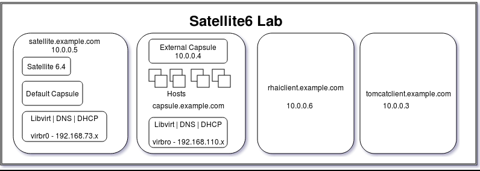
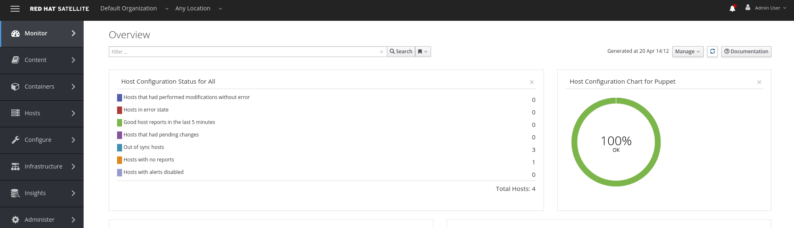

:scrollbar:
:data-uri:
:toc2:

== Hands on With Satellite 6

:numbered:

== Overview

This lab provides an overview of the Satellite product, showing core functionalities of Satellite as well as a preview of features which will be available in Satellite 6.4 and future versions. The lab will cover:

* Instructions to get to the RSS feed which has link to the Lab guide
* Introduction and tour of Satellite 6.4
* Notification drawer RSS seed
* Future dated subscriptions
* Finding a risk using Red Hat Insights and fix it
** Register existing host to Satellite 6 using the bootstrap script
** Register host with Red Hat Insights
** Find risks reported by access insights
** Remediate the risk by downloading playbook
* Deploying a tomcat app using file based repo
* Managing custom templates
* Enhancements to content management (Lazy Sync)

=== Audience/Intro/Prerequisites:

This lab is geared towards Operators and System Administrators, those are the primary users of Satellite. No prior knowledge of Satellite is required. However, this lab focuses on upcoming features of Satellite 6.4 and a few enhancements in Satellite 6.3, so attendees who are new to Satellite will benefit from some self discovery on the product during the lab.

== Lab Infrastructure Configuration

This lab is delivered as 4 KVM boxes on a public cloud - the Satellite server, Capsule and and two Red Hat Enterprise Linux 7 clients used for various exercises in the lab, like finding and fixing risks through Red Hat Insights plugin. All content has already been synced to the Satellite server, so there will be no need to access the Red Hat Content Delivery Network (CDN) to pull down content. The host is running a virtual network called “example”. During the Lab the user may provision new machines into this private network using libvirt. The experience of using libvirt as a virtualization fabric is indicative of how Satellite 6 works when connected to other Red Hat Enterprise Virtualization, VMWare, OpenStack, and EC2.

In order to provide for faster setup and configuration of this lab, we have not synced the full Red Hat Enterprise Linux Server 7 (RPMS) repo.  This allows us to use smaller disk images and faster installation into the lab environment.  If you notice that this particular repository or any other repository is empty, note that this is expected during the lab session.

The environment for the lab looks like:

== Lab Details

In order to facilitate a successful lab, certain information is required. Please note the following details about the environment. This information will be utilized throughout the exercises in the lab.

=== Warning - Lab guide commands copy-pasting

Be wary when copy-pasting commands from this guide directly into terminal. Spaces, regular quotes can be replaced with irregular characters that cause errors when they are included in a command execution.

Instance info with Public DNS is given below. One can access any of these instances via given private keys under root user. Please reach out to Lab administrator in case of any issues.

`*_Note: Please replace the GUID in Satellite6 URL with the given ID. In case of any issues, please reach out to lab administrator._*`

.Lab Instance Information
|==========
|*Instance* |*Public DNS*
|Satellite   |satellite-summit2018labsat6-<GUID>.srv.ravcloud.com
|Capsule     |capsule-summit2018labsat6-<GUID>.srv.ravcloud.com
|rhaicleint  |rhaiclient-summit2018labsat6-<GUID>.srv.ravcloud.com
|tomcatclient|tomcatclient-summit2018labsat6<GUID>.srv.ravcloud.com
|==========

.Other Information of Instances with network & login credentials
|============================
|*Data*                       |*Value*                                                       |*FQDN*
|Satellite Instance         |https://satellite6-summit2018labsat6-<GUID>.srv.ravcloud.com|satellite.example.com
|Default Username           |admin                                                       |N/A
|Default Password           |changeme                                                    |N/A
|Organization               |Default Organization                                        |N/A
|Satellite Private IP       |10.0.0.5                                                    |satellite.example.com
|Bridge on Satellite        |192.168.73.1                                                |satellite.example.com
|Bridge on Capsule          |192.168.110.1                                               |capsule.example.com
|All root passwords         |r3dh4t1!                                                    |N/A
|Capsule Private IP         |10.0.0.4                                                    |capsule.exampe.com
|Bootstrap Client Private IP|10.0.0.6                                                    |rhaiclient.example.com
|Tomcat Client              |10.0.0.3                                                    |tomcat client
|============================

== In the Community

If you would like to keep up to date with the latest development, or if you would like to submit a patch, please come find us in the community.

* Websites:
** http://www.theforeman.org/[^]
** https://theforeman.org/plugins[^]
** http://www.pulpproject.org/[^]
** http://candlepinproject.org/[^]
* Community Events and Discussions
** http://theforeman.org/events[^]
** https://community.theforeman.org[^]
* IRC: #theforeman on freenode

== Story 1 - Tour of Satellite 6.4

The first story is not really a user story, but rather a tour of Satellite 6.4. If you are familiar with Satellite 6 you can continue to Story 2. The user will be given small exercises to do, but the real goal of this story is to understand the major components of Satellite 6.4 and to view the pre-populated data for the lab.

=== Login

Log in to the Satellite 6.4 Server at *https://satellite-summit2018labsat6-<GUID>.srv.ravcloud.com* using the provided credentials. ( Note: please update the GUID as given to you or contact Lab administrator) This is an administrator account, which is similar to the “Site Admin” role in Satellite 5. Satellite 6 has a robust Role Based Access Control (RBAC) system which controls what actions users can take, and the resources (e.g. organizations) which they can access. For the sake of simplicity in this lab, only the admin account will be used.

=== Basic Navigation and Organizations

When you login, you are presented with a set of menus on left side as vertical menu navigation.

Please make sure _Deafult Organization_ is selected when you login to UI. It can be selected through org switcher _Any Context_ from top left dropdown

==== The menus have the following functions:

|===================================
|*Menu Item*                         |*Description*
|Any Context / Default Organization|This is the organization and location switcher, and lets the user select the current Organization and Location which is being managed. Satellite 6 is a multi tenant solution, and this selector which is always at the top of the screen tells the user the current organization and location. For this lab, the organization to use is named “Default Organization” and the location setting will remain “Any Location”. If the context is not “Default Organization” then select the organization by going to Org Switcher >> Any Organization >> Default Organization.
|Monitor                           |Summary Dashboards and Reports are grouped here.
|Content                           |Features around Content Management are grouped here. This includes Subscriptions, Lifecycle Environments, Products, Repositories, Content Views, Errata, and Activation Keys.
|Containers                        |Container management features are here.
|Hosts                             |System Inventory and Provisioning Configuration tools are grouped here.
|Configure                         |General Configuration Data is setup here, including Host Groups, Puppet and Ansible data.
|Infrastructure                    |How Satellite 6 interacts with the environment is managed through these menus.
|Insights                  |An interface into the Red Hat Insights tool is embedded into Satellite 6, and can be accessed here.
|Administer                        |Advanced configuration such as Users, RBAC, and Settings are grouped here.
|Red Hat Access                    |Customer Portal Access, including Red Hat Insights, is grouped here.
|Admin User                        |This is the user control, which lets users edit their own information.
|===================================

=== Subscriptions

Satellite 6 delivers the Subscription Management functionality, which has been available via the Customer Portal. With this feature, users have complete visibility into the subscriptions that an account has, the duration the subscription is active, and the service level.

Users can access the Subscription Functionality at *Content >> Red Hat Subscriptions*. You will see several Red Hat Products.

==== Exercise: Subscriptions

What is the support level and contract number for the _Red Hat Satellite Infrastructure Subscription_ Subscription?

=== Products

Satellite 6 models content as Products. Products are collections of repositories which are managed together. With this feature, users can create custom products for applications and layer these on top of Red Hat Provided Products.

Users can access the Product Functionality at *Content >> Products*. You will see several Red Hat Products. You can create your own custom products, but this will not be done in this lab.

For the sake of the image size, much of the Red Hat Enterprise Linux content has not been synchronized to the Satellite.

==== Exercise: Products

How many packages are contained in the _Red Hat Enterprise Linux 7 Server Kickstart x86_64 7Server_ repository?

=== Activation Keys

Satellite 6 provides Activation Keys which allow users to define properties that may be applied to machines that are registered using the key. This includes properties like lifecycle environment, content view, subscriptions, enabling repositories and host collections.

=== Content Views

Satellite 6 moves away from channel cloning and allows users to define rules for creating snapshots of content. These snapshots are called Content Views. These views can be promoted across Lifecycle Environments to provide a controlled deployment model where different machines are updated based on different schedules. For customers who do not wish to use content views, the Library contains a default content view with the latest version of all content.

The Lab starts with a single content view representing a simple RHEL Standard Operating Environment (SOE) based on RHEL 7. Satellite 6 has built in access to minor releases of RHEL (e.g. 7) and robust filters which will allow users to make highly specialized content views. Users can access the Content View Functionality at *Content >> Content Views*.

==== Exercise: Content Views

How many Packages are contained in Version 1.0 of the _RHEL 7 SOE_ Content View?

=== Host Groups

Host Groups are recipes for systems, describing how the system should be provisioned. When deploying the host into a location either on bare metal or in your hybrid cloud, Satellite 6 will have all the information required to create the machine.

==== Exercise: Host Groups

Create a new hostgroup by following settings and make sure to set the default root password, activation key.

. Go to *Configure >> Host groups*.
. Create hostgroup with name *RHEL 7 SOE*.
.. Select Lifcycle envrionment *Library*
.. Select Content View *RHEL 7 SOE*
.. Select Content Source *satellite.example.com*
. Select the *Network* tab
.. For *Domain*, select *example.com*
. Select the *Operating System* Tab
.. Select Architecture *x86_64*
.. Select Operating System *RedHat 7.5*
.. Select Partition table *Kickstart default*
.. In the *Root password* field - Click the edit icon and enter *changeme*
. Select the *Activation Keys* Tab
.. Click the *input box* and select *ak-rhel-7*
. Click *Submit*

=== Compute Resources

Satellite 6 supports the Hybrid Cloud model by allowing users to provision machines onto both bare metal machines and onto cloud fabrics such as EC2, OpenStack, RHEV-M, VMWare etc. Compute Resources model the connection between Satellite 6 and the fabric.

==== Exercise: Compute Resources

. Go to *Infrastructure >> Compute resources*
. Click *Edit* on the row for the compute resource named *libvirt*
. Click the *Test Connection* button
. Click *Submit*

=== Hammer Command Line

Satellite 6 ships with a full command line tool called hammer. The goal of the command line tool is that anything done via the UI can be done via the CLI. The CLI exposes the REST API, which can be used for richer integration into a user’s environment.

==== Exercise: List the organizations

ssh in to the Satellite lab vm:

----
ssh -i <key_name> root@satellite-summit2018labsat6-<GUID>.srv.ravcloud.com
----

*_Note: Private ssh-key is already placed on your provided laptop_*

Execute the following command:

----
hammer -u admin -p changeme organization list
----

==== Exercise: List the roles in the hammer shell

Hammer comes with a shell which can be used to run multiple hammer commands

----
ssh -i <key_name> root@satellite6-summit2018labsat6-<GUID>.srv.ravcloud.com
----

Execute the following commands:

----
 hammer -u admin -p changeme shell
 hammer> role list
 hammer> role filters --id 1
 hammer> exit
----
==== Exercise: Export the subscriptions to a CSV file.

Hammer comes with an ability to export items in a csv format which then can be imported into any software that can read csv files.

ssh in to the Satellite lab vm:

----
ssh -i <key_name> root@satellite6-summit2018labsat6-<GUID>.srv.ravcloud.com
----

Execute the following command:

----
hammer --csv subscription list --organization-label Default_Organization > subscriptions
----

=== Answers

.Here are the answers to the exercises above

|==============
|*Exercise*     |*Answer*
|Subscriptions|Support Level: Premium, Contract Number: 11528762. Go to Content >> Red Hat Subscriptions.
|Products     |5099. Go to Content >> Products >> Red Hat Enterprise Linux Server >> Repositories.
|Content Views|23249. Go to Content >> Content Views >> RHEL 7 SOE.
|==============

== Story 2 - Notification drawer RSS feed
// ==== Prerequisites (to be done by us):
// - Put prepared RSS feed into /var/www/html/pub/atom.xml
// - Make sure the notifications show up when the user first logs in, run the following before finishing the image
// ----
// # FOREMAN_RSS_FORCE_REPOST=true foreman-rake rss:create_notifications
// ----

Among new features in Satellite 6.4 is the ability to pull a RSS feed and display it to the users via notifications. By default, the feed contains links to posts on the Red Hat Satellite blog and is refreshed twice a day.

.Observing the notifications
To see the three newest items from the RSS feed, follow these steps:

- Log in to the Satellite
- Open the notification drawer
- Expand the _Community_ item

.Overriding the feed source
This mechanism can be used for example by administrator of Satellite to deliver messages about the instance to its users. Let’s reconfigure the Satellite to pull from another URL.

- Navigate to _Administer_ > _Settings_
- Select the _Notifications_ tab
- Change the value of _RSS URL_ to `https://satellite.example.com/pub/atom.xml`

.Refreshing the feed manually
By default the RSS feed is refreshed twice a day. To force the refresh and actually see it is working, log into the Satellite over SSH and run the following command:

----
# foreman-rake rss:create_notifications
----

The notification drawer should now be populated with information about scheduled maintenance of the machine. This can be easily verified by following the steps described earlier.

== Story 3 - Futured dated subscriptions
// Prerequisites
// - manifest must have current and future subs
// - manifest must be imported into satellite
// - client has to be registered to Satellite and set to consume the currently valid subs

Satellite allows importing content from Red Hat's Content Delivery Network, which can then be consumed by client machines. In order to do so, Satellite needs to know what product subscriptions are available so it can use the products' repositories. This is done by importing a subscription manifest into the Satellite.

Among new features in Satellite 6.3 is the ability to import subscriptions with future dates into the Satellite. This allows the user to attach "not-yet-valid" subscriptions to hosts, before their current subscriptions expire.

In the lab, the client machine is consuming a subscription `Red Hat Enterprise Linux Server with Smart Management, Premium (Physical or Virtual Nodes)`. To find out when the subscription is going to expire, navigate to _Hosts_ > _Content Hosts_, select the client host and take a look at the _Expires_ column in the _Subscriptions_ tab.

----
# hammer subscription list --organization "Default Organization"
----

// - Briefly mention the horrors which ensue if subscriptions expire

There is a futured dated subscription included in the lab's manifest. To ensure the client host will not be denied updates in case its subscription expires, it is a good idea to attach a future dated subscription to it some time before the current one expires.

The workflow for attaching future dated subscriptions is exactly the same as for attaching regular subscriptions.
- Navigate to _Hosts_ > _Content Hosts_
- Select hosts to attach subscriptions to
- Click _Select Action_ > _Manage Subscriptions_
- Check the subscription to attach
- Click _OK_

To do the same thing using hammer, perform the following when logged on to the Satellite server via SSH.
----
# hammer host subscription attach \
         --host $HOST_NAME \
         --subscription-id $SUB_ID
----

To ensure everything works log into the client machine over SSH and use `subscription-manager` to query information about attached subscriptions. Search for _Status Details_ key in the output. In there you should be able to see two subscriptions, one with "Subscription is current" and one with "Subscription has not begun" details.

----
# subscription-manager refresh
# subscription-manager list --consumed
----

== Story 4 - Find a risk using Red Hat Insights and Fix it with Satellite 6

. Login to satellite server using 'Admin' user (Password: changeme). Access the Satellite Server using: https://satellite6-summit2018labsat6-<GUID>.srv.ravcloud.com. Please replace the GUID with the ID given to you.

. Once login, Please make sure Red Hat Insights Service is enabled by navigating to the Insights -> Manage. If the service is not enabled, please click Enable Service and Save.

=== Using a bootstrap script to register client

With Satellite 6, in addition to creating new hosts, you can  also easily bring existing hosts under Satellite’s wings. **_Bootstrap script_** is used for this purpose. The two main use cases are:

. Migrate from RHN Classic or Satellite 5
. Register a new host that has not been previously registered with Red Hat Systems Management Platform

We will go through the latter use case in our lab. The bootstrap script is served from /pub directory on your Satellite server.

* Navigate to https://satellite6-summit2018labsat6-<GUID>.srv.ravcloud.com/pub/[^] in your browser to verify.

ssh into a VM that will be bootstrapped:

----
# ssh -i <path_to_public_key> root@rhaiclient-summit2018labsat6-<GUID>.srv.ravcloud.com -p 22
----

*Download the script:*

----
# curl -O -k https://satellite-summit2018labsat6-<GUID>.srv.ravcloud.com/pub/bootstrap.py
----

Make the script executable:

----
# chmod +x bootstrap.py
----
Run the script with the help options to see all options that are available:

----
# ./bootstrap.py -h
----
Now let’s run the script:

----
# ./bootstrap.py -l admin -s capsule.example.com -o 'Default Organization' -L 'Default Location' -a ak-rhel-7 -g 'bootstrap' --unmanaged
----
Type in the admin’s password when prompted. Script will download the necessary packages, install consumer RPM and run subscription-manager (with the user provided activation key) to register the system. Then it will set up the system with a proper Puppet configuration pointing to Satellite server.

When the script reaches the step to execute ‘*_/usr/bin/puppet agent --test --noop'_*_, it will pause for few secs for  administrator to approve the Puppet certificate. Once  bootstrap script is completed, follow below steps

. Navigate to *Hosts -> All Hosts*
. Verify that your client is connected to the correct hostgroup
. Select the host *rhaiclient.example.com*
. Click the content button.
. Verify that your host is subscribed which is indicated by *Fully entitled* in the _Subscription Status_ field.

=== Populate risks on registered client

Risks can be populated by generating flaws in configuration files. We have scripted the issues in configuration files and you can populate them by running _helper.sh_ script from

----
# curl -O -k https://satellite-summit2018labsat6-<GUID>.srv.ravcloud.com/pub/helper.sh
----

----
# chmod +x helper.sh
----

=== Install redhat-access-insights

Once you have verified that the client is registered in your Satellite environment it is time to Install the redhat-access-insights client for risk reporting.

Install the Red Hat Insights client for reporting the flaws and risks to Satellite +
Login to your client machine *(rhaiclient-summit2018labsat6-<GUID>.srv.ravcloud.com)* using ssh and run the following command to refresh and install the Red Hat Insights client:

----
# yum install redhat-access-insights
----

=== Populate risks on registered client

Risks can be populated by generating flaws in configuration files. We have scripted the issues in configuration files and you can populate them by running _helper.sh_ script from

----
# curl -O -k https://satellite-summit2018labsat6-<GUID>.srv.ravcloud.com/pub/helper.sh
----

----
# chmod +x helper.sh
----

=== Register client with redhat access insights

Register the client with insights on Satellite6 server using below command:

----
# redhat-access-insights --register
----

This registers the server with insights, adds a cron entry under cron.daily and also runs the insights client immediately.

=== Examine flaws and risks on registered client using Insights

After registering your client with Insight access service, one can start analysing the risks  by navigating to the *Red Hat Insights > Overview* menu option on the top nav bar. Overview page will provide the critical vulnerabilities or bugs that insight service has detected from your clients.

Actions Summary header giving you the ability to quickly drill down into an individual risk severity level provided by Insights.

=== Download the Ansible playbook to remediate identified risk

To remediate the identified risks on each registered client, Navigate to *‘Red Hat Insights’ -> Inventory* on top navigation menu item. There you will see your registered clients with number of actions under Status header. Follow the below steps to run the ansible playbook for remediate:

* Click on ‘Actions’ dropdown on left of the ‘Inventory’ page
* Select ‘Create a new plan/playbook’
* Enter the plan name, and select the following rules to fix and save the form
** Decreased security in system logging permissions
** Decreased security when Red Hat Product Signing Key not installed
* Now the click on ‘Run Playbook’ on bottom of the planner page
* wait until job get finished.

After performing the recommended resolution and running the remote-execution job on client, re-run the Insights client with:*# redhat-access-insights *on client node. The identified risk should be fixed.

Please navigate to ‘Red Hat Insights’ -> Overview page and web UI should not show any remediated risk/issue there.

== Story 6 - Managing templates
// Prerequisites
// install tfm-rubygem-hammer_cli_foreman_templates
// fix foreman_templates apidoc, rebuild apipie:cache

// Notes
// Can't use /tmp for export/import, systemd runs httpd with private /tmp mount

Templates have been an essential part of Satellite 6 for a long time and they are present in several different flavors. Some of these include kickstart, finishing scripts, and custom snippets. The 6.4 version will offer an extended tooling for managing your templates that leverages git for tracking changes. The templates plugin allows users to easily export or import templates and it does not matter how many different kinds of templates you use. By default Satellite is configured to use the upstream community-templates repository hosted on GitHub when performing template operations.

.Importing templates
To import the templates from the repository, run the following command on the Satellite server.

----
# hammer import-templates --prefix '[Summit 2018] '
----

To see the imported templates, go to *Hosts* > *Provisioning templates* and see the templates with `[Summit 2018]` prefix.

Sometimes it may be desirable to filter the templates before importing them to avoid cluttering the system. To do so, several options can be passed to the `hammer import-templates` command to modify its behavior. To import only Ansible templates from upstream repository and development branch to get the latest and greatest Ansible templates run the following:
----
# hammer import-templates \
    --prefix '[develop] ' \
    --filter '.*Ansible Default$' \
    --repo https://github.com/theforeman/community-templates \
    --branch develop
----

Looking at the templates in Satellite now, we should be able to see a couple of new templates with the '[develop]' prefix.

In the last example we can see the repository path can be overriden by passing another path or URL to the command on a per-invocation basis. To change the repository in Satellite, navigate to *Settings* > *TemplateSync* and change the repository to `/custom/templates`.

The path we configured doesn't exist on the Satellite server yet, so we have to create it. We'll go on and clone the community templates repository to `/custom/templates`.

----
# mkdir /custom
# git clone https://github.com/theforeman/community-templates /custom/templates
----

Because the exporting and importing is done by the Satellite server, we need to make sure the correct permissions are set on the repository and it has the correct SELinux context.

----
# chown -R foreman:foreman /custom/templates
# chcon -R -t httpd_sys_rw_content_t /custom/templates
----

Now we can export the templates to the directory.

----
# hammer templates-export
----

We can now inspect the exported templates and commit them to the repository.

----
# cd /custom/templates
# git commit -am 'exported templates from Satellite'
----

To see the true benefit of having the templates version controlled, edit any of the templates and export them again. Now we can take a look at the repository again and see what changed.

----
# cd /custom/community-templates
# git diff
----

=== Extra: Exporting templates to a hosted git service

The templates can also be exported, commited and pushed or imported into or from a git repository directly. To do so, a single condition has to be met. The `foreman` user on the Satellite server has to be able to authenticate against the hosting service without a password. This usually involves configuration of SSH keys.

When this prerequisite is fulfilled, all that is left is to either configure the repository in *Settings* as mentioned earlier or just pass the repository to the command.

== Story 7 - Manage a Tomcat Application with File Repositories and Auto Publish

Satellite 6.4 adds file repository management to content views allowing repositories to be versioned and sync'd to Capsules allowing for a wide range of new client workflows.

=== Create Product, Repository and Content Views

  1. Navigate to *Content > Products*
  2. Click the *Create Product* button
  3. Give it the name *Hello Product*
  4. Click *Save*
  5. Click the *New Repository* button
  6. Give it the name *Hello Java App*
  7. Select Type *file* and save the repository

=== Upload Java Application

On the Satellite exists a pre-built WAR file that will now get uploaded to our repository.

----
ssh -i <key_name> root@satellite6-summit2018labsat6-<GUID>.srv.ravcloud.com
----

Now upload the WAR file to the file repository.

----
hammer repository upload-content --product "Hello Product" --name "Hello Java App" --organization "Default Organization" --path helloworld/hello.war
----

Back in the UI, click on the repository *Hello Java App* and note it lists *Files 1*. Click on the *1* to see that our *hello.war* file exists in that repository.

=== Create Content Views

  1. Navigate to *Content > Content View*
  2. Click the *Create New View* button
	3. Give it the name *Hello Application* and click *Save*
  4. Click *File Repositories* tab
  5. Click *Add* sub-tab
  6. Select *Hello Java App* from the table
  7. Click *Add Repositories* button
 	8. Navigate back to *Content View* list by clicking the breadcrumb located under the *Hello Application* title

Note in CV List there is a *RHEL7 SOE* pre-built. This reflects how another department, such as IT, might build and control the base OS view. Let's create a composite content view to use the SOE and our application view.

  1. Click the *Create New View* button
  2. Give it the name *Hello Application with RHEL7 SOE*
  3. Select *Composite View?* and *Auto Publish*
  4. Click *Save*

We have now created a composite content view that is set to auto publish itself whenever a component view is updated. Thus if the SOE view is re-published, or our Application view receives an update, this composite will publish and stage a new view.

  1. Select *RHEL7 SOE* view set to *Always Use Latest*
  2. Select *Hello Application* view set to *Always Use Latest*
	3. Click *Add Content Views*

Using the arrows icon next to the breadcrums *Hello Application with RHEL7 SOE >> Content Views*, navigate back to the *Hello Application*. Now we will publish our application.

	1. Click *Publish New Version*
	2. Click *Save*
	3. Navigate back to *Hello Application with RHEL7 SOE*

Note that *Version 1.0* is either published or still publishing via the *Status* column. If still publishing, wait until complete. Once complete, the *Description* column will show that this was due to an Auto Publish and which content view publish triggered the event.

=== Deploy Java Application

	1. Navigate to *Hosts > All Hosts*
	2. Click on *tomcatclient.example.com*
 	3. Click *Schedule Remote Job*
	4. Ensure *Ansible Playbook* is selected
  5. Click *Submit*
	6. Click *Hosts* tab
	7. Click *tomcatclient.example.com*

This page shows the Ansible role in action running on our host. Once this is complete we can view our application.

	1. Open a browser tab to *http://tomcatclient-summit2018labsat6-<GUID>.srv.ravcloud.com:8080/hello*
	2. Note a "Hello World!* application is running

=== Bonus: Deploy New Version of Java App

On the Satellite exists a new version of our application in a pre-built WAR file that will now get uploaded to our repository.

----
ssh -i <key_name> root@satellite-summit2018labsat6-<GUID>.srv.ravcloud.com
----

Now upload the WAR file to the file repository.

----
hammer repository upload-content --product "Hello Product" --name "Hello Java App" --organization "Default Organization" --path hellosummit/hello.war
----

Now let's publish our application content view to produce a new version with our application.

	1. Navigate to *Content > Content Views*
	2. Click on *Hello Application*
	3. Click *Publish New Version*
	4. Click *Save*
	5. Navigate back to *Hello Application with RHEL7 SOE*

Again, watch as *Version 2.0* is either published or still publishing via the *Status* column. If still publishing, wait until complete. Once complete, the *Description* column will show that this was due to an Auto Publish and which content view publish triggered the event. In this case, it should indicate Version 2.0 of *Hello Application*.

Now, let's re-apply our Ansible role to fetch the new version of our application.

	1. Navigate to *Hosts > All Hosts*
	2. Click on *tomcatclient.example.com*
 	3. Click *Schedule Remote Job*
	4. Ensure *Ansible Playbook* is selected
  5. Click *Submit*
	6. Click *Hosts* tab
	7. Click *tomcatclient.example.com*

This page shows the Ansible role in action running on our host. Once this is complete we can view our application.

	1. Open a browser tab to *http://tomcatclient-summit2018labsat6-<GUID>.srv.ravcloud.com:8080/hello*
	2. Note that the application now reads *Hello Red Hat Summit!*

== Story 8 - Repository improvements

As part of Satellite 6.3 many improvements have been made to the Repository and Content Management aspects of Satellite.

=== Lazy Sync

Lazy Sync allows you to more quickly synchronize large repositories by not downloading the actual rpm files until later, based upon the desired download policy.  Three different download policies exist:

|===
|*Download Policy*|*How it works?*
|*Immediate*    |Traditional synchronization where rpm files are downloaded immediately. This is the only type of synchronization policy that existed prior to Satellite 6.2.
|*On Demand*    |The initial synchronization only downloads the repository metadata.  RPM files are not downloaded until they are requested by a client.  These repositories can be published in content views and synced to capsules even if any or all of the rpms are not downloaded. This is the default option.
|*Background*   |Similar to On Demand. Initially, only the repository metadata is synced. After the initial synchronization is finished, Satellite will continue downloading the rpm files in the background.  Any requests for RPMs while that is happening will be synced immediately.
|===

==== Create and sync the repository:

. Navigate to *Content > Products*
. Click *Create Product* in the upper right corner
. Give it name *Summit*
. Click *New Repository *in the upper right corner
. Give it the name *lazy*
. Select the type *yum*
. Provide the *Url*  http://satellite.example.com/pub/lazy[^]
. For *Download Policy* select *On Demand*
. Click *Save*
. Click on the *lazy* repository
. Select Action -> *Sync Now* in the upper right corner
. Once it is synced, go back to the repository details page and click *Content Counts -> Packages* link to see the list of packages

To see the file system:

. Click *Back* and click on the *Published At* link.
. You should notice that no RPMs exist in the repo.  The URL you are browsing to should look like:

----
http://satellite-summit2018labsat6-<GUID>.srv.ravcloud.com/pulp/repos/Default_Organization/Library/custom/Summit/lazy/*
----

==== Simulate a client request

Request an RPM to force Satellite to download it.  Run the following command from your workstation:

----
wget http://satellite.example.com/pulp/repos/Default_Organization/Library/custom/Summit/lazy/Packages/b/bear-4.1-1.noarch.rpm
----

Browse the repository again:

. Navigate to *Content > Products*
. Click the *Summit* Product
. Click the *lazy* repository
. Click on the *Published At* link
You should see the RPM we downloaded now appears in the repository.  Note this may take up to 5 minutes to occur.  You may wish to continue to the next section in another browser tab and come back and refresh this later.

== Glossary

The following terms are used throughout this document, and are important for the users understanding of Satellite 6.
|===================================
|*Term*                               |*Definition*
|Activation Key                     |A registration macro which can be used in a kickstart file. These can be used to control actions at registration before Puppet Master kicks in. These are similar to Activation Keys in Red Hat Satellite 5, but they include less features. These features are covered by Puppet Manifests.
|Application Lifecycle Environment  |Named areas where content can be moved to, and which systems are grouped into. Traditional usage of these are Dev -> Test -> Prod. Channel cloning was used for this in Red Hat Satellite 5
|Attach                             |Associating a Subscription to a Host which provides access to RPM content.
|Capsule                            |A node in the Red Hat Satellite 6 deployment. It supports large scale deployments by providing services such as a Puppet Master, DHCP Integration, or a Content Cache (Pulp Node).
|Common Vulnerability Exposure (CVE)|A standardized format for naming and reporting security exposures. It is maintained by the MITRE Corporation.
|Compute Profile                    |Default attributes for new virtual machines on a compute resource.
|Compute Resource                   |A virtual fabric, or cloud infrastructure, where hosts can be deployed by Red Hat Satellite 6. Examples include RHEV-M, OpenStack, EC2, and VMWare.
|Content                            |Software packages (RPMS), or configuration modules. These are mirrored into the Library and then promoted into Application Lifecycle Environments to be used.
|Content Delivery Network (CDN)     |The mechanism to deliver Red Hat content in a geographically co-located fashion. For example, content which is synced by a Satellite 6 in Europe will pull content from a source in Europe.
|Content View                       |A snapshot of content which is in the Library. Content views define the rules for creating the snapshots and a stream views created from the rules. Content Views are a refinement of channel cloning pattern from Red Hat Satellite 5.
|Hammer                             |The name of the command line tool for Red Hat Satellite 6. It works like a standard cli as well as a shell in the same way that space-cmd works.
|Host                               |A system, either physical or virtual, which is managed by Red Hat Satellite 6.
|Host Group                         |A template for how a host should be built. This includes the packages to install, and the puppet classes to apply.
|Image                              |A container which is currently not running.
|Location                           |A collection of default settings which represent a physical place. These can be nested so that a user can set up defaults for Europe, which are refined by Tel Aviv, which are refined by DataCenter East, and then finally by Rack 22.
|Library                            |The Library is your collection of content which can be used. If you are an ITIL shop, it is your definitive software library.
|Manifest                           |The means of transferring subscriptions from the Customer Portal to Red Hat Satellite 6. This is similar in function to satellite certificates.
|Organization                       |A tenant in Red Hat Satellite 6. Organizations, or orgs, are collections of Hosts, Subscriptions, Users, and Application Lifecycle Environments.
|Permission                         |The ability to perform an action.
|Product                            |A collection of content repositories which are managed as a single unit.
|Promote                            |The act of moving content from one Application Lifecycle Environment to another.
|Provisioning Template              |User defined templates for Kickstart files and other provisioning actions. These provide similar functionality as Kickstart Profiles and Snippets in Red Hat Satellite 5.
|Puppet Agent                       |A Host agent which applies puppet changes to a Host.
|Puppet Master                      |A component of a Capsule which provides puppet manifests to Hosts.
|Pulp Node                          |A component of a Capsule which mirrors content. This is similar to the RHN Proxy for Satellite 5. The main difference is that content can be pushed to the mirror before it is used by a Host.
|Repository                         |A collection of content (yum repository, containers, puppet repository)
|Role                               |A collection of permissions which are applied to a set of resources (such as Hosts)
|Smart Proxy                        |A component of a Capsule which can integrate with external services, such as DNS or DHCP.
|Standard Operating Environment (SOE)|A controlled version of the operating system which applications are deployed on top of.
|Subscription                       |The right to recieve content and service for Red Hat. This is purchased by customers.
|Syncing                            |The mirroring of content from external resources into the Red Hat Satellite 6 Library.
|Sync Plans                         |Scheduled executing of syncing content.
|Usergroup                          |A collection of roles which can be assigned to a collection of users. This is similar to the Role in Red Hat Satellite 5.
|User                               |A human who works in Red Hat Satellite 6. Authentication and authorization can be done via built in logic, or using external LDAP or kerberos resources.
|====================================
