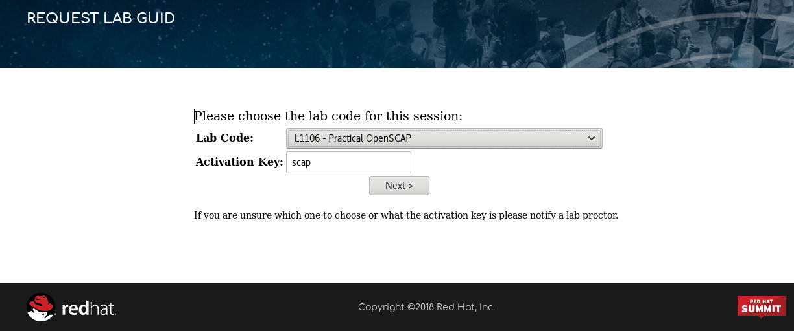
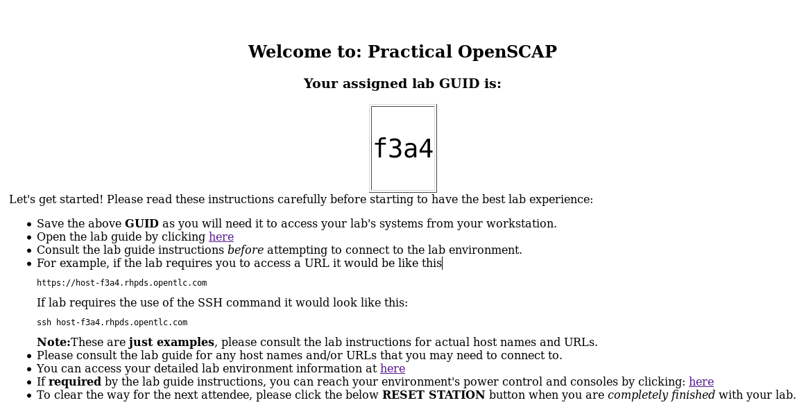
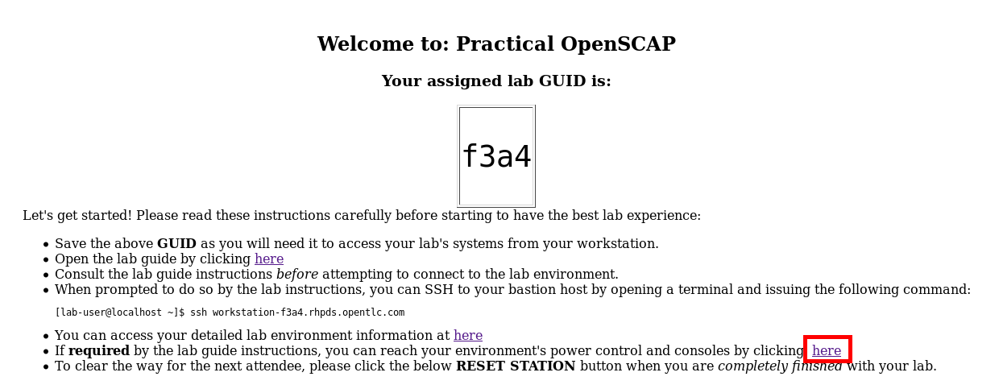

# Practical OpenSCAP - L1106

In this hands-on lab, we'll review using OpenSCAP to perform automated security compliance for bare-metal machines, virtual machines, and containers. SCAP content customization lets you fit security policies to your use case.

### Presenters

 - Martin Preisler, Red Hat
 - Watson Sato, Red Hat

## Lab environment

To access the lab environment use the Lab Request [form](https://www.opentlc.com/guidgrabber/guidgrabber.cgi).

You should see a screen like below. Select the Practical OpenSCAP lab, **L1106 - Practical OpenSCAP**, and use the activaction key **scap**.

You will be assigned a lab environment with a lab GUID.

Image above shows an example GUID, yours will be different. Take note of it as you'll use it to access the lab environment.

## Lab instructions

The Practical OpenSCAP lab is divided in two parts.

### Part 1
On part 1, attendees will go through OpenSCAP on the command-line, execute scans, generate reports and perform remediations.  
They will be able to understand the OpenSCAP tool and security standards used to scan.

To access the lab environment, open a terminal and SSH into the system using your GUID. The hostname has the following format `workstation-GUID.rhpds.opentlc.com`.
Issue the following command, replacing `GUID` with your actual GUID.

	ssh workstation-GUID.rhpds.opentlc.com

In the example image, the GUID is f3a4, the access to lab environment would be done via:

	ssh workstation-f3a4.rhpds.opentlc.com

Here you can find the instructions for [Practical OpenSCAP lab part 1](./Summit_2018-Practical_OpenSCAP-L1106-part-1.pdf)

### Part 2
On part 2, attendees will go through SCAP Workbench, execute scans, customize a profile, and perform remediations.  
Part 2 also covers how to scan and remediate containers, and how to visualize results of a scan on DISA STIG Viewer.

For this part of the lab you'll need to access the lab environment through the Web Console.
From the GUID page, access the environment's power control and consoles page.

You should see a list of machines, click in the **CONSOLE** link of the machine called **0WORKSTATION**.

Here you can find the instructions for [Practical OpenSCAP lab part 2](./Summit_2018-Practical_OpenSCAP-L1106-part-2.pdf)

## Tips

During some steps you'll be asked to open an HTML report of the scan.  
It may be more convenient to copy the report to your laptop and open it locally.

	scp workstation-GUID.rhpds.opentlc.com:/root/report.html ./report.html

In the lab environment there are two machines in the environment, one called `0Workstation` and the other `1Server`.  
Host `0Workstation` is there for you to go through the lab.  
Use it to follow the intructions and get acquainted with OpenSCAP.  
It's hostname is `workstation-GUID.rhpds.opentlc.com`.

Host `1Server` is available for you to freely experiment and remediate with OpenSCAP.  
Use it to do whatever you want without fear of breaking it and not be able to continue the lab.  
It's hostname is `server-GUID.rhpds.opentlc.com`.
