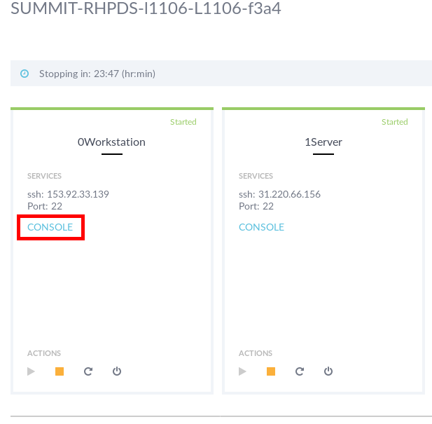

# Practical OpenSCAP - L1106

In this hands-on lab, we'll review using OpenSCAP to perform automated security compliance for bare-metal machines, virtual machines, and containers. SCAP content customization lets you fit security policies to your use case.

### Presenters

 - Martin Preisler, Red Hat
 - Watson Sato, Red Hat

## Lab instructions

The Practical OpenSCAP lab is divided in two parts.

### Part 1
On part 1 you will go through OpenSCAP on the command-line, execute scans, generate reports and perform remediations.  
You will be able to understand the OpenSCAP tool and security standards used to scan.

For Part 1, you should access the lab environment via SSH using your SSH key and GUID . The hostname has the following format `workstation-GUID.rhpds.opentlc.com`.
Issue the following command, replacing `GUID` with your actual GUID.

	ssh -i SSHKEY RHPDSUSER@workstation-GUID.rhpds.opentlc.com

If path to your SSHKEY is `~/.ssh/id_rsa`, GUID is `f3a4`, and your RHPDSUSER`user-redhat.com`, the access to lab environment would be done like this:

	ssh -i ~/.ssh/id_rsa user-redhat.com@workstation-f3a4.rhpds.opentlc.com

Here you can find the instructions for [Practical OpenSCAP lab part 1](./Summit_2018-Practical_OpenSCAP-L1106-part-1.pdf)

### Part 2
On part 2 you will go through SCAP Workbench, execute scans, customize a profile, and perform remediation.  
Part 2 also covers how to scan and remediate containers, and how to visualize results of a scan on DISA STIG Viewer.

For this part of the lab you'll need to access the lab environment through the Graphical Web Console.  
Access the environment's power control and consoles page.  
You should see a list of machines, click in the **CONSOLE** link of the machine called **0WORKSTATION**.

For the graphical console the user is `root`, and password is `r3dh4t1!`.

Here you can find the instructions for [Practical OpenSCAP lab part 2](./Summit_2018-Practical_OpenSCAP-L1106-part-2.pdf)

## Tip

Note that in the lab environment there are two machines, one called `0Workstation` and the other `1Server`.  
Host `0Workstation` is there for you to go through the lab, follow the intructions and get acquainted with OpenSCAP.  
Its hostname is `workstation-GUID.rhpds.opentlc.com`.

Host `1Server` is available for you to experiment with OpenSCAP.   
It is meant as a spare machine for you to scan and remediate with different profiles and/or customizations.  
As some rules can block access through SSH, or console, we recommend you apply remediations on Server host. You can access the Server via SSH and graphical console.  
Its hostname is `server-GUID.rhpds.opentlc.com`.
