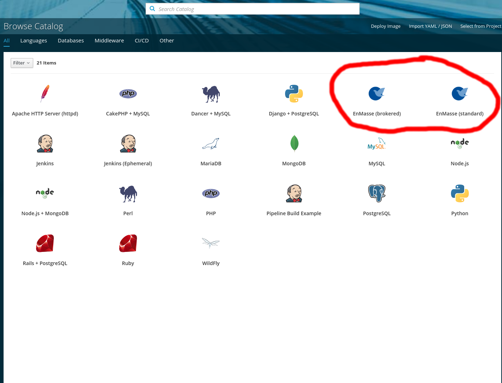
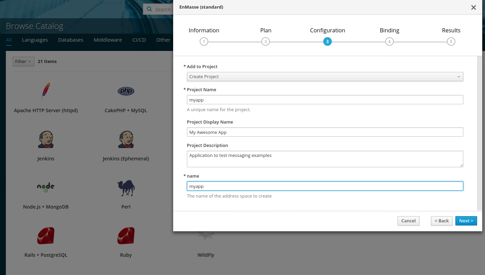
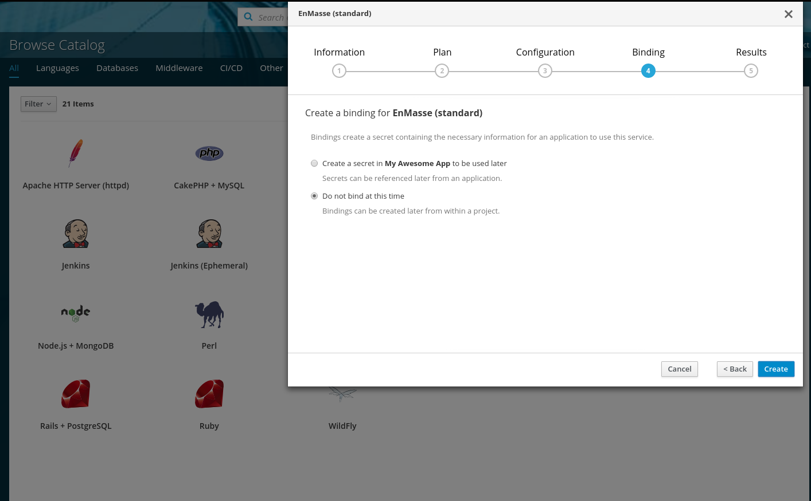
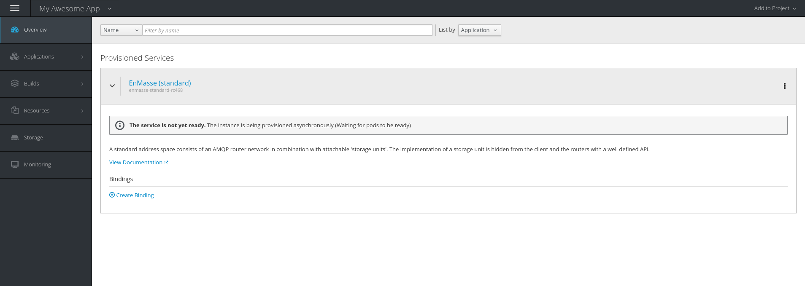

# Messaging using OpenShift Service Catalog

This tutorial walks you through provisioning messaging infrastructure and deploying example
messaging clients using that messaging infrastructure based on OpenShift Service Catalog.

## Provision Address Space

In the OpenShift Service Catalog overview, select either of "EnMasse (standard)" or "EnMasse
(brokered)".

Select among the available plans. If you have an OpenShift project on this cluster already, select it in the "Add to Project" field. If not, select the "Create Project" in the drop-down box.

Use the same value for the "name" field. The address space will be provisioned and may take a few
minutes. In the meantime, you can go to the next step of deploying the example application.

Skip binding at this point, we will perform the bind later.

If you go to your project, you should see the service provisioning in progress.

