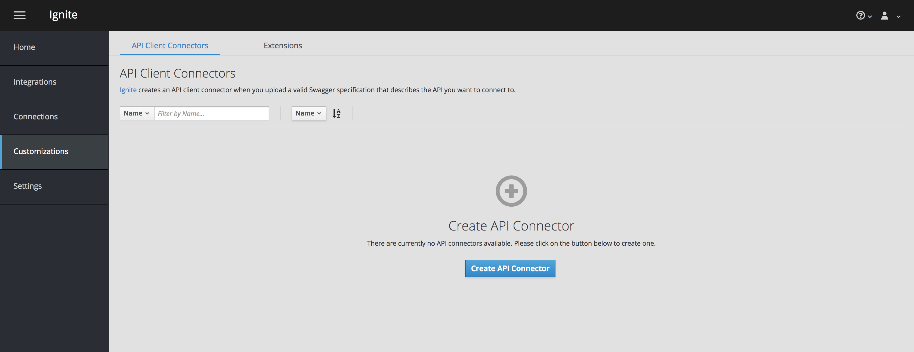
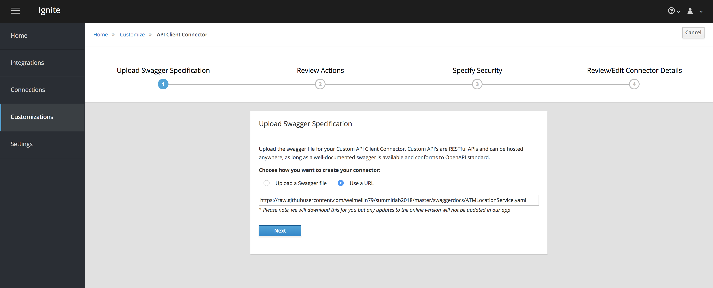
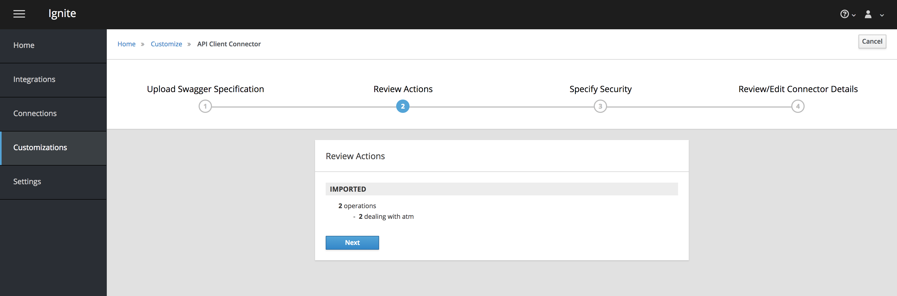
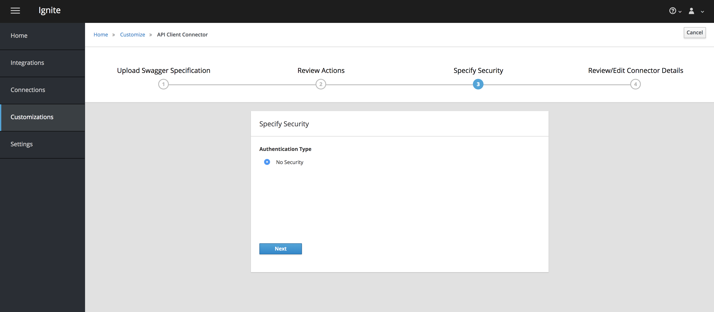
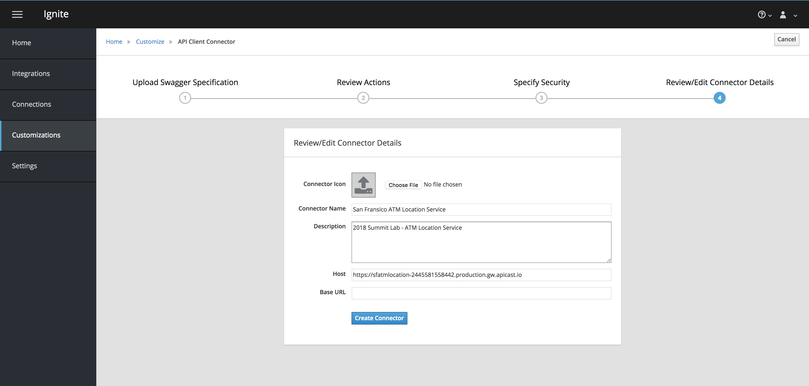
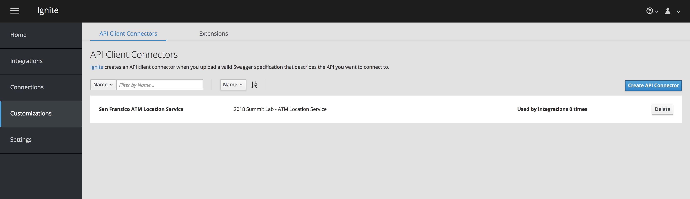
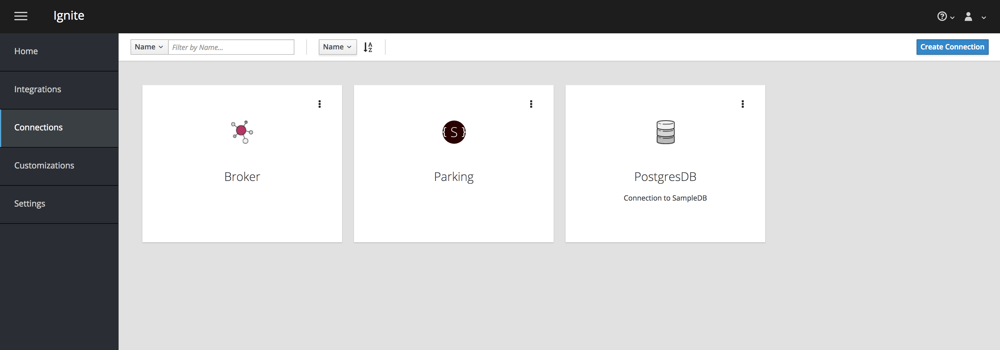
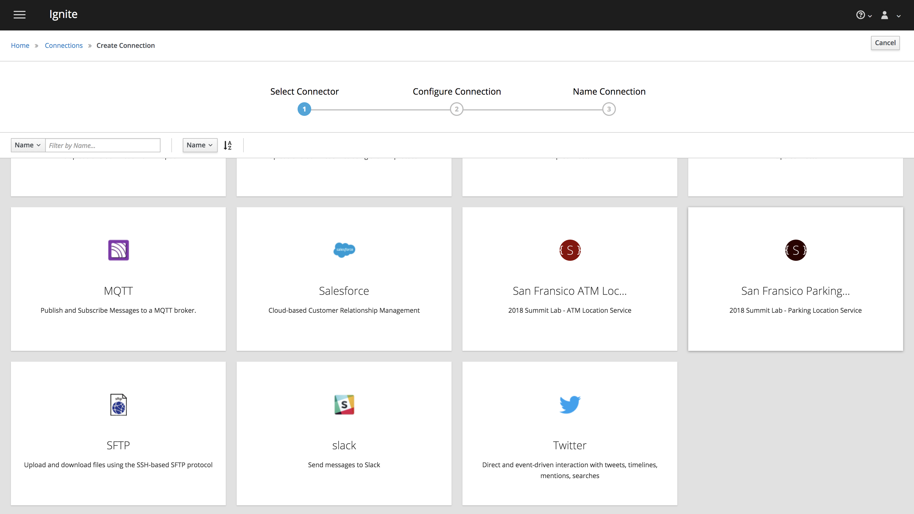
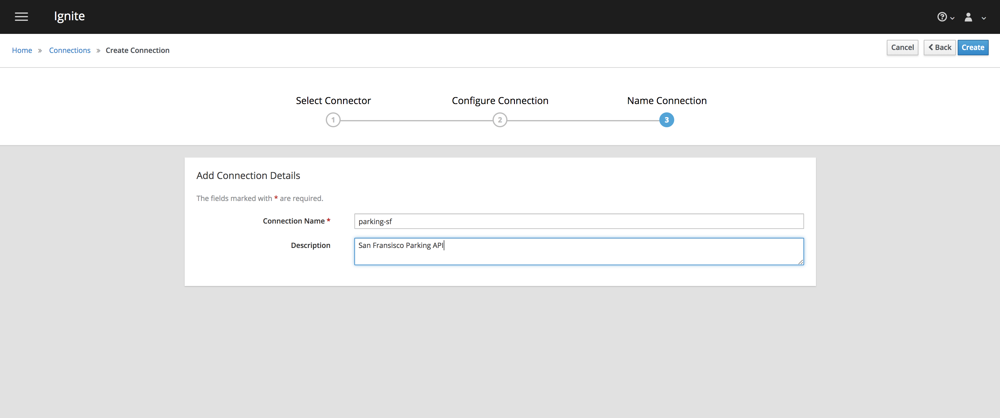
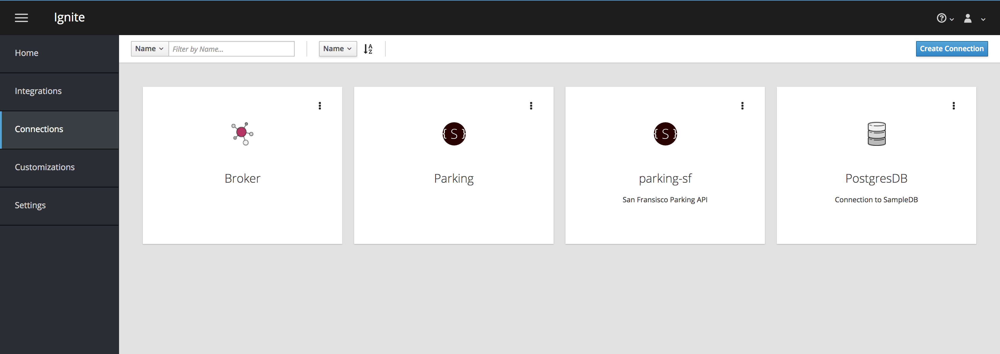

# Setup API Services

## Import API Client Connectors
To import custom API connector, this will allow you to utilize the SaaS API avalible on the internet. Go to Customizations on the side navigation menu.

On the **API Client Connector** tab, click on **Create API Connecot** 



In the **Upload Swagger Specification**, select the *Use a URL* option and enter the following URL in the URL location to create the connector, and click **Next**.

```
https://raw.githubusercontent.com/weimeilin79/summitlab2018/master/swaggerdocs/ParkingLocationService.yaml
```



Click **Next**,



Click **Next**,



Click **Create Connector**,



And you will see the Connector that you just added.


Add the following four API connectors. 

```
#ATM Location
https://raw.githubusercontent.com/weimeilin79/summitlab2018/master/swaggerdocs/ATMLocationService.yaml

#BAR Location
https://raw.githubusercontent.com/weimeilin79/summitlab2018/master/swaggerdocs/BarLocationService.yaml

#Restaurant Location
https://raw.githubusercontent.com/weimeilin79/summitlab2018/master/swaggerdocs/RestaurantLocationService.yaml

#Store Location
https://raw.githubusercontent.com/weimeilin79/summitlab2018/master/swaggerdocs/StoreLocationService.yml
```
## Create API Connections

Now it's time to create a Connection, select the **Connections** on the side navigation menu. On the top right hand corner, click on **Create Connection**.



Select *San Fransisco Parking API* Connecotr



In the configuration setup page, and place **/** in the **base path**. And click on **Next**.


Set Connection Details, add **parking-sf** in the Connection Name and **San Fransisco API** in the description. And click on **Create**.



And you will see the connection that just created.


Do the same to other four API connectors.

- ATM Location
- BAR Location
- Restaurant Location
- Store Location