# Second Hack

-Instructor lead-

Search all parking spot with specified rate (Integer)

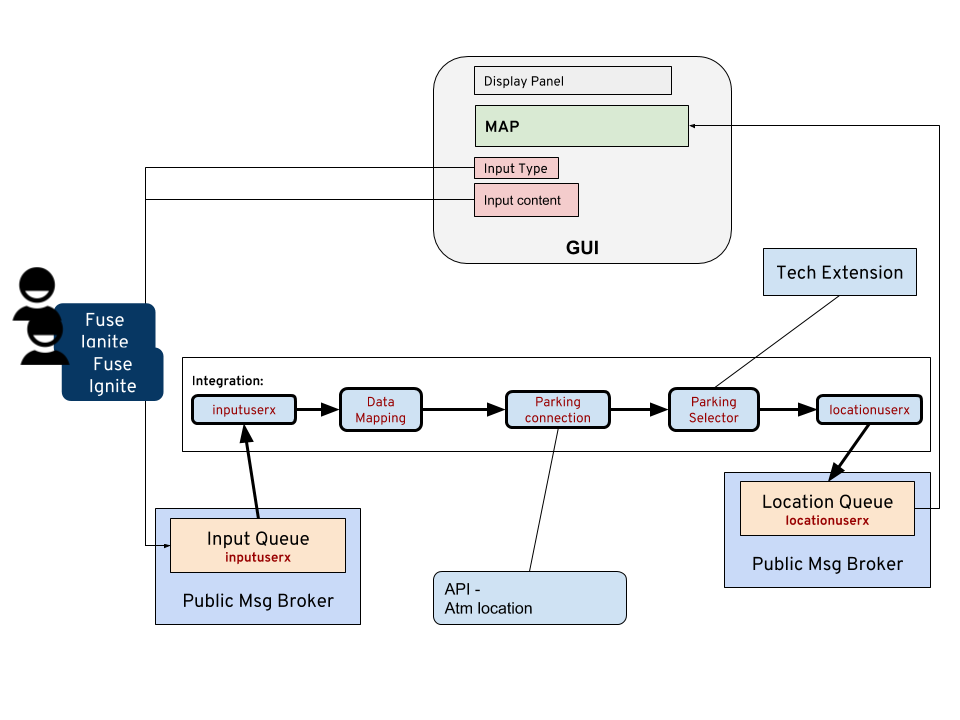


- **Create new integration**. Select the **Integration** on the side menu, and click **Create Integration** button on the top right hand corner.

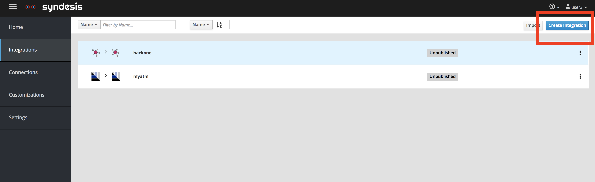

- Click on the AMQP Connector.
- 
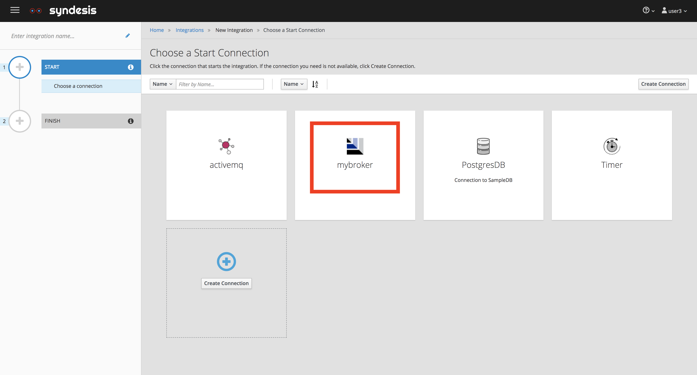

- Select < YOUR_BROKER_CONNECTION > .

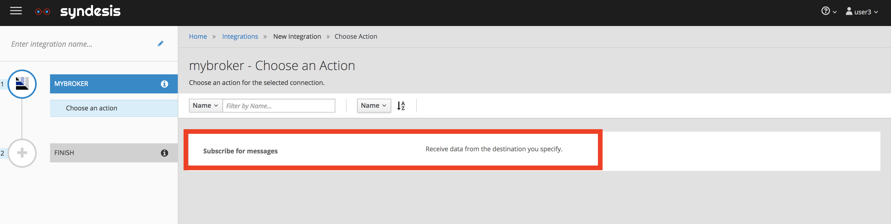

- Select *subscribe for messages action*. 

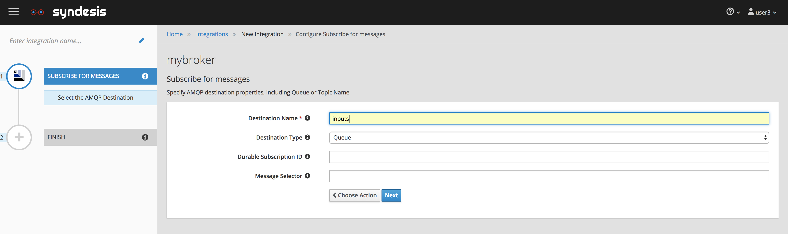

- Configure the name of the queue to listen
	- Destination Name: inputs
	- Destination Type: Queue 


- Configure the Output data type,  
  	- Select Type: JSON Instance
	- Definition: 
	
```
{
  "type": "announcement",
  "content": {
    "title": "Tester",
    "text": "This is the message for everyone!!"
  }
}
```

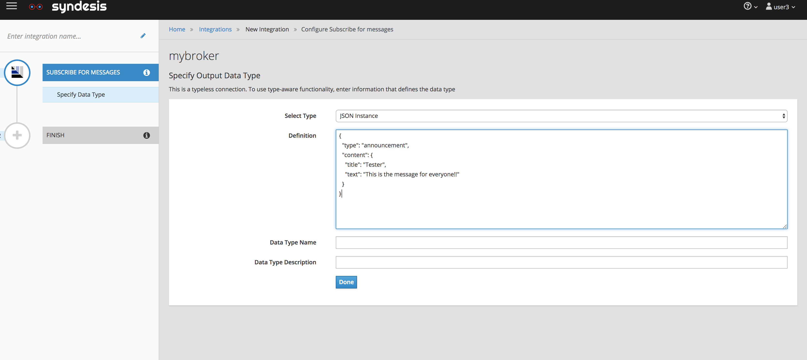

- For end connector setting, and select the < YOUR_BROKER_CONNECTION > 

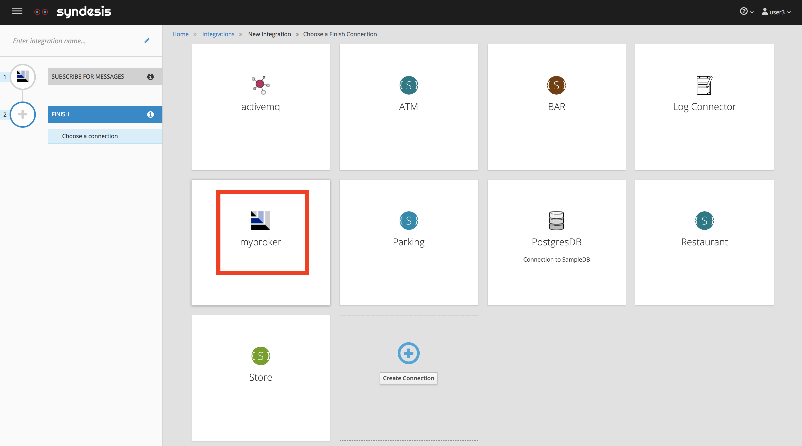

- Select *Publish messages action*.


- Configure the name of the queue to listen
	- Destination Name: locations
	- Destination Type: Queue 
	
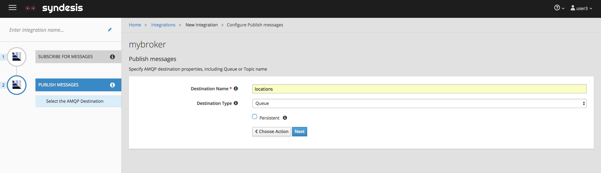

- Configure the Output data type,  
  	- Select Type: JSON Instance
	- Definition: 
	
```
[
   {
      "location":{
         "lat":37.784323,
         "lng":-122.40069
      },
      "title":"Moscone Center",
      "type":"Point of Interest",
      "id":"109"
   },
   {
      "location":{
         "lat":37.785905,
         "lng":-122.413022
      },
      "title":"Hilton Union Square",
      "type":"Hotel",
      "id":"203"
   }
]

```	
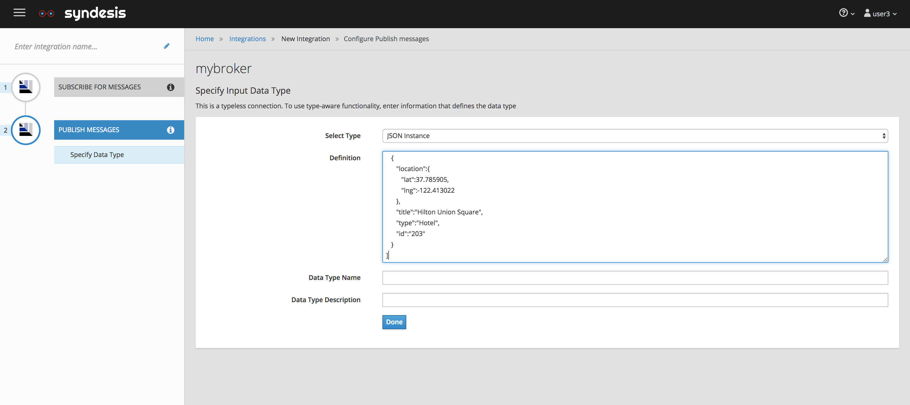

- Select *Add a Connection* in the center
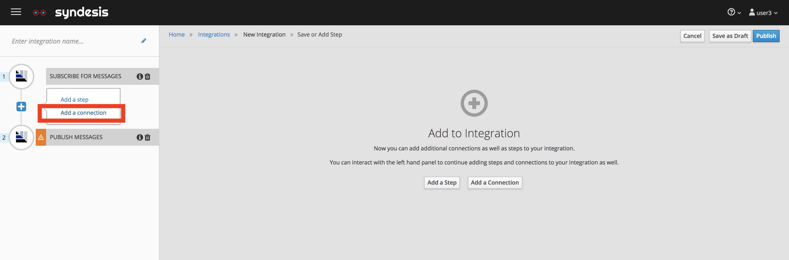

- Select parking-sf (or Parking depends on how you name your Parking API Service connection)

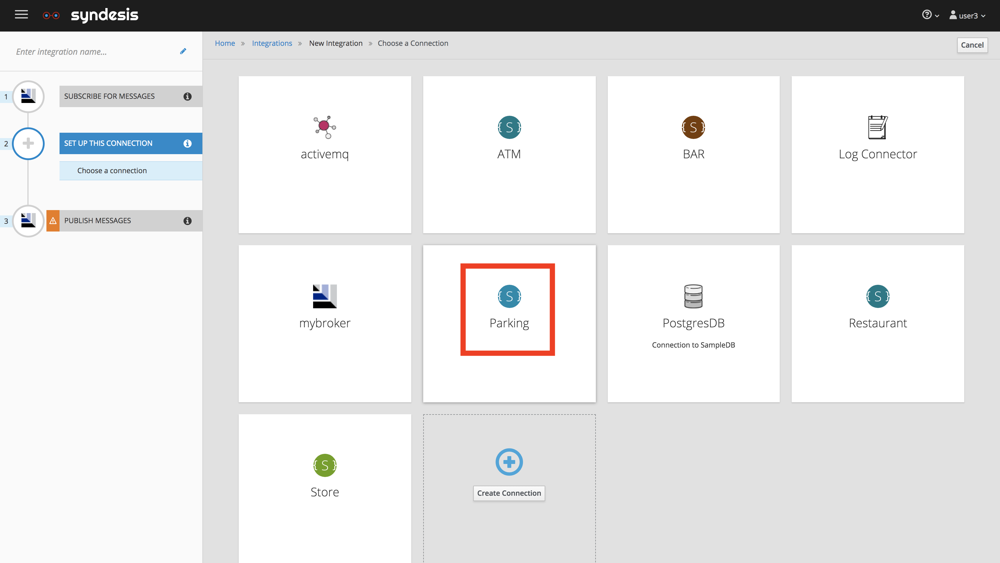

- Select **Get Parking place base on hourly rate** action
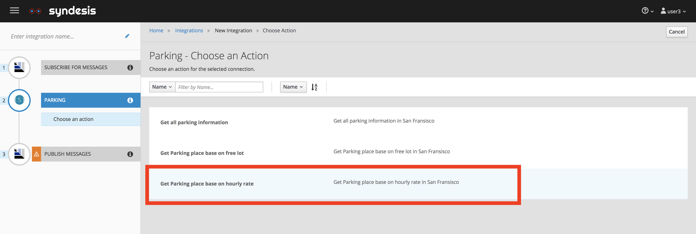

- Click on **Done**


- On the integration route menu, hover over the **+** sign between first two connection, click on **Add a Step**

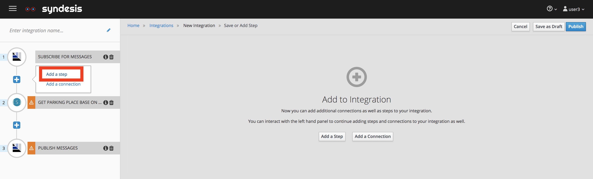

- Select **Data Mapper** Step

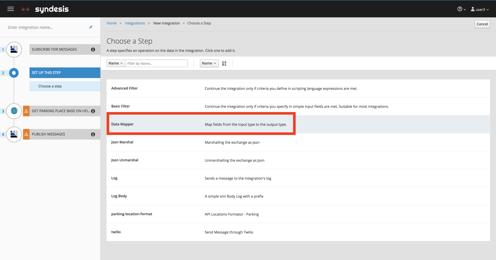

- Map from Source -> content -> text **to** Target -> Request -> Parameter -> maxpay

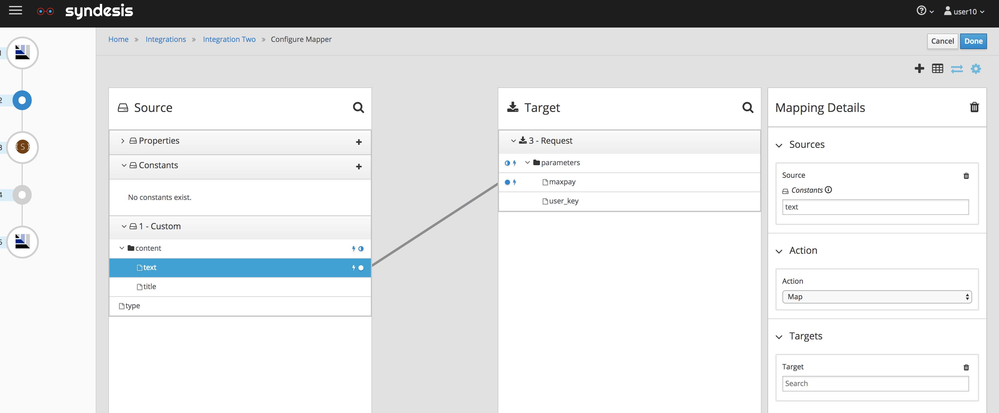

- Add a contant value in Source, by clicking in the Source column **"+"** of *Constants* drop down menu. 
	- 73917fb7c1c8d7142a5db4d6f0ec4a97
	- This value comes from the key we need to access the API
	
	| API Service Name | User Key |
	|------------------|----------|
	| **Restaurant Locations** | d2b8f9e059c2bbfc1a5c7b1cb8115d60 |
	| **ATM Locations** |  b88456bf863608f5b79324eae13a4e46 |
	| **Parking locations** | 73917fb7c1c8d7142a5db4d6f0ec4a97 |
	| **Bar locations** |  f6ba725532f6797d5dc7afbf8c012c20 |	| **Store locations** | b62940ff7a175691e0396b28ceaa0bf4 |
- Map the constant that we just created **to** Target -> Request -> Parameter -> user_key and click on **Done**

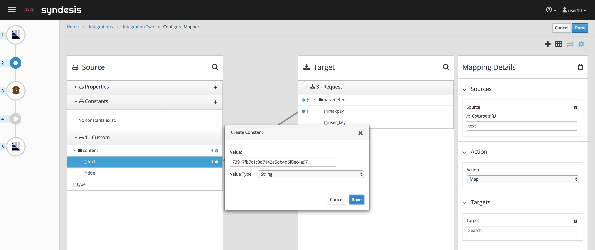
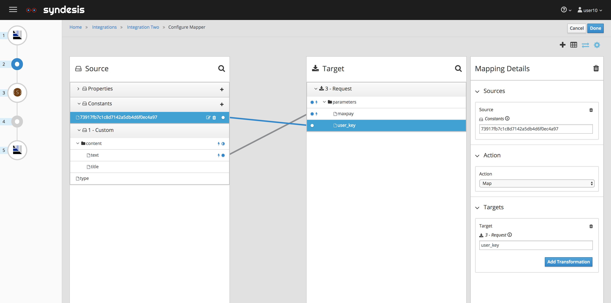

- On the integration route menu, hover over the **+** sign between last two connection, click on **Add a Connection**

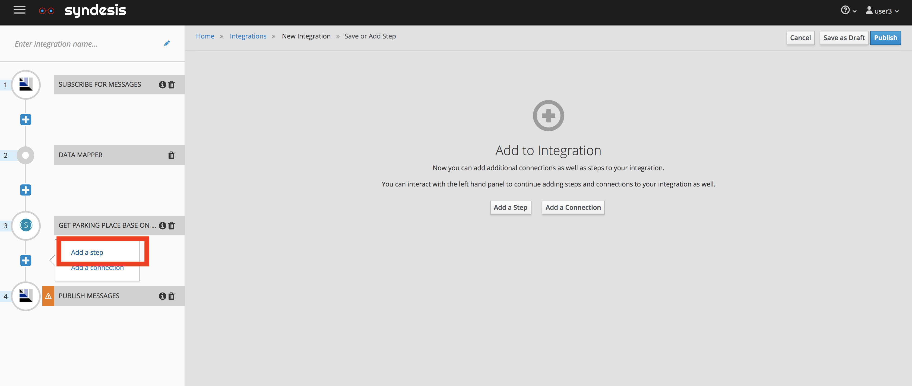

- Select the location-list-format

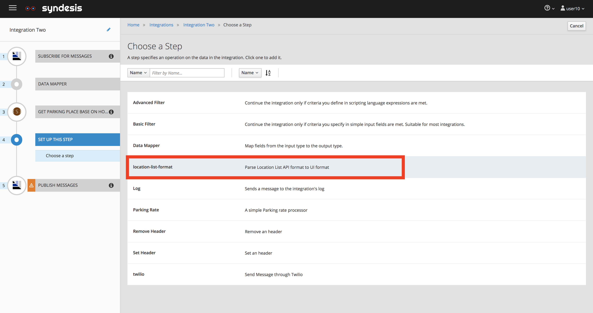

- Make sure the location type is set to **Parking** and click **Next**

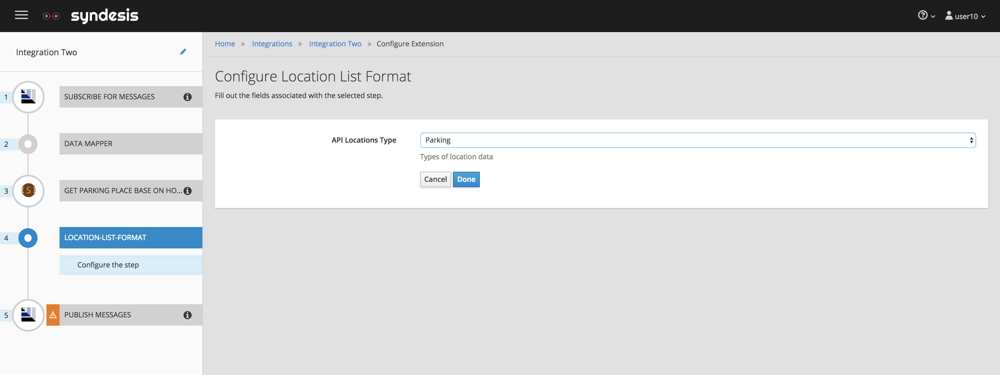

- Click **Finish** 

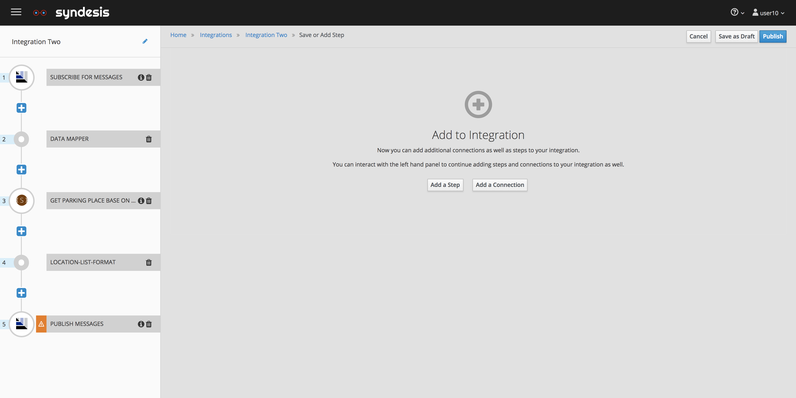

- Give a name to the route and click **Finish**


- Go to your UI, *http://www-hackathon-ui-<USER_NAME>.apps.<ID>.openshift.opentlc.com/*
,in the input panel enter: 
 	- Type: Location, 
	- Title: Parking less than 4 dollars
	- Text: 4
	
 and you should be able to see the location return from the service in the map. 
 
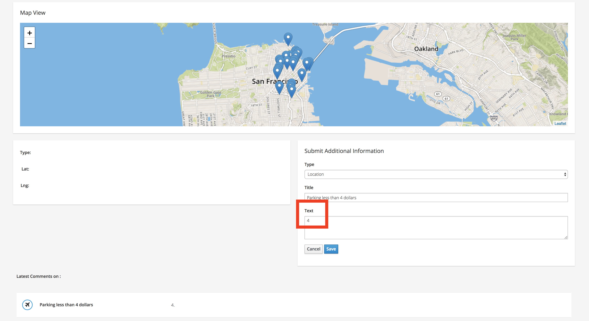

- Testing again, this time, with limit 5
	- Type: Location, 
	- Title: Parking less than 5 dollars
	- Text: 5x

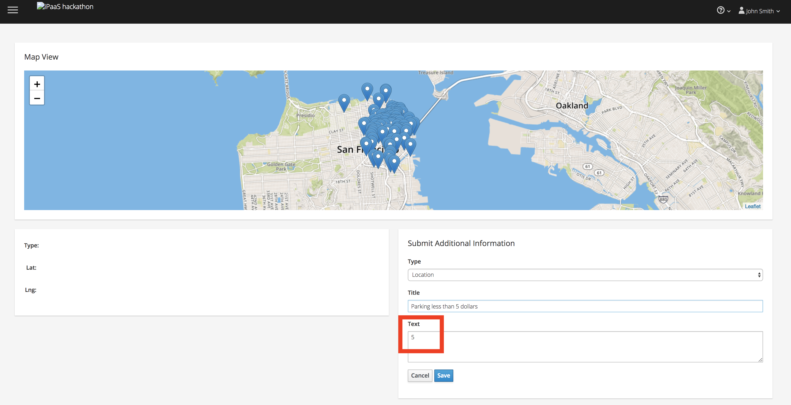


