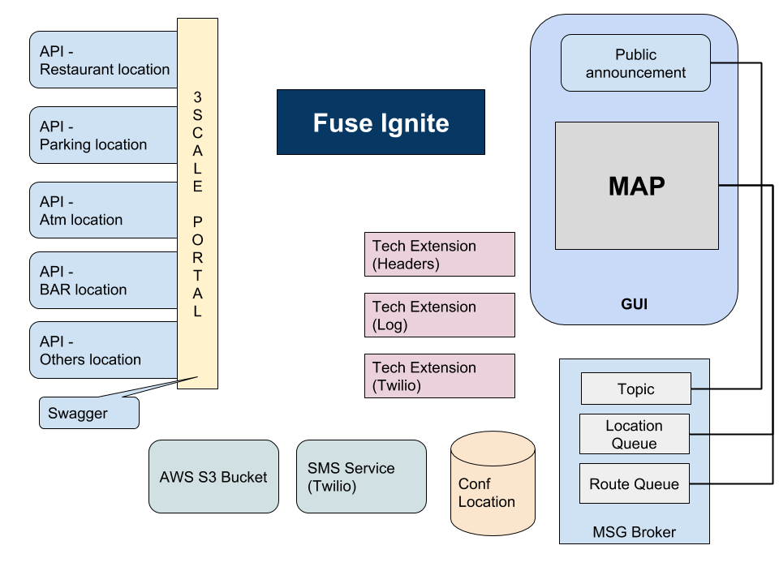
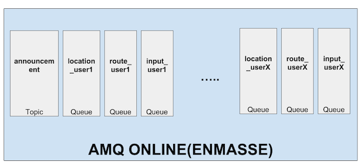
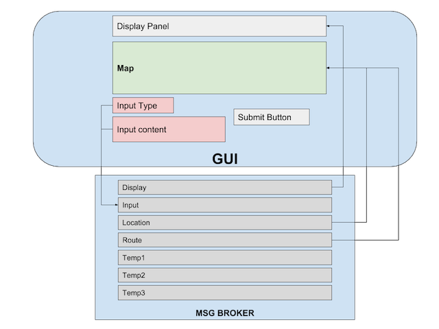

# L1120 iPaaS Hackathon

Welcome to this hackathon. Putting integration solution together used to take days and you will have to have some sort of coding background to successfully put data from various services together. Today, with Red Hat’s low code iPaaS platform, we will use the minimum number of codes to achieve maximum integration results! 

First of all, give us 15 mins to walk through the tooling platform with you,  so you know where everything is. After that we will let you work on two instructor lead integration scenarios, to get you familiar with the environment, and platform. Then you are free to hack it away! 

## Environment 

### MAP GUI Interface

Go to [http://gui-YOURUSERID-summitlab.opentlc.com](http://gui-YOURUSERID-summitlab.opentlc.com) (TBC). This is where you can use to display the result, and places for you to submit input as well.  To interact You will need to pass/retrive data from messaging queues that are assign to you!

What is the fun of integration if you don’t have API/data? 

### Location API Services

Go to the following links to access  (login with your user id/pwd)

- **Restaurant Locations** d2b8f9e059c2bbfc1a5c7b1cb8115d60
- **ATM Locations**  b88456bf863608f5b79324eae13a4e46
- **Parking locations** 73917fb7c1c8d7142a5db4d6f0ec4a97
- **Bar locations**  f6ba725532f6797d5dc7afbf8c012c20
- **Store locations** b62940ff7a175691e0396b28ceaa0bf4

https://fusedemo.3scale.net/docs


### Schema in Database: (TBC)
To make things more interesting, you will have access to the local conference meetup location in the Database. 

- Schema Name: sampledb 
- Table Name: meetups

| Column name | Data Type | Description |
|---|---|---|
| meetupid | int | Unique ID number |
| meetupname | varchar(100) | Name of the meetup |
| lng | decimal | Longitude of the meetup location |
| lat | decimal | Latitude of the meetup location |
| desc | text | Short Description of meetups  |


### Other Services

To step up the game, you can also use the following services for 

- **Amazon S3**
More details to come!  (DISCUSSION: Do we set this up for audience or they do it on their own)

- **Twilio**
More details to come!  (DISCUSSION: Do we set this up for audience or they do it on their own)





### Deployment on AMQ Online

We will have ONE single Topic that everyone listen to for announcement! 

- 1 queue for __display__
- 1 queue for __input__
- 1 queue for __location display in map__
- 1 queue for __route display in map__
- 3 queues in case the participants needs it, __temp queues__





## Working with GUI



### Communicating with the Notifications Display 
To display messages in the notifications widget, you will need to send the text into the receiving message broker topic. And you will need to follow the data format listed below: 

```
{
  type: 'Success',
  header: 'Christina',
  message: 'This is the message for <strong>everyone</strong>!!'
}
```

Message body allows non-abusive use of HTML. You can use one of the following message types:

* Info
* Success
* Warning
* Danger


### Showing Locations in the Map
Map allows you to pin point and mark multiple locations, the location can be set by passing into the receiving message broker queue with the data format below:

````
[
  {
    location: {
      lat: 37.784323,
      lng: -122.40069
    },
    title: 'Moscone Center',
    type: 'Point of Interest',
    id: 109
  },
  {
    location: {
      lat: 37.785905,
      lng: -122.413022
    },
    title: 'Hilton Union Square',
    type: 'Hotel',
    id: 203
  }
]
````

### Showing route in Map
To add route in the map, simply pass in the route data below into a messaging broker queue:

### Data from Input
Inputs are collected and formatted into a messaging broker queue ready for you to process after submitting it with the submit button. An example of the data is show below:

```
{
  type: 'announcement',
  content: {
    title: 'Tester',
    text: 'This is the message for everyone!!'
  }
}
```

or 

```
{
  type: 'forLocation',
  content: {
    id: '109',
    title: 'Comment',
    text: 'Here's a comment'
  }
}
```

## First Hack - Data Shapes and Data Mapper
-Instructor lead-


Publishing and receiving from announcement topic!

- Add connection for messaging broker for Input queue and announcement topic
(TBA) Screen Shoot

- Add new integration

- From internalbroker connection with following datashapes

```
{
  "type":"accouncement",
  "content": [{"this is the message for everyone!!"}]
}
```

- Data Mapper 

(TBA) Screen Shoot

- To externalbroker connection with following datashapes

```
{
  "username":"accouncement",
  "content": "this is the message for everyone!!"
}
```


- Add new integration

- From externalbroker connection with following datashapes

```
{
  "username":"accouncement",
  "content": "this is the message for everyone!!"
}
```

- Data Mapper 

(TBA) Screen Shoot

- To internalbroker connection with following datashapes

```
{
  "Color":"red",
  "UserName":"Christina",
  "Content":"this is the message for everyone!!"
}
```


## Second Hack

-Instructor lead-

Showing all ATM locations that is my prefered bank and has less then rate


- Add connection for messaging broker for Input queue if you have not done so from the previous hack

- Add API swagger to create API 

- Add Tech Extension  
 
- Add connection for API and Tech Extension 

- Add new integration

- From internalbroker connection with following datashapes

```
{
  "type":"accouncement",
  "content": [{"this is the message for everyone!!"}]
}
```

- Data Mapper 

(TBA) Screen Shoot

- To externalbroker connection with following datashapes

```
{
  "username":"accouncement",
  "content": "this is the message for everyone!!"
}
```


## Off you go 
Have fun Hacking!
