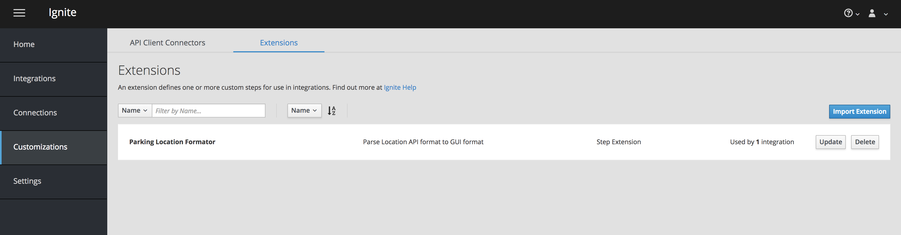
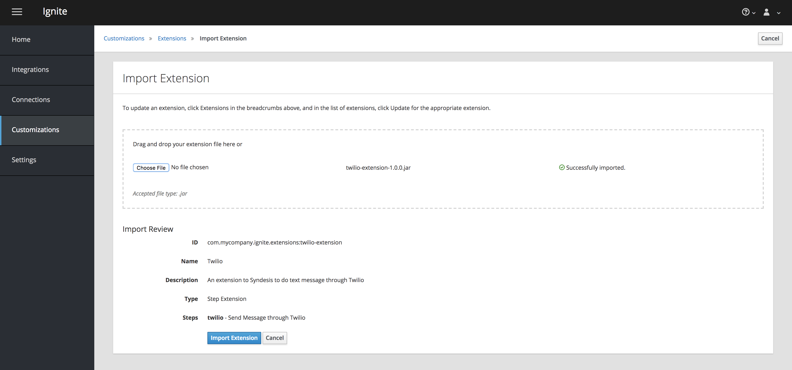
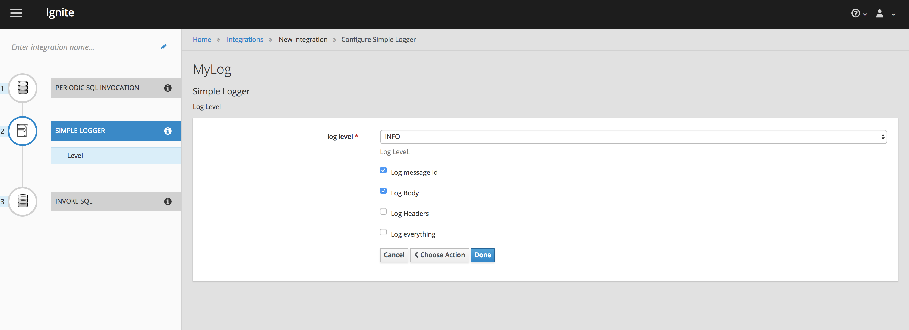
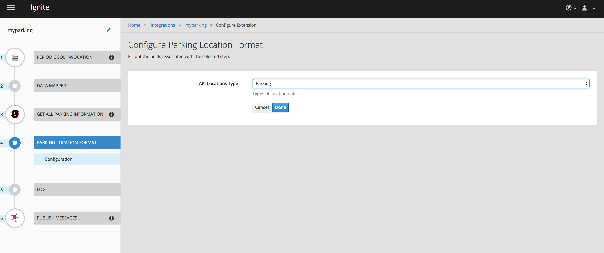

# Setup Technical Extension

To setup extension of the API connectors, go to Customizations on the side navigation menu. Select the top **Extensions** tab, select **Import Extensions**.

Choose the extension file to upload. Choose *techextensions/location-format-1.0.0.jar* as the extension file.

The detail of the extension will show up, and select **Import Extension**

And you are done! 

Repeat the other tech extension in **Extensions** folder.

- location-list-format-1.0.0.jar
- manage-headers-extension-1.0.0.jar
- syndesis-connector-log-1.0.0.jar
- syndesis-connector-timer-1.0.0.jar
- syndesis-extension-json-dataformat-1.0.0.jar
- twilio-extension-1.0.0.jar

### Here are the available tech extensions

- **Log**

This extension allows you to determin what to show in the log

- **Twilio**

This extension allows you to send text message, you can define things to send by defining the input and sender message.

- **Location List format**

Turns all the API data list into the format that is needed by GUI.

- **Remove Camel Header**

Removes the Camel header

- **Timer**

Timer that can use to start route

- **Json Dataformat**

Converts to and from JSON Data Format 

