# Messaging using OpenShift Service Catalog

This tutorial walks you through provisioning messaging infrastructure and deploying the example messaging application using the OpenShift Service Catalog.

## Provision Address Space

1. In the OpenShift Service Catalog overview, select **EnMasse (brokered)**.

    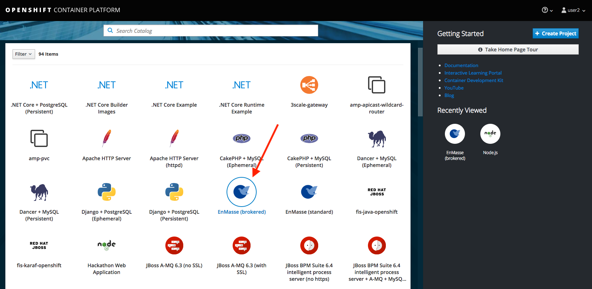

1. Click the **Next** button to start the configuration.

    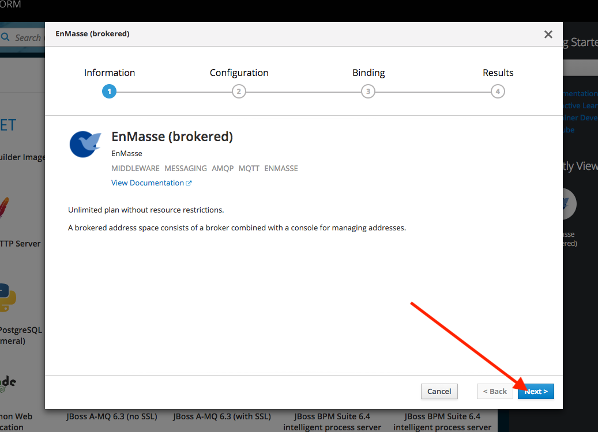

1. Select your project in the **Add to Project** field. If you haven't yet created a projet, select the **Create Project** in the drop-down box. Use your username as the project name _userX_. Use the same value for the **name** field. 
1. Click the **Next** button.

    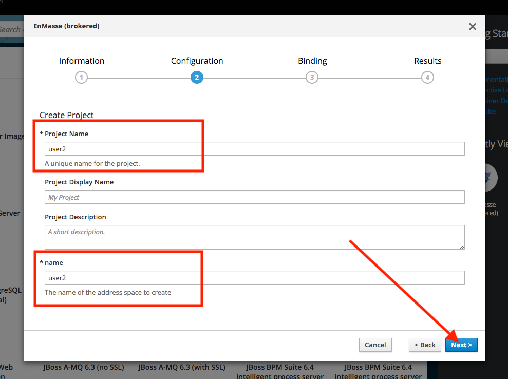

1. Select the **Do not bind at this time** option. Click the **Create** button.

    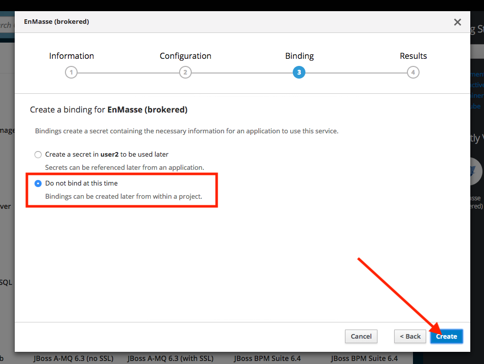

1. The provisioning has been scheduled now. Click on the **Continue to the project view** link to review the progress.

    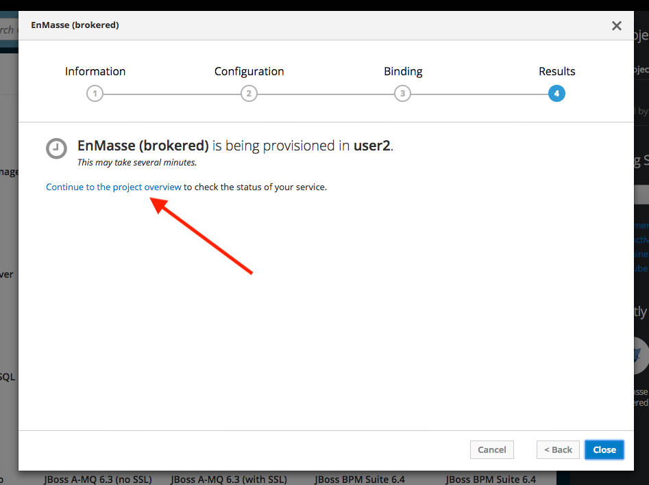

1. The address space will be provisioned and may take a few
minutes.

    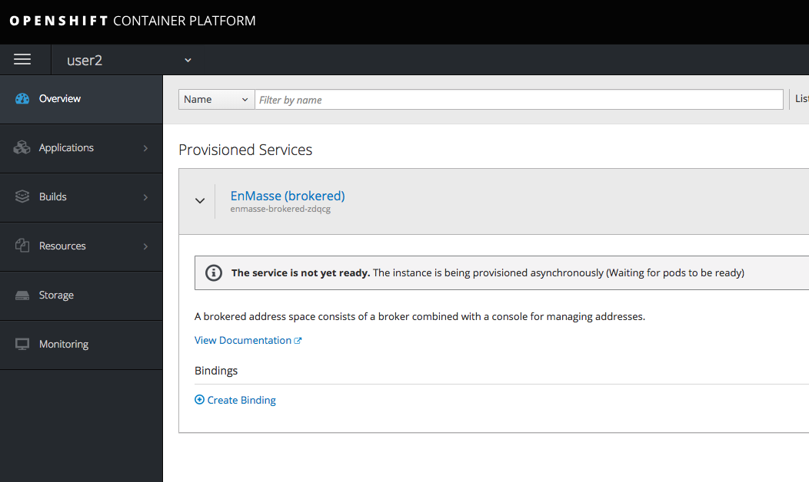

## Configure Addresses

1. Collapse the Service by clicking on the header.

    

1. Log in to the Messaging console by clicking on the **Dashboard** link. It will open a new tab.

    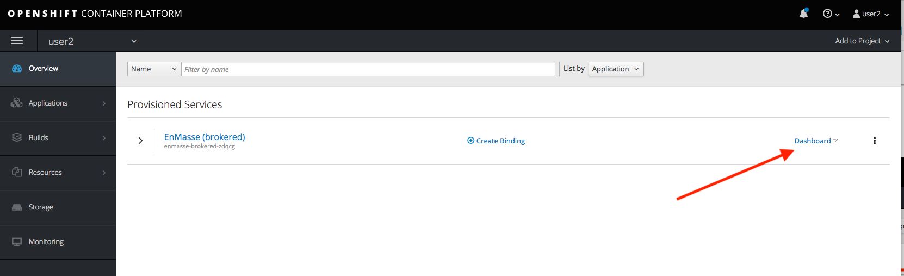

1. The link will redirect you to the Single Sign On Login Page. Click the **OpenShift** button.

    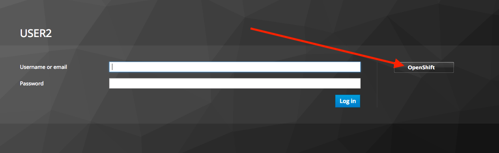

1. This will redirect you to the OpenShift login. Type in your assigned username and password and click the **Log In** button.

    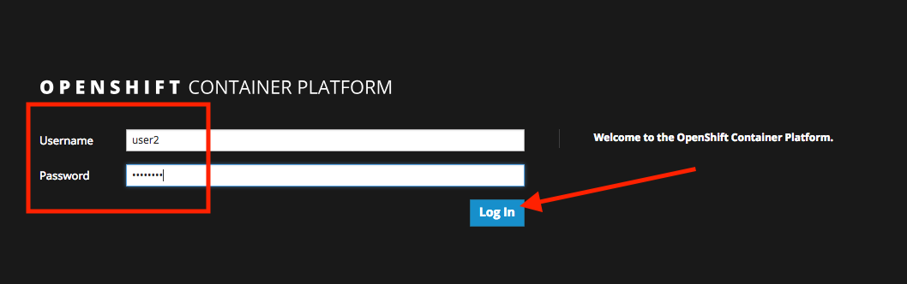

    If everything is ok you will land in the _Dashboard_ page of the messaging console.
    
    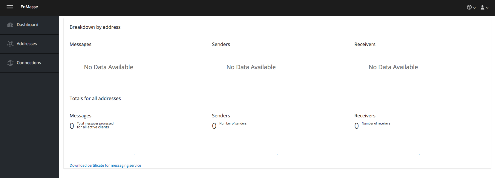

1. Click the **Addresses** option on the left side menu.

1. To start creating the addresses, click the **+ Create** button.

    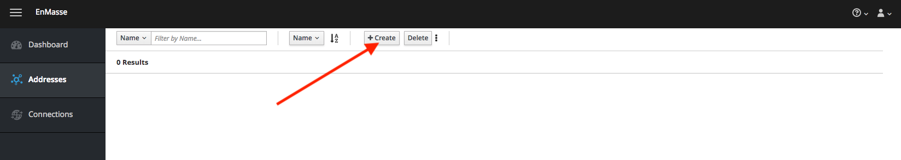

1. Fill in the **Name** with the address name like *inputs* and select the **Type**, in this case *queue*. Click on **Next >**.

    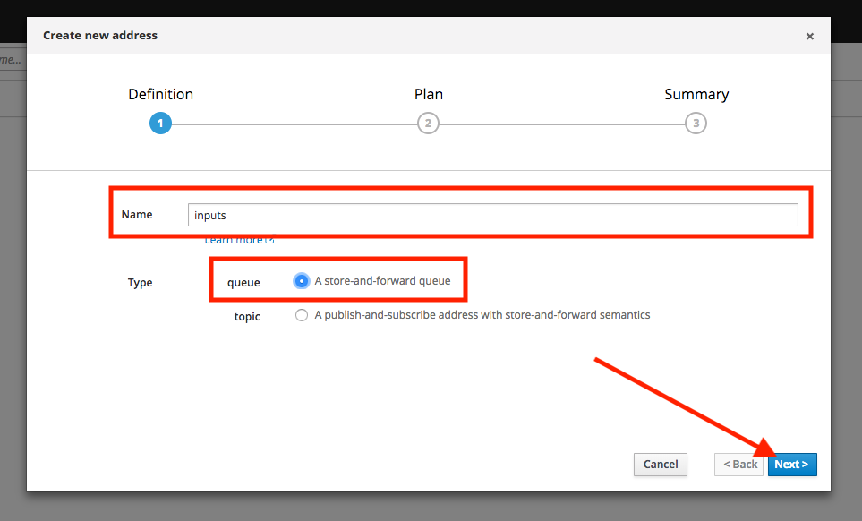

1. Select the default **Plan** type and click on **Next >**.

    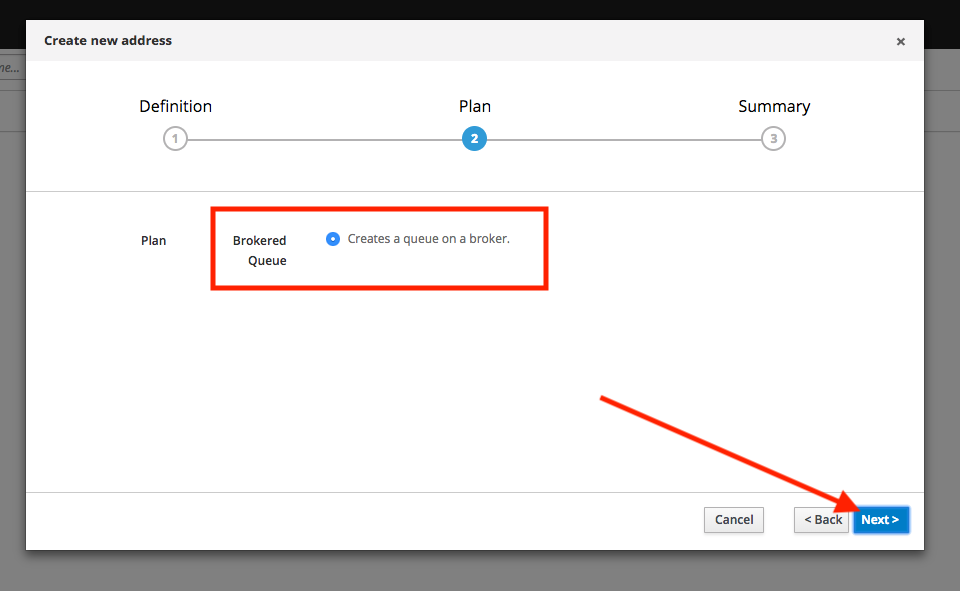

1. Finally click on **Create**.

    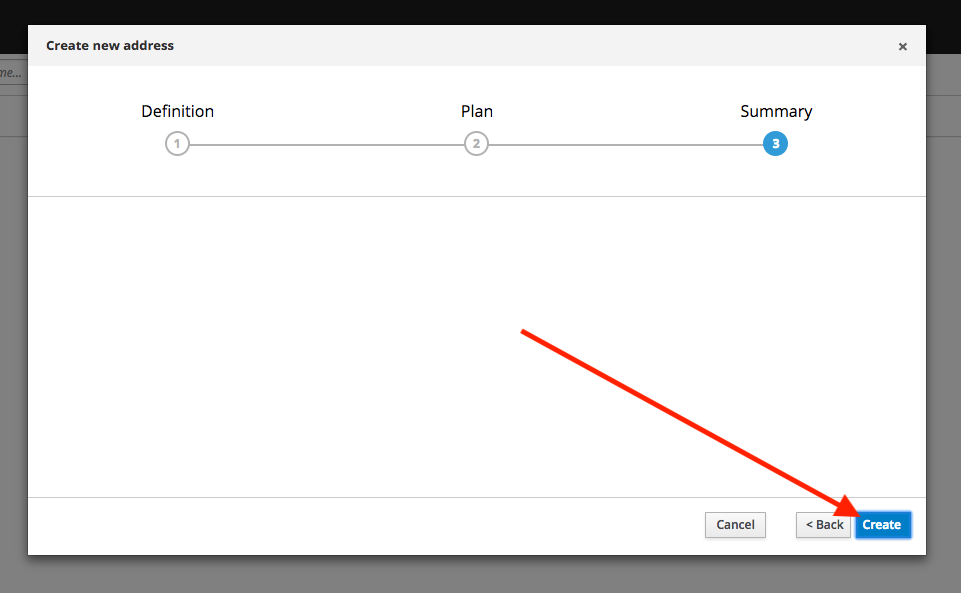

1. Your address will be provisioned in the address space and will become available shortly.

    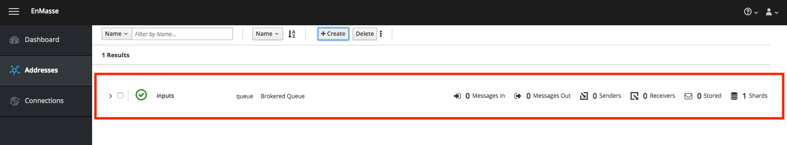

1. Add the following addresses to your space:

    * **notifications** - type: *topic*
    * **inputs** - type: *queue*
    * **locations** - type: *queue*
    * **temp1** - type: *queue*
    * **temp2** - type: *queue*
    * **temp3** - type: *queue*

    You will be able to create additional addresses if needed.

## Create Application Credentials

Now you are able to provision credentials for your applications. You will need this information when creating the Web Application UI. Follow the next steps to create an app binding.

1. Get back to the OpenShift web console.

1. Click on **Create Binding** link of the messaging service. Wait a few seconds to let the wizard dialog load completly.

    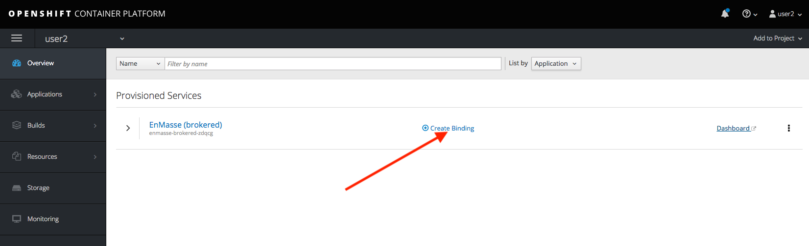

1. Click **Next >**.

    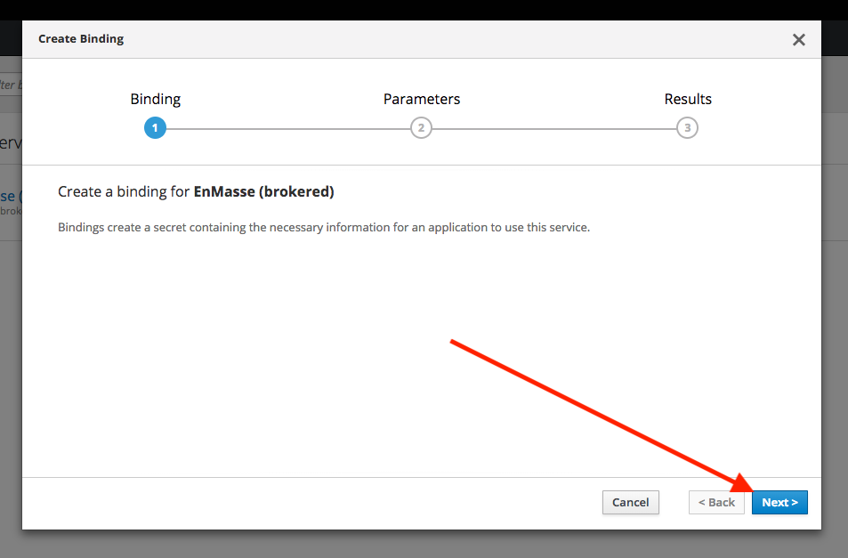

1. Select the **externalAccess** checkbox and leave the default options. Click **Bind**.

    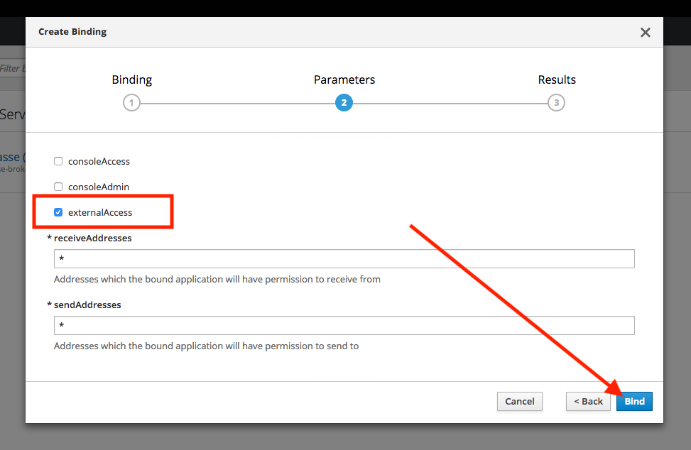

1. Click **Close** to finish the process.

    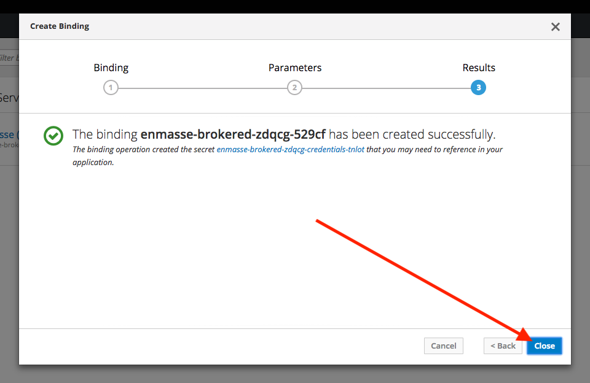

1. Expand the messaging service and click **View Secret** of the newly created binding.

    

1. Click **Reveal Secret** to show the credentials and extra information. You will need this information for the Web Application UI.

    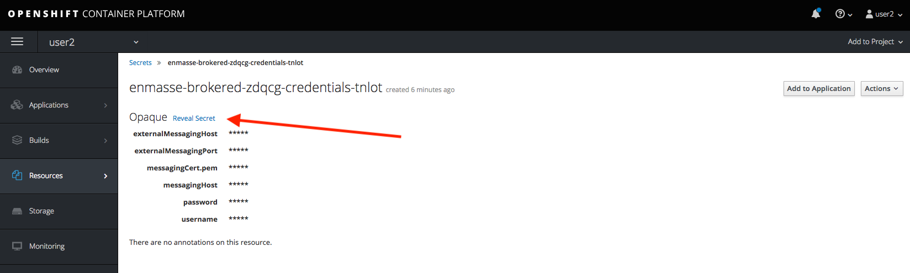

1. Take notice of the **externalMessagingHost**, **externalMessagingPort**, **password**, and **username** you will need those values to connec the web application UI to the messaging service.

    

## Summary

In this tutorial, you've seen how to provision messaging using the OpenShift Service Catalog. You
have seen how to bind it to the provisioned messaging service. You then used the messaging console to create an address before modifying the application to use the secret for authenticating.